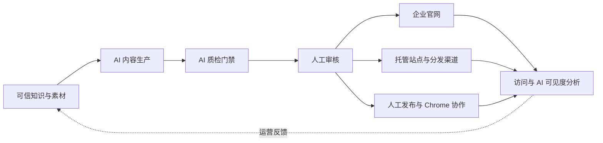

# GEOFlow 3.0

> Languages: [简体中文](README.md) | [English](docs/readme/README_en.md) | [日本語](docs/readme/README_ja.md) | [Español](docs/readme/README_es.md) | [Русский](docs/readme/README_ru.md) | [Português (BR)](docs/readme/README_pt_BR.md)

> 面向企业官网的开源 GEO 智能运营系统

GEOFlow 把可信知识、AI 内容生产、质量门禁、人工审核、多站点分发与数据分析接进一条可持续运营链路。品牌、增长和内容团队可以用它建设企业官网、GEO 子频道、行业信源站或内部内容运营平台，让资料、流程、发布结果和运营数据留在同一套系统中。

[快速开始](#快速开始) · [界面预览](#界面预览) · [核心能力](#geoflow-30-核心能力) · [部署文档](docs/deployment/DEPLOYMENT.md) · [更新日志](docs/CHANGELOG.md) · [官方网站](https://www.geoflow.me)

[](version.json)
[](https://github.com/yaojingang/GEOFlow/releases/latest)
[](https://www.php.net/)
[](https://github.com/yaojingang/GEOFlow/actions/workflows/ci.yml)
[](LICENSE)
[](https://github.com/yaojingang/GEOFlow/stargazers)

> **版本说明：** 当前源码版本为 `3.0.0`，实际公开发布状态以 [GitHub Releases](https://github.com/yaojingang/GEOFlow/releases) 为准。生产部署建议使用已发布版本，或固定到经过审核的提交。

---

## GEOFlow 解决什么问题

企业开展 GEO 运营时，通常需要同时管理品牌知识、模型、内容生产、质量审核、官网工程、渠道发布和效果分析。工具分散会让资料来源、审核结论和发布结果难以追踪。

GEOFlow 把这些工作放进同一个管理后台：



系统保留知识来源、任务配置、模型调用、质检证据、人工放行、发布状态和渠道日志，方便团队持续复盘和维护内容资产。

---

## 界面预览

<table>
  <tr>
    <td width="50%"><br /><sub>图文帮助工作台</sub></td>
    <td width="50%"><br /><sub>数据中心</sub></td>
  </tr>
  <tr>
    <td width="50%"><br /><sub>任务管理</sub></td>
    <td width="50%"><br /><sub>文章 AI 质检</sub></td>
  </tr>
  <tr>
    <td width="50%"><br /><sub>托管渠道站点</sub></td>
    <td width="50%"><br /><sub>人工发布工作台</sub></td>
  </tr>
</table>

这些脱敏界面来自 3.0 内置帮助素材，覆盖知识问答、任务调度、文章质检、托管站点、人工发布和数据分析等主要流程。

---

## GEOFlow 3.0 核心能力

| 能力 | 3.0 提供的工作方式 |
|------|-------------------|
| 可信知识与内容生产 | 集中管理知识库、标题库、关键词库、图片库、作者、提示词和 AI 模型；知识库支持结构化切片、可选语义规划、向量召回和稳定回退 |
| AI 质量门禁 | 按知识证据、数据与引文、广告规则和发布语境检查文章，记录分项评分、原文定位、法规依据、修改建议和历史结果；待复核、阻断、异常或过期的文章停留在草稿阶段 |
| 审核与运营协作 | 统一管理草稿、审核、发布、回收站和批量 Markdown 导出；人工发布工作台保存身份、账号、执行人、计划时间、风险提示、回执和审计记录 |
| 企业官网与多站点交付 | 本地前台提供 SEO 元信息、Open Graph、Schema、sitemap 和 `llms.txt`；渠道支持托管站点、GEOFlow Agent、WordPress REST 和通用 HTTP API |
| 数据反馈与日常运维 | 数据中心汇总内容、分发、访问、Top 内容、AI 爬虫和趋势；独立 Updater 负责签名更新、完整备份、环境验收和恢复点回滚 |
| 团队与开发者入口 | Admin UI V3 支持六种语言、响应式布局、PWA 和图文帮助；API v1、GEOFlow CLI 与内置 Agent Skill 覆盖自动化与二次开发 |

### 3.0 的主要升级

- Admin UI V3 统一侧栏、顶栏、导航、表单、对话框和移动端交互，静态资源改为本地加载。
- AI 工作台调整为后台图文帮助助手，内置 15 个主题、24 张脱敏截图和 72 条固定评测，功能入口按管理员权限生成。
- 文章 AI 质检进入发布门禁，质检结果、人工放行和策略变化都保留审计记录。
- 托管渠道站点支持子域名分配、生命周期、文章分配、发布配额、失败冷却、技术预检、缓存失效和状态对账。
- Chrome 运营助手通过设备配对和最小权限 Token 领取人工发布工单、填充待审核草稿并回传执行凭证，最终发布由运营人员确认。
- 标题库支持最高 10 万条的分批 AI 生成、恢复、取消、失败重试和去重；任务回收站保留 90 天审计信息。
- API v1 和 `bin/geoflow` 覆盖目录、任务、执行记录、素材、文章与浏览器运营协议。
- 独立 GEOFlow Updater 通过本地 Unix socket 承担更新、完整备份、环境验收和恢复点回滚，高风险操作需要管理员密码与 6 位验证器授权码。

完整变更见 [中文更新日志](docs/CHANGELOG.md) 和 [English changelog](docs/CHANGELOG_en.md)。

---

## 适用场景

| 场景 | 建议用法 | 重点能力 |
|------|----------|----------|
| 企业官网 GEO 运营 | 围绕产品、案例、FAQ、行业知识和品牌规则持续建设内容 | 企业知识库、任务、质检、官网发布、数据分析 |
| 官网 GEO 子频道 | 通过子域名或独立目录快速建立资讯、知识或解决方案频道 | 主题、栏目、SEO、内容调度、线索表单 |
| 行业信源站 | 围绕一个行业、主题或问题域维护可核验的长期内容资产 | RAG、审核、引用友好输出、sitemap、`llms.txt` |
| 内部内容运营平台 | 弱化公开前台，由品牌、增长和内容团队统一生产与审核 | 素材库、API、CLI、人工发布、权限和审计 |
| 多品牌与多站点 | 从一套后台管理多个站点、栏目或内容出口 | 托管站点、Agent、WordPress、通用 API、分发日志 |

GEOFlow 适合拥有真实业务资料、明确审核责任和持续运营计划的团队。知识库质量、人工判断和长期维护决定内容能否稳定获得用户与 AI 的信任。

---

## 安全与治理

| 范围 | 设计边界 |
|------|----------|
| 内容质量 | 知识证据、规则版本、评分、人工放行和结果过期均可追踪 |
| 账号与权限 | 管理入口按权限过滤，敏感操作由超级管理员控制，任务和人工发布保留状态历史 |
| 浏览器协作 | Chrome 扩展使用设备配对与最小权限 Token，不保存外部平台密码、Cookie 或 OAuth 凭证 |
| 出站请求 | URL 导入、分发、AI、主题参考和更新检查经过统一安全策略，限制私网访问、重定向和响应体大小 |
| 更新与恢复 | Updater 使用签名包、本地 Unix socket、环境验收、完整备份和恢复点，高风险请求要求二次验证 |
| 匿名统计 | 默认关闭；启用后只发送固定白名单字段，业务内容、账号、邮箱、域名、Cookie 和密钥不会进入载荷 |

安全设计、部署门禁和升级步骤以 [部署文档](docs/deployment/DEPLOYMENT.md) 与当前版本发布说明为准。

---

## 组件与运行环境

| 组件 | 当前源码版本或状态 | 说明 |
|------|-------------------|------|
| GEOFlow Core | `3.0.0` | Laravel 应用、管理后台、前台、API、队列和分发系统 |
| GEOFlow CLI | `0.2.0` | 仓库内置 `bin/geoflow`，支持 macOS、Linux 和 WSL |
| Chrome 运营助手 | `0.1.0` | 源码和打包产物位于 `browser-extension/` 与 `dist/browser-extension/` |
| GEOFlow Updater | 独立组件 | 使用与目标 Release 明确兼容的签名版本，参见 [geoflow-updater](https://github.com/yaojingang/geoflow-updater) |
| 目标站点 Agent | 按渠道生成 | 每个渠道可生成预配置 PHP 包，提供首页、详情页、静态资源、Schema、sitemap 和 `llms.txt` |

运行要求：

| 组件 | 要求 |
|------|------|
| PHP | 8.3 及以上，Docker 默认可使用 PHP 8.4 |
| 数据库 | PostgreSQL，推荐使用 pgvector 镜像或兼容扩展 |
| Redis | 用于队列、缓存和运行状态 |
| Node.js | 用于前端资源构建，CI 使用 Node.js 22 |
| 容器部署 | Docker Compose，生产使用 Nginx 与 php-fpm |

---

## 快速开始

### Docker 开发与体验

```bash
git clone https://github.com/yaojingang/GEOFlow.git
cd GEOFlow
cp .env.example .env
docker compose build
docker compose up -d --remove-orphans
```

- 前台默认地址：`http://localhost:18080`
- 后台默认地址：`http://localhost:18080/geo_admin/login`
- 端口由 `APP_PORT` 控制，后台前缀由 `ADMIN_BASE_PATH` 控制
- 首次启动由 `init` 服务完成数据库迁移和空库安装

开发环境的默认管理员配置见 [部署文档](docs/deployment/DEPLOYMENT.md)。生产环境应显式设置管理员密码、HTTPS、Cookie 安全策略和反向代理配置。

### Docker 生产部署

生产环境使用 `docker-compose.prod.yml`，由 Nginx 和 php-fpm 提供 Web 服务。部署前请准备 `.env.prod`、数据库备份策略、HTTPS、持久化目录和运行进程管理：

```bash
cp .env.prod.example .env.prod

docker compose --env-file .env.prod -f docker-compose.prod.yml build
docker compose --env-file .env.prod -f docker-compose.prod.yml up -d postgres redis
docker compose --env-file .env.prod -f docker-compose.prod.yml up -d init
docker compose --env-file .env.prod -f docker-compose.prod.yml up -d --remove-orphans app web queue ai-quality-queue ai-quality-backfill-queue ai-optimization-queue knowledge-queue scheduler reverb
```

完整的生产部署、健康检查、反向代理和故障恢复说明见 [`docs/deployment/DEPLOYMENT.md`](docs/deployment/DEPLOYMENT.md)。

### 从 2.x 升级

升级前需要备份数据库、`.env`、上传目录和 `storage`，随后停机排空旧进程，执行迁移、前端构建和运行进程重启。早期 2.x 版本还需完成受管图片 readiness 与安全审计。托管站点应在泛 DNS、通配符 TLS、可信代理和 Nginx 配置完成后启用。

已有部署请完整执行 [停机排空与安全迁移协议](docs/deployment/DEPLOYMENT.md)，避免直接运行 `git pull` 后重建容器。正式版本的精确升级命令和组件兼容关系以对应 GitHub Release 为准。

---

## 开发者入口

### GEOFlow CLI

`bin/geoflow` 通过 API v1 管理目录、任务、执行记录、素材和文章，支持安全配置、登录、JSON 文件或 stdin、删除确认和结构化错误。

[CLI 中文文档](docs/GEOFLOW_CLI.md) | [CLI English guide](docs/GEOFLOW_CLI_en.md)

### GEOFlow Agent Skill

仓库内置统一的 [GEOFlow Agent Skill](.agents/skills/geoflow/)，覆盖 Laravel 开发、后台运营、网站前台、主题模板、渠道站点和旧版迁移。支持 Agent Skills 的工具打开仓库后可以直接发现它；Codex 用户可通过 `$geoflow` 调用。

安装与回滚说明见 [Skill README](.agents/skills/geoflow/README.md)。

### 开发与测试

```bash
composer install
npm ci
npm run build
composer test
npm run test:analytics
vendor/bin/pint --test
```

贡献代码前请阅读 [贡献指南](CONTRIBUTING.md)。

---

## 开源协议与商业授权

GEOFlow 当前版本采用 [GNU Affero General Public License v3.0](LICENSE)。此前按 Apache-2.0 发布的版本继续适用原许可证，历史文本保存在 [`docs/licenses/Apache-2.0.txt`](docs/licenses/Apache-2.0.txt)。

| 使用方式 | 授权路径 |
|----------|----------|
| 在遵守 AGPL-3.0 的前提下使用、修改、部署或分发 | 可免费使用，网络服务和分发场景应按许可证履行对应源代码义务 |
| 闭源修改、白标、OEM、专有产品集成，或需要免除 AGPL-3.0 义务 | 向版权所有者申请单独的商业许可 |

商业授权可先通过 [GitHub Issue](https://github.com/yaojingang/GEOFlow/issues/new) 联系版权所有者。Issue 内容会公开显示，请勿提交合同、报价、客户资料或其他敏感信息，初步联系后可转为私下沟通。具体授权义务以许可证和双方签署的协议为准。

外部贡献者保留其贡献版权，同时需要在合并前接受 [GEOFlow Contributor License Agreement v1.0](CLA.md)，使项目可以持续提供 AGPL 开源版本和单独的商业授权。

### 匿名使用统计

匿名使用统计默认关闭。部署方同时启用开关并配置 HTTPS 采集地址后，已登录后台页面每天最多发送一次活跃事件，字段限定为随机实例 ID、管理员不可逆摘要、GEOFlow 版本和事件类型。

```dotenv
GEOFLOW_TELEMETRY_ENABLED=false
```

域名、页面路径、管理员账号、邮箱、文章内容、Cookie、`APP_KEY` 和业务密钥不会进入上报载荷；采集地址为空时不会产生请求。

---

## 多语言文档

- [English README](docs/readme/README_en.md)
- [日本語 README](docs/readme/README_ja.md)
- [Español README](docs/readme/README_es.md)
- [Русский README](docs/readme/README_ru.md)
- [Português (BR) README](docs/readme/README_pt_BR.md)

---

## Star 趋势

[](https://star-history.dera.page/#yaojingang/GEOFlow&Date)
