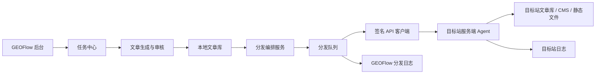

# GEOFlow 分发管理模块页面设计与技术实施方案

> 版本：v0.1
> 日期：2026-05-17
> 状态：方案评审稿
> 目标：把 GEOFlow 从单站内容生成与发布系统，升级为可以集中管理多个目标网站内容生产、审核、分发、同步和回滚的多站点内容中控系统。

## 1. 方案结论

“分发管理”模块可行，但核心实现不建议依赖前端 JS 包直接控制目标站点。更稳妥的架构是：

```text
GEOFlow 中控系统
-> 分发队列
-> 签名 API
-> 目标站服务端 Agent
-> 目标网站内容存储与发布系统
```

JS 文件包可以作为前台嵌入、展示组件或安装辅助存在，但不应该持有写权限，也不应该承担文章增删改查能力。真正的创建、更新、删除、下架、图片同步、分类同步等动作，应通过目标站服务端 Agent 完成。

## 2. 核心目标

- 在 GEOFlow 后台新增一级模块“分发管理”。
- 管理多个目标站点或内容分发渠道。
- 创建任务时可选择一个或多个分发渠道。
- 文章仍由 GEOFlow 生成、审核、入库和管理。
- 发布时通过队列把内容同步到目标站点。
- 每个目标站点通过服务端 Agent 接收 GEOFlow 的签名请求。
- 支持每个渠道的模板、分类、作者、发布状态、日志和失败重试。
- 不影响现有 GEOFlow 站内文章生成、审核、发布和前台展示逻辑。

## 3. 边界与不做事项

第一阶段不做这些能力：

- 不做纯前端 JS 写入目标站点。
- 不直接支持所有第三方平台 API。
- 不做复杂的跨站主题在线编辑器。
- 不让分发失败影响 GEOFlow 本地文章状态。
- 不把目标站数据库权限暴露给 GEOFlow。
- 不做无鉴权的远程 Webhook。

第一阶段重点是把底座做稳：

- 分发渠道管理。
- 任务绑定分发渠道。
- 分发队列。
- 服务端 Agent 协议。
- HMAC 签名通信。
- 分发状态、日志、重试和审计。

## 4. 系统架构



架构原则：

- GEOFlow 是内容主库，目标站是分发副本。
- 分发动作必须异步执行。
- 每个目标站使用独立密钥、独立状态和独立日志。
- 远程失败只影响对应渠道的分发状态，不影响本地文章发布。
- 所有写操作必须有签名、幂等、审计和失败重试。

## 5. 核心概念

### 5.1 分发渠道

分发渠道代表一个目标站点或一个远程内容接收端。例如：

- `geo.example.com`
- `news.example.com`
- 客户官网的 GEO 子频道
- WordPress 站点
- Laravel 站点
- 静态站点构建服务

渠道核心字段：

| 字段 | 说明 |
| --- | --- |
| 名称 | 后台显示名称，例如“移山科技官网 GEO 频道” |
| 域名 | 目标站点域名，例如 `https://example.com` |
| 渠道类型 | `geoflow_agent`、`wordpress_agent`、`laravel_agent`、`static_agent`、`webhook` |
| Agent 地址 | 目标站 Agent API 地址 |
| 模板 | 该渠道默认使用的前台模板 |
| 状态 | 未验证、正常、异常、禁用 |
| 最近心跳 | Agent 最近一次健康检查时间 |
| 最近错误 | 最近一次分发或心跳失败原因 |
| 创建人 | 创建该渠道的管理员 |

### 5.2 服务端 Agent

服务端 Agent 是安装在目标网站服务器上的轻量接收器，不是 AI 终端，也不是大模型服务。

它负责：

- 接收 GEOFlow 的签名请求。
- 校验来源、签名、时间戳、nonce 和幂等 key。
- 把文章写入目标站数据库、CMS 或静态文件。
- 返回远程文章 ID、远程 URL 和执行结果。
- 提供健康检查接口。
- 记录目标站本地日志。

### 5.3 分发任务

分发任务是“某篇文章同步到某个渠道”的一次可追踪动作。

示例：

```text
文章 A -> 渠道 1 -> 待推送
文章 A -> 渠道 2 -> 已成功
文章 A -> 渠道 3 -> 失败待重试
```

### 5.4 渠道模板

渠道模板用于控制目标站的页面样式和结构。第一阶段建议复用 GEOFlow 当前已有 themes 机制。后续可扩展为：

- GEOFlow 托管模板。
- Agent 安装包模板。
- 静态站模板。
- JS 嵌入组件模板。

## 6. 后台页面设计

### 6.1 顶部菜单

后台顶部新增一级菜单：

```text
分发管理
```

菜单位置建议放在“任务管理”和“文章管理”之间，原因是分发逻辑承接任务和文章。

### 6.2 分发管理首页

路径建议：

```text
/admin/distribution
```

页面目标：

- 让管理员快速看到所有渠道状态。
- 快速发现失败渠道。
- 快速进入安装、日志、重试和配置。

页面模块：

| 模块 | 内容 |
| --- | --- |
| 顶部统计卡片 | 渠道总数、正常渠道、异常渠道、今日分发、失败待处理 |
| 分发渠道列表 | 名称、域名、类型、模板、状态、最近心跳、最近错误、操作 |
| 最近分发日志 | 最近 10 条分发成功或失败记录 |
| 快速入口 | 新建渠道、查看队列、失败重试、安装文档 |

渠道列表操作按钮：

- 查看
- 编辑
- 测试连接
- 生成安装包
- 查看日志
- 禁用
- 删除

删除需要二次确认。已有关联分发记录的渠道默认只能禁用，不建议物理删除。

### 6.3 新建分发渠道页面

路径建议：

```text
/admin/distribution/channels/create
```

页面字段：

| 字段 | 类型 | 规则 |
| --- | --- | --- |
| 渠道名称 | 文本框 | 必填，2-80 字 |
| 目标域名 | URL 输入框 | 必填，自动补全协议 |
| 渠道类型 | 下拉选择 | 默认 `GEOFlow Agent` |
| Agent API 地址 | URL 输入框 | 可自动根据域名生成 |
| 前台模板 | 下拉选择 | 读取现有 themes |
| 默认发布方式 | 单选 | 草稿、直接发布、跟随 GEOFlow |
| 图片策略 | 单选 | 使用远程 URL、同步到目标站、不分发图片 |
| 分类策略 | 单选 | 自动创建、手动映射、使用默认分类 |
| 作者策略 | 单选 | 自动创建、手动映射、使用默认作者 |

页面按钮：

- 保存并生成密钥
- 保存并验证域名
- 取消

保存后进入渠道详情页。

### 6.4 渠道详情页

路径建议：

```text
/admin/distribution/channels/{channelId}
```

页面模块：

- 基本信息：名称、域名、类型、模板、状态。
- 安装状态：未安装、已检测、版本过低、异常。
- 密钥信息：Channel ID、Secret 只允许重置，不再次明文展示。
- Agent 安装说明：根据渠道类型展示安装步骤。
- 健康检查：最近心跳、Agent 版本、目标站时间、目标站环境。
- 分发统计：成功数、失败数、待重试数、最近成功时间。
- 最近日志：请求摘要、响应摘要、错误原因。

操作按钮：

- 测试连接
- 验证域名
- 生成安装包
- 重置密钥
- 禁用渠道
- 查看全部日志

### 6.5 Agent 安装包页面

路径建议：

```text
/admin/distribution/channels/{channelId}/install
```

页面目标：

- 给站长明确安装方式。
- 生成当前渠道专属配置。
- 避免用户手动复制错误。

安装方式：

| 类型 | 输出 |
| --- | --- |
| PHP Agent | `geoflow-agent.php`、配置文件、Nginx/Apache 示例 |
| Laravel Agent | route/controller/config 中间件包 |
| WordPress Agent | 插件 zip |
| Static Agent | Node/PHP 接收器与构建脚本 |
| JS Embed | 只读展示 snippet |

页面展示：

- 下载 Agent 包。
- 复制安装命令。
- 复制环境变量。
- 复制 Nginx 规则。
- 安装后点击“检测 Agent”。

### 6.6 分发队列页面

路径建议：

```text
/admin/distribution/jobs
```

筛选项：

- 渠道
- 文章
- 任务
- 状态
- 日期
- 错误类型

列表字段：

| 字段 | 说明 |
| --- | --- |
| 文章标题 | 本地文章 |
| 渠道 | 目标站 |
| 动作 | 创建、更新、删除、下架、重试 |
| 状态 | 排队中、推送中、成功、失败、已取消 |
| 尝试次数 | 当前重试次数 |
| 远程 URL | 成功后可点击 |
| 最近错误 | 失败摘要 |
| 操作 | 查看日志、重试、取消 |

### 6.7 分发日志页面

路径建议：

```text
/admin/distribution/logs
```

日志展示规则：

- 默认展示最近 100 条。
- 支持按渠道、文章、任务、状态筛选。
- 请求体和响应体只展示摘要。
- 密钥、Token、Cookie、Authorization 必须脱敏。

日志级别：

- `info`
- `warning`
- `error`
- `security`

### 6.8 任务创建页面改造

在创建任务页面新增模块：

```text
内容分发
```

字段：

| 字段 | 类型 | 说明 |
| --- | --- | --- |
| 是否启用分发 | 开关 | 默认关闭 |
| 分发渠道 | 多选 | 可选择多个正常渠道 |
| 分发时机 | 单选 | 本地发布后、审核通过后、生成草稿后 |
| 远程发布状态 | 单选 | 草稿、发布、跟随本地状态 |
| 失败策略 | 单选 | 失败不阻塞、失败后暂停分发、失败后暂停任务 |
| 重试次数 | 数字 | 默认 3 次 |

建议默认值：

- 分发时机：本地发布后。
- 远程发布状态：跟随本地状态。
- 失败策略：失败不阻塞。
- 重试次数：3。

### 6.9 任务列表页面改造

任务列表增加：

- 分发渠道数量。
- 分发进度，例如 `3/5 已同步`。
- 分发失败数量。
- 查看分发记录按钮。

### 6.10 文章列表页面改造

文章列表增加：

- 分发状态：未分发、排队中、部分成功、全部成功、失败。
- 远程链接入口。
- 手动分发按钮。
- 重新分发按钮。
- 远程下架按钮。

### 6.11 文章编辑页面改造

文章编辑页增加“分发设置”折叠模块：

- 选择额外分发渠道。
- 查看各渠道标题、slug、分类、作者映射。
- 支持渠道级标题覆盖。
- 支持渠道级摘要覆盖。
- 支持渠道级远程发布状态。

第一阶段可以只读展示，不做复杂覆盖编辑。

## 7. 数据库设计

### 7.1 `distribution_channels`

```php
Schema::create('distribution_channels', function (Blueprint $table) {
    $table->id();
    $table->string('name', 120);
    $table->string('domain', 255);
    $table->string('agent_url', 500)->nullable();
    $table->string('channel_type', 60)->default('geoflow_agent');
    $table->string('theme_key', 120)->nullable();
    $table->string('status', 40)->default('pending');
    $table->string('verification_status', 40)->default('unverified');
    $table->string('agent_version', 60)->nullable();
    $table->timestamp('last_heartbeat_at')->nullable();
    $table->text('last_error')->nullable();
    $table->json('config')->nullable();
    $table->foreignId('created_by')->nullable()->constrained('admins')->nullOnDelete();
    $table->timestamps();
    $table->softDeletes();

    $table->unique('domain');
    $table->index(['status', 'channel_type']);
});
```

### 7.2 `distribution_channel_secrets`

```php
Schema::create('distribution_channel_secrets', function (Blueprint $table) {
    $table->id();
    $table->foreignId('channel_id')->constrained('distribution_channels')->cascadeOnDelete();
    $table->string('key_id', 80)->unique();
    $table->text('secret_encrypted');
    $table->json('scopes')->nullable();
    $table->timestamp('expires_at')->nullable();
    $table->timestamp('last_used_at')->nullable();
    $table->boolean('is_active')->default(true);
    $table->timestamps();
});
```

### 7.3 `task_distribution_channels`

```php
Schema::create('task_distribution_channels', function (Blueprint $table) {
    $table->id();
    $table->foreignId('task_id')->constrained('tasks')->cascadeOnDelete();
    $table->foreignId('channel_id')->constrained('distribution_channels')->cascadeOnDelete();
    $table->string('trigger', 60)->default('after_local_publish');
    $table->string('remote_status', 40)->default('follow_local');
    $table->string('failure_policy', 60)->default('ignore_distribution_failure');
    $table->unsignedSmallInteger('max_attempts')->default(3);
    $table->timestamps();

    $table->unique(['task_id', 'channel_id']);
});
```

### 7.4 `article_distributions`

```php
Schema::create('article_distributions', function (Blueprint $table) {
    $table->id();
    $table->foreignId('article_id')->constrained('articles')->cascadeOnDelete();
    $table->foreignId('channel_id')->constrained('distribution_channels')->cascadeOnDelete();
    $table->string('action', 40)->default('create');
    $table->string('status', 40)->default('queued');
    $table->string('remote_id', 120)->nullable();
    $table->string('remote_url', 800)->nullable();
    $table->string('idempotency_key', 120)->unique();
    $table->string('payload_checksum', 80)->nullable();
    $table->unsignedSmallInteger('attempts')->default(0);
    $table->timestamp('last_attempted_at')->nullable();
    $table->timestamp('synced_at')->nullable();
    $table->text('last_error')->nullable();
    $table->json('payload_snapshot')->nullable();
    $table->timestamps();

    $table->unique(['article_id', 'channel_id', 'action']);
    $table->index(['status', 'channel_id']);
});
```

### 7.5 `distribution_logs`

```php
Schema::create('distribution_logs', function (Blueprint $table) {
    $table->id();
    $table->foreignId('article_distribution_id')->nullable()->constrained('article_distributions')->nullOnDelete();
    $table->foreignId('channel_id')->nullable()->constrained('distribution_channels')->nullOnDelete();
    $table->string('level', 30)->default('info');
    $table->string('event', 120);
    $table->text('message');
    $table->json('context')->nullable();
    $table->timestamps();

    $table->index(['channel_id', 'level', 'created_at']);
});
```

### 7.6 `distribution_domain_verifications`

```php
Schema::create('distribution_domain_verifications', function (Blueprint $table) {
    $table->id();
    $table->foreignId('channel_id')->constrained('distribution_channels')->cascadeOnDelete();
    $table->string('method', 40);
    $table->string('token', 160);
    $table->string('status', 40)->default('pending');
    $table->timestamp('verified_at')->nullable();
    $table->text('last_error')->nullable();
    $table->timestamps();
});
```

## 8. 后端服务设计

### 8.1 `DistributionChannelService`

职责：

- 创建渠道。
- 更新渠道。
- 生成密钥。
- 重置密钥。
- 禁用渠道。
- 验证域名。
- 测试 Agent 健康状态。

### 8.2 `DistributionOrchestrator`

职责：

- 在文章发布后匹配任务绑定的渠道。
- 创建 `article_distributions`。
- 避免重复创建分发任务。
- 根据渠道状态决定是否入队。
- 写入分发日志。

### 8.3 `DistributionPayloadBuilder`

职责：

- 把本地 `Article` 转成远程 Agent 统一 payload。
- 处理标题、摘要、正文、分类、作者、图片、SEO 字段。
- 生成 payload checksum。
- 生成幂等 key。

### 8.4 `DistributionHttpClient`

职责：

- 发送签名请求。
- 添加 HMAC headers。
- 处理超时。
- 处理 HTTP 错误。
- 对敏感响应脱敏。

### 8.5 `DistributionRetryPolicy`

职责：

- 判断错误是否可重试。
- 网络错误、5xx、429 可重试。
- 401、403、签名错误不自动重试，提示人工处理。
- 每个渠道可配置重试次数和重试间隔。

### 8.6 `ProcessArticleDistributionJob`

职责：

- 从队列读取分发任务。
- 构建 payload。
- 调用目标 Agent。
- 更新状态。
- 写入日志。
- 失败时按策略释放回队列。

## 9. 目标站 Agent API 协议

### 9.1 健康检查

```http
GET /geoflow-agent/v1/health
```

响应：

```json
{
  "ok": true,
  "agent_version": "1.0.0",
  "site_name": "Example Site",
  "server_time": "2026-05-17T10:00:00+08:00",
  "capabilities": ["articles.create", "articles.update", "articles.delete", "assets.upload"]
}
```

### 9.2 创建文章

```http
POST /geoflow-agent/v1/articles
```

请求：

```json
{
  "idempotency_key": "article-123-channel-5-create-v1",
  "article": {
    "source_id": 123,
    "title": "GEO 内容系统如何提升 AI 搜索可见度",
    "slug": "geo-content-system-ai-search-visibility",
    "excerpt": "本文介绍 GEOFlow 如何通过知识库、标题库和任务队列沉淀可信内容。",
    "content_html": "<h2>...</h2>",
    "content_markdown": "## ...",
    "status": "published",
    "published_at": "2026-05-17T10:00:00+08:00",
    "category": {
      "name": "科技资讯",
      "slug": "tech"
    },
    "author": {
      "name": "姚金刚"
    },
    "seo": {
      "meta_title": "GEO 内容系统如何提升 AI 搜索可见度",
      "meta_description": "GEOFlow 多站点内容生成与分发方案。",
      "keywords": ["GEO", "AI 搜索", "内容系统"]
    },
    "assets": []
  }
}
```

响应：

```json
{
  "ok": true,
  "remote_id": "987",
  "remote_url": "https://example.com/article/geo-content-system-ai-search-visibility",
  "status": "published"
}
```

### 9.3 更新文章

```http
PATCH /geoflow-agent/v1/articles/{remote_id}
```

### 9.4 下架或删除文章

```http
DELETE /geoflow-agent/v1/articles/{remote_id}
```

默认行为建议是下架，不是物理删除。

## 10. 签名机制

GEOFlow 请求目标 Agent 时必须带这些 header：

```text
X-GEOFlow-Key-Id: gfch_xxx
X-GEOFlow-Timestamp: 2026-05-17T10:00:00+08:00
X-GEOFlow-Nonce: 64-byte-random
X-GEOFlow-Idempotency-Key: article-123-channel-5-create-v1
X-GEOFlow-Signature: hex-hmac-sha256
```

签名原文：

```text
METHOD + "\n" +
PATH + "\n" +
TIMESTAMP + "\n" +
NONCE + "\n" +
SHA256(BODY)
```

签名：

```text
HMAC_SHA256(channel_secret, signing_string)
```

Agent 校验规则：

- 时间戳超过 5 分钟拒绝。
- nonce 已使用拒绝。
- body hash 不一致拒绝。
- key id 不存在拒绝。
- secret 已禁用拒绝。
- scope 不包含当前动作拒绝。

## 11. 状态机设计

### 11.1 分发渠道状态

```text
pending -> verifying -> active -> degraded -> disabled
pending -> failed
active -> disabled
degraded -> active
```

### 11.2 文章分发状态

```text
queued -> rendering -> sending -> synced
queued -> rendering -> failed
sending -> retrying -> sending
failed -> queued
synced -> update_queued -> sending -> synced
synced -> delete_queued -> sending -> deleted
```

## 12. 安全设计

### 12.1 密钥安全

- 渠道 secret 只在创建或重置时展示一次。
- 数据库存储必须加密。
- 页面展示永远脱敏。
- 支持手动吊销和重新生成。
- 每个渠道独立 secret。

### 12.2 域名验证

渠道创建后必须验证域名。

支持两种方式：

- DNS TXT：`geoflow-verification=xxxx`
- 文件验证：`https://example.com/.well-known/geoflow-verification.txt`

未验证渠道不能启用写入分发。

### 12.3 请求防重放

- Agent 记录 nonce，至少保留 10 分钟。
- 同一个 idempotency key 多次请求返回同一结果。
- 时间戳超过窗口拒绝。

### 12.4 权限 scope

建议 scope：

```text
articles:create
articles:update
articles:delete
articles:publish
assets:upload
categories:sync
health:read
```

### 12.5 审计日志

必须记录：

- 谁创建了渠道。
- 谁重置了密钥。
- 谁启用了渠道。
- 哪篇文章被推送到哪个渠道。
- 远程返回了什么状态。
- 哪个管理员执行了重试或删除。

### 12.6 失败隔离

- 一个渠道失败不影响其他渠道。
- 外部分发失败不影响本地文章状态。
- Agent 异常不应阻塞文章生成任务。
- 分发队列应设置最大并发和速率限制。

## 13. 和现有 GEOFlow 模块的关系

### 13.1 任务管理

任务负责生成内容和本地发布节奏。分发管理只接管“本地文章发布后的外部同步”。

### 13.2 文章管理

文章仍是唯一内容主库。分发记录只是文章在目标站点的同步副本状态。

### 13.3 网站设置

网站设置继续管理 GEOFlow 本站。分发渠道里的模板只影响目标渠道。

### 13.4 API Token

现有 API Token 机制可继续服务 GEOFlow 自身 API。目标站 Agent 使用独立的 channel secret，不建议复用管理员 API Token。

### 13.5 队列系统

现有队列可以承载分发任务。分发任务应使用独立 job class 和独立队列名，例如：

```text
distribution
```

## 14. 开发实施阶段

### 阶段一：后台与数据底座

目标：让 GEOFlow 能创建分发渠道，并在任务中绑定渠道。

包含：

- 新增分发相关数据表。
- 新增 `DistributionChannel` 等模型。
- 新增后台“分发管理”菜单。
- 新增渠道列表、创建、详情、编辑页面。
- 新增密钥生成和重置。
- 新增域名验证。
- 任务创建页增加分发渠道选择。
- 文章列表展示分发状态占位。

验收标准：

- 可以创建一个渠道。
- 可以生成 channel key 和 secret。
- 可以测试健康检查。
- 可以在创建任务时选择渠道。
- 不影响原有任务生成与发布。

### 阶段二：分发队列与 Agent 协议

目标：让文章可以通过签名 API 推送到目标 Agent。

包含：

- 新增 `DistributionOrchestrator`。
- 新增 `DistributionPayloadBuilder`。
- 新增 `DistributionHttpClient`。
- 新增 `ProcessArticleDistributionJob`。
- 新增 `article_distributions` 状态流转。
- 新增分发日志页面。
- 新增 Laravel/PHP Agent 示例。

验收标准：

- 本地文章发布后能创建分发任务。
- 分发任务能发送签名请求。
- 目标 Agent 能校验签名。
- 成功后写入 remote_id 和 remote_url。
- 失败后写入日志并可重试。

### 阶段三：安装包与多目标适配

目标：让用户可以更容易安装目标站 Agent。

包含：

- 生成 PHP Agent 安装包。
- 生成 Laravel Agent 安装包。
- 生成 WordPress 插件草案。
- Agent 安装说明页。
- Agent 版本检测。
- Agent 能力检测。

验收标准：

- 后台可下载当前渠道专属安装包。
- 安装后可以通过健康检查。
- Agent 版本低时后台有提示。

### 阶段四：高级分发能力

目标：提升多站点精细化运营能力。

包含：

- 分类映射。
- 作者映射。
- 渠道级标题/摘要覆盖。
- 图片同步策略。
- 远程下架与回滚。
- 渠道分发统计。
- 失败重试中心。

验收标准：

- 同一文章可分发到多个站点并有不同远程 URL。
- 某个渠道失败不影响其他渠道。
- 可以对单篇文章手动重新分发。
- 可以远程下架某篇文章。

## 15. 测试策略

### 15.1 单元测试

覆盖：

- HMAC 签名生成。
- HMAC 签名校验。
- payload checksum。
- idempotency key 生成。
- 失败重试策略。
- 状态流转。

### 15.2 功能测试

覆盖：

- 创建分发渠道。
- 重置渠道密钥。
- 域名验证。
- 任务绑定渠道。
- 文章发布后创建分发记录。
- 分发成功后记录 remote_url。
- 分发失败后写入日志。

### 15.3 集成测试

准备一个本地 Fake Agent：

```text
/fake-agent/v1/health
/fake-agent/v1/articles
/fake-agent/v1/articles/{id}
```

用于验证完整链路：

```text
创建文章 -> 发布文章 -> 创建分发任务 -> 队列执行 -> Fake Agent 返回成功 -> GEOFlow 保存远程 URL
```

### 15.4 安全测试

覆盖：

- 错误签名被拒绝。
- 过期时间戳被拒绝。
- 重复 nonce 被拒绝。
- 缺少 scope 被拒绝。
- Token 脱敏显示。
- 日志不泄露 secret。

## 16. 风险与应对

| 风险 | 影响 | 应对 |
| --- | --- | --- |
| 目标站 Agent 安装复杂 | 用户接入成本高 | 第一阶段先支持 GEOFlow 托管和 PHP/Laravel Agent |
| 远程站点 API 不稳定 | 分发失败 | 队列重试、失败隔离、人工重发 |
| Token 泄露 | 远程站点被写入垃圾内容 | 独立 secret、可吊销、scope、域名验证 |
| 分类/作者不一致 | 内容落库失败 | 渠道级映射和默认兜底 |
| 图片同步失败 | 文章展示不完整 | 支持引用远程 URL、跳过图片、重试上传 |
| 删除误操作 | 远程内容丢失 | 默认下架，不物理删除 |
| SEO 受 JS 影响 | 页面不被抓取 | 核心分发走服务端 Agent，不依赖 JS 渲染 |

## 17. 推荐第一版范围

第一版建议只做这些：

- 分发管理菜单。
- 分发渠道 CRUD。
- 渠道密钥与域名验证。
- 任务创建页选择分发渠道。
- 文章分发记录表。
- 分发队列与日志。
- Laravel/PHP Agent 协议样板。
- 健康检查和测试连接。
- 文章创建/更新/下架三个动作。

暂缓：

- WordPress 插件完整实现。
- 静态站生成。
- JS 嵌入包。
- 渠道级复杂模板编辑。
- 社交媒体平台 API。

## 18. 自检结论

本方案已按以下维度自检：

- 功能完整性：覆盖渠道管理、任务绑定、文章分发、Agent 通信、日志、重试和安全。
- 安全边界：避免前端 JS 持有写权限，采用服务端签名 API。
- 架构兼容：不破坏现有任务、文章、模板和 API Token 机制。
- 可迭代性：支持先做 GEOFlow 内部底座，再扩展 Agent 和第三方平台。
- 风险控制：明确远程失败不影响本地发布，删除默认下架。

建议进入开发前，先确认两个产品决策：

- 第一版是否优先做 `GEOFlow Agent`，暂不做 WordPress 插件。
- 远程删除动作第一版是否统一设计为“下架”，不做物理删除。
