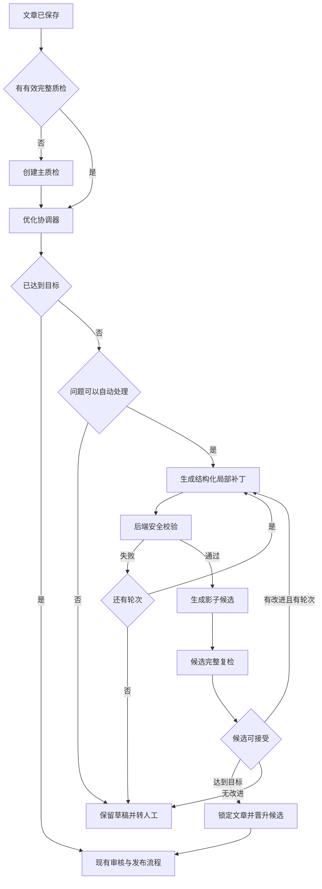

🥷 # GEOFlow AI 质检自动优化最终迭代方案（待确认）

> 状态：最终版，等待确认后实施
>
> 日期：2026-08-30
>
> 适用范围：任务创建与设置、任务监控、单篇文章编辑、AI 质检、发布门禁、Admin/API/CLI、Redis/Horizon
>
> 前一版：`docs/plans/2026-08-30-ai-quality-auto-optimization-iteration-plan.md`

本轮审查重新核对了当前代码、路由、CLI、队列配置、质检数据模型和评测样本。最终版已经补齐发布竞态、抽样恢复、并发租约、模型额度、未保存编辑、提示词注入、草稿回滚、API 幂等、多语言和部署回退等边界。本方案仍只定义升级内容，业务代码保持原状。

## 最终决策

| 项目 | 决定 |
| --- | --- |
| 产品形态 | 任务自动优化和单篇 AI 优化共用一套服务、状态机和审计记录 |
| 优化循环 | 质检给出问题，优化器生成局部补丁，候选经过完整复检，达到目标后停止 |
| 三个级别 | 风险优先、优秀 80+、严格 90+ |
| 发布分数 | 实际目标使用 `max(任务自动通过分, 级别分数)`，任何级别都不能降低现有发布门禁 |
| 内容写入 | 所有修改先进入影子候选，正式文章只在事务内一次性更新 |
| 候选存储 | 复用 `article_ai_quality_checks.article_snapshot`，优化表只保存运行状态和补丁，避免重复保存全文 |
| 单篇入口 | 有有效质检时显示“AI 优化”，没有有效质检时显示“AI 质检并优化” |
| 自动应用 | 只适用于未发布草稿、完整质检、通过全部安全校验且指纹一致的候选 |
| 抽样结果 | 只供人工参考；自动优化开启时，系统排队执行禁止抽样降级的完整复检 |
| 回滚 | 一键回滚只适用于尚未发布且没有分发记录的草稿 |
| 队列 | 交互请求与任务批量请求分优先级，候选复检复用现有质检前台和回填队列 |
| 上线顺序 | 单篇预览、任务影子运行、任务自动应用灰度、API/CLI 完整开放 |

## 需求范围

### 任务自动优化

任务开启 AI 质检后，可以继续开启“质检未达目标时自动优化”。系统在主质检完成后检查实际目标：

- 结果为 `blocked` 或 `needs_review`，且存在可自动处理的问题时，进入优化。
- 结果已经 `passed`，分数仍低于 80 或 90 级别的实际目标时，暂停自动发布并进入优化。
- 结果已经达到目标时，继续现有人工审核、自动发布和分发流程。

任务自动优化只处理任务生成的未发布草稿。已发布文章、手工创建且未绑定任务的文章、模型执行失败和证据不可用结果不会自动改写。

### 单篇文章 AI 优化

文章编辑页的 AI 质检卡片增加入口，手工文章和 AI 生成文章都可以使用。文章必须先保存，系统才能建立稳定的内容指纹和审计记录。

- 当前有有效完整质检结果时，入口显示“AI 优化”。
- 当前没有有效结果或结果已经过期时，入口显示“AI 质检并优化”。系统先创建完整质检，得到结果后自动继续。
- 编辑器存在未保存内容时，入口禁用并提示“请先保存文章”。系统不会静默保存或覆盖编辑器内容。
- 单篇模式默认生成候选并预览，编辑点击“应用并重新质检”后才更新文章。

文章创建页在首次保存前不显示该入口。现有手动编辑、问题定位和重新质检能力继续保留。

### 方案边界

- 已发布文章不会被任务自动优化，可以复制为草稿后处理。
- 优化器只使用文章、任务内容提示词、知识库证据和质检结果，不搜索互联网。
- 第一版每轮只生成一个候选，不做多候选并行搜索。
- 第一版不开放自由编辑优化提示词、轮次、编辑预算和任务级优化模型。
- 第一版不改变当前质检评分维度、权重和人工放行最低分。
- 第一版不自动修改分类、作者、Slug、发布状态、审核状态、图片关联和分发配置。

`docs/plans/2026-08-29-ai-quality-final-iteration-plan.md` 曾把“自动改写文章正文”列为非目标。本方案确认后只替换该项范围定义，原方案中的稳定性、证据、评分、超时和质量门禁继续有效。

## 当前系统依据

截至 2026-08-30，运行时检查得到 Laravel 12.64.0。Admin 和 API 已提供 AI 质检状态、重新质检和人工放行接口；本地 CLI 已提供 `ai-quality-status`、`ai-quality-recheck` 和 `ai-quality-override`。

| 当前能力 | 真实代码或路由 | 本次复用方式 |
| --- | --- | --- |
| 任务 AI 质检配置 | `Task`、`TaskLifecycleService`、`Admin\TaskController`、`Api\V1\TaskController` | 增加两个配置字段，保持现有校验、复制、读回和策略失效方式 |
| 文章内容指纹 | `ArticleRiskScanner::contentHash()` | 优化运行、并发检查和应用操作统一使用同一算法 |
| 结构化问题与位置 | `ArticleAiQualityResultValidator` | 只自动处理 `location_status=resolved` 的唯一定位，偏移量按 UTF-8 字符计算 |
| 根因与评分 | `ArticleAiQualityScorerV2` | 选择高优根因，比较决定、门禁原因、风险和分数 |
| 质检快照 | `ArticleAiQualityCheck::article_snapshot` | 保存原文与每轮候选，优化表不再重复保存全文 |
| 候选模式字段 | `evaluation_mode`、`gate_applied`、`baseline_check_id` | 候选复检不参与发布，最终候选在应用事务中晋升 |
| 发布统一入口 | `ArticlePublicationQualityGate`、`ArticleWorkflowTransitionService` | 所有 Admin、API、任务和分发路径都能阻止优化中的文章发布 |
| 任务配置失效 | `ArticleAiQualityInvalidationService` | 内容、知识库、模型、质检提示词变化时同步让优化运行过期 |
| 模型额度 | `AiUsageQuotaService`、`ArticleContentGenerationService`、`LaravelArticleAiQualityReviewer` | 每次修改和复检都预占额度，成功记录，调用前失败时释放 |
| 队列和恢复 | `config/horizon.php`、质检前台与回填队列、`ReconcileArticleAiQualityJob` | 增加优化优先队列、批量队列、运行租约和恢复任务 |
| 管理端进度 | `ArticleAiQualityProgressPresenter`、`article-ai-quality-progress.js` | 现有状态响应增加 `optimization`，保持一次轮询 |

当前 `tests/Fixtures/ai-quality/golden-v1.json` 只有 6 条起始样本。文件中的 240 条是目标要求，尚未形成真实 240 条数据。自动应用上线前必须补齐该评测集，这一项已经写入发布门槛。

## 参考机制

本方案借鉴算法结构，不引入 Python 运行时、外部编排服务或新的 API Key。

| 资料 | 采用的机制 |
| --- | --- |
| [Self-Refine](https://github.com/madaan/self-refine) | 初始结果、明确反馈、有限次迭代和完整历史 |
| [TextGrad](https://github.com/zou-group/textgrad) 与 [Nature 论文](https://www.nature.com/articles/s41586-025-08661-4) | 把问题、上下文和约束作为自然语言梯度指导修改 |
| [LangGraph evaluator-optimizer](https://docs.langchain.com/oss/python/langgraph/workflows-agents) | 生成器、评估器、条件分支和可恢复状态 |
| [DSPy Refine](https://github.com/stanfordnlp/dspy/blob/main/docs/docs/cheatsheet.md) | 最大尝试次数、目标阈值、提前停止和最佳候选保留 |
| [Anthropic: Building effective agents](https://www.anthropic.com/engineering/building-effective-agents) | 评价标准明确时使用 evaluator-optimizer，并设置人工检查点和停止条件 |

## 三级策略

| 策略值 | 界面名称 | 实际目标 | 单轮正文编辑预算 | 最多轮次 | 单轮逻辑调用 |
| --- | --- | --- | --- | --- | --- |
| `pass` | 风险优先，达标即可 | 任务自动通过分 | 15%，上限 8,000 字符 | 1 | 1 次修改和 1 次完整复检 |
| `excellent_80` | 优秀 80+ | `max(自动通过分, 80)` | 25%，上限 8,000 字符 | 2 | 每轮 1 次修改和 1 次完整复检 |
| `excellent_90` | 严格 90+ | `max(自动通过分, 90)` | 35%，上限 8,000 字符 | 3 | 每轮 1 次修改和 1 次完整复检 |

任务默认自动通过分是 85。选择“优秀 80+”时，界面显示“实际目标 85 分，受自动通过分约束”。任务自动通过分是 95 时，“严格 90+”的实际目标也为 95。

单篇文章没有任务时，自动通过分沿用手动质检策略，默认 85。单篇面板可以临时选择三级策略，这个选择只作用于本次运行。

轮次和预算固定在 `config/geoflow.php`，任务表只保存开关和级别。界面展示服务器返回的实际目标、最大轮次和预计最长时间，不在 JavaScript 中重复计算业务规则。

## 触发与停止

### 可以进入优化的结果

- 文章状态是 `draft`，未进入回收站。
- 来源质检为完整模式，状态是 `completed`，内容指纹和策略指纹有效。
- 至少一个问题定位成功且属于自动处理白名单，或结果已通过发布门禁但低于更高目标，并且质检给出了可执行问题。
- 同一文章、基础内容、策略和触发来源没有活跃运行。
- 内容模型和质检模型可用，当前每日额度可以预占。

### 直接转人工的结果

- 模型失败、证据构建失败、质检取消、过期或结果结构无效。
- 问题位置无法唯一确定。
- 修改需要新增没有证据的重要事实、数字、链接、资质或效果承诺。
- 法律、医疗、金融、合同、活动规则和监管语境需要人工判断。
- AI 标识、广告标识和发布标识由正文外字段控制。
- 文章已经发布、设为私有、删除，或正在分发。

### 抽样质检

任务同时开启超时抽样和自动优化时，自动优化目标需要完整质检确认：

1. 抽样结果到达后，文章保持草稿。
2. 系统创建 `allow_sampling=false` 的完整复检，放入 `ai-quality-backfill`。
3. 完整结果到达后继续优化判断。
4. 完整复检再次超时或失败时，停止自动运行并转人工，禁止反复创建完整复检。
5. 管理员仍可按现有人工放行规则填写依据并放行。

候选复检始终使用 `allow_sampling=false`。任务自动候选走质检回填队列，单篇交互候选走质检前台队列。

### 停止条件

- 决定为 `passed`，分数达到实际目标，所有安全校验通过。
- 达到策略最大轮次。
- 连续两次补丁结构或安全校验失败。
- 候选没有优于当前最佳结果。
- 文章、任务策略、知识库、提示词、模型或算法版本变化。
- 运行超过服务端计算的 `deadline_at`。
- 管理员取消、人工放行、删除文章、暂停或删除任务。

## 总体架构



### 角色分工

内容模型承担优化器，质检模型承担评估器。任务文章使用任务内容模型及其智能故障转移顺序；质检继续使用任务质检模型及现有候选顺序。

没有任务的单篇文章复用编辑器现有 AI 模型选择器，请求中显式提交 `optimization_model_id`。没有选择有效聊天模型时，界面提示选择模型，服务端不会静默选择其他模型。质检策略继续由 `resolveForManualInspection()` 解析。

### 新增契约

新增 `ArticleAiOptimizationRefiner` 接口及 Laravel AI SDK 实现。它使用结构化输出生成补丁，模型不支持结构化输出时允许一次严格 JSON 回退，所有回退结果仍经过同一校验器。每个逻辑修改调用最多两次供应商尝试，真实尝试次数写入 `usage_meta`。

优化提示词把文章、问题和证据放入清晰的数据边界，并声明其中所有指令都是不可信内容。优化器没有工具调用、网络访问、数据库访问和文件访问能力。

## 状态机

### 优化运行状态

```text
awaiting_quality
  -> queued
  -> planning
  -> rewriting
  -> validating
  -> evaluating
  -> rewriting | candidate_ready | applying | completed | needs_review

任何非终态
  -> stale | cancelled | failed
```

| 状态 | 含义 |
| --- | --- |
| `awaiting_quality` | 单篇入口尚无完整质检，或正在等待禁止抽样的完整复检 |
| `queued` | 已有有效来源质检，等待优化队列 |
| `planning` | 选择根因、证据和本轮允许修改的范围 |
| `rewriting` | 调用内容模型生成结构化补丁 |
| `validating` | 后端验证补丁、事实、Markdown 和编辑预算 |
| `evaluating` | 候选质检运行中 |
| `candidate_ready` | 单篇候选达到目标，等待人工应用 |
| `applying` | 正在锁定文章并晋升候选 |
| `completed` | 候选已经应用，或来源文章本来就达到目标 |
| `needs_review` | 轮次耗尽、没有安全候选或完整质检无法完成 |
| `failed` | 系统执行异常且重试耗尽 |
| `stale` | 文章或策略变化，候选只允许查看 |
| `cancelled` | 管理员、任务暂停或删除触发取消 |

### 现有质检工作流状态

`ArticleAiQualityInspectionService::applyCompletedWorkflow()` 是接入风险最高的位置。`execution_meta.workflow_apply.status` 增加 `waiting_optimization`：

- 主质检达到较高目标时，沿用 `processing -> succeeded`。
- 主质检需要优化时，协调器先把状态从 `pending` 原子改为 `waiting_optimization`，再创建或复用优化运行。
- `beginWorkflowApplyAttempt()` 遇到 `waiting_optimization` 时不发布。
- 优化成功后，最终候选质检晋升为 `optimization_final`，使用新的 `workflow_apply=pending` 继续原工作流。
- 优化失败或转人工时，来源质检记录为 `held_for_review`，文章保持草稿。

候选复检使用：

```text
evaluation_mode = optimization_candidate
gate_applied = false
baseline_check_id = 来源质检或上一轮候选质检 ID
allow_sampling = false
```

候选完成事件只进入优化协调器。它不会调用发布工作流，也不会递归创建新的顶层运行。

当前 `article_ai_quality_checks.evaluation_mode` 是 `string(20)`，`optimization_candidate` 有 22 个字符。实施迁移需要先把该字段扩为 `string(32)`，避免 MySQL 严格模式报错或非严格模式截断。`optimization_final` 和现有值继续兼容。

### 最终候选晋升

应用事务按固定锁顺序执行：文章、任务、优化运行、质检记录、优化步骤。所有 Job 只传 ID，不序列化 Eloquent 模型。

1. 比较文章内容哈希、策略指纹、运行状态和取消标记。
2. 再跑一次确定性风险扫描和事实差异校验。
3. 用候选快照更新 `title/excerpt/content/keywords/meta_description`。
4. 把候选质检改为 `evaluation_mode=optimization_final`、`gate_applied=true`，并设置 `supersedes_check_id`。
5. 保存最终内容哈希和审计记录，运行进入 `completed`。
6. 事务提交后调用现有工作流转换服务。

专用应用服务直接晋升已经评估的候选，不调用普通文章保存中的批量质检失效逻辑。候选输入指纹在文章更新后必须等于当前质检指纹，契约测试负责锁定这条规则。

## 补丁协议

### 输出结构

```json
{
  "base_article_hash": "64-char-sha256",
  "strategy": "excellent_80",
  "operations": [
    {
      "field": "content",
      "anchor_start": 120,
      "anchor_end": 168,
      "replace_start": 100,
      "replace_end": 190,
      "old_text_hash": "64-char-sha256",
      "replacement": "修改后的 Markdown 片段",
      "issue_codes": ["knowledge_contradiction"],
      "root_cause_keys": ["..."],
      "evidence_keys": ["kb:42:block:7"],
      "reason": "修改理由"
    }
  ]
}
```

`anchor_start/end` 直接使用质检定位，`replace_start/end` 可以包含必要上下文，但必须位于同一段落，包含锚点，且扩展范围不超过 500 个 UTF-8 字符。偏移量统一使用字符位置，字节位置不参与协议。后端从较大偏移向较小偏移应用补丁。

### 自动处理白名单

| 问题 | 自动条件 |
| --- | --- |
| 知识库冲突、数据不一致 | 已审核证据给出唯一替换值 |
| 绝对化、夸大和高风险广告措辞 | 收敛措辞即可修复，不增加事实 |
| 占位符、残句和内容完整性 | 修改范围明确，位置唯一 |
| 引用范围不一致 | 已有证据精确支持修改后的表述 |
| 摘要、关键词和元描述问题 | 能从当前正文直接推导，不新增重要事实 |

`citation_missing`、`source_declared_unverified`、位置未解析、证据多义和高影响事实默认转人工。

### 后端校验

`ArticleAiOptimizationPatchValidator` 执行：

- 字段只允许 `title/excerpt/content/keywords/meta_description`，字段长度复用文章表单校验。
- 锚点必须来自来源质检，`location_status=resolved`，原文、偏移量和哈希完全一致。
- 替换范围包含锚点，位于同一段落，补丁互不重叠。
- 修改量不超过策略预算，操作数不超过 50。
- 问题代码、根因键和证据键都存在于来源质检。
- 不新增证据中没有的数字、网址、实体、资质、引语和效果承诺。
- 使用 `ArticleFactCandidateExtractor` 比较修改前后高重要性事实，任何新增高重要性事实都会拒绝候选。
- 使用 `ArticleRiskScanner` 检查确定性风险，严重或高风险不能增加。
- Markdown 标题、列表、表格、代码围栏、图片和链接语法完整。
- 已有图片、代码块和链接保持不变；新增链接一律拒绝，危险协议一律拒绝。
- 内容中的提示词、HTML 和脚本只按普通文本处理，差异界面必须转义后显示。

### 候选选择

候选先通过安全条件：

- 没有新增严重或高风险问题。
- 没有新增中风险根因；低风险问题不能增加总扣分。
- 没有新增无证据的重要事实。
- 确定性风险扫描没有变差。
- 主要标题、章节、关键实体、图片、链接和代码块保持完整。
- 正文字符数不低于基础文章的 75%，质检明确要求删除的范围可以豁免。

通过安全条件后按以下顺序比较：硬阻断数、严重和高风险数、门禁原因数、决定等级、总分、修改量。决定改善时允许总分最多下降 2 分；决定不变时总分至少提高 3 分，候选才进入下一轮。达到目标立即停止，其他轮次保留最佳候选。

## 数据模型

### `tasks` 新字段

| 字段 | 类型 | 默认值 | 说明 |
| --- | --- | --- | --- |
| `ai_quality_auto_optimize_enabled` | boolean | `false` | 是否允许任务自动优化 |
| `ai_quality_optimization_level` | string(20) | `excellent_80` | `pass/excellent_80/excellent_90` |

这两个字段进入模型 `fillable/casts/defaults`、Admin/API 校验、任务复制、任务读回和策略快照。AI 质检关闭时，服务端强制把自动优化开关归零。

只修改这两个字段时，不让已有完整质检失效：关闭开关会取消 `task_auto` 运行并按当前质检恢复原工作流；修改级别会让当前自动运行过期，再按新目标重新判断。通过分、质检模型、质检提示词、知识库和内容模型变化时，继续使用现有质检失效流程，并同步让优化运行过期。

### `article_ai_optimization_runs`

| 字段组 | 字段 |
| --- | --- |
| 关联 | `article_id`、`task_id`、`source_check_id`、`best_check_id`、`final_check_id`、`initiated_by` |
| 请求 | `request_key`、`trigger`、`strategy`、`target_score`、`max_rounds`、`completed_rounds` |
| 状态 | `status`、`stop_reason`、`error_code`、`error_message`、`cancel_requested_at` |
| 指纹 | `base_article_hash`、`policy_fingerprint`、`active_dedupe_key` |
| 租约 | `lease_owner`、`lease_expires_at`、`deadline_at` |
| 审计 | `usage_meta`、`execution_meta`、`started_at`、`finished_at`、时间戳 |

`article_id` 使用 `cascadeOnDelete`，`task_id`、质检 ID 和管理员 ID 使用 `nullOnDelete`。`request_key` 唯一；`active_dedupe_key` 是 64 位可空唯一键，终态时清空。状态使用字符串，不使用数据库 enum，保持 MySQL、PostgreSQL 和 SQLite 测试兼容。

### `article_ai_optimization_steps`

| 字段组 | 字段 |
| --- | --- |
| 关联 | `run_id`、`round`、`input_check_id`、`output_check_id`、`model_id` |
| 状态 | `status`、`rejection_reason`、`request_key` |
| 内容 | `selected_root_causes`、`patch_plan`、`applied_patch`、`validation_result` |
| 指纹 | `before_hash`、`after_hash` |
| 评分 | `before_score`、`after_score`、`before_decision`、`after_decision` |
| 审计 | `usage_meta`、`execution_meta`、`started_at`、`finished_at`、时间戳 |

运行和步骤不保存全文。来源、每轮候选和最终候选都引用现有质检记录的 `article_snapshot`。补丁在步骤表中保留审计；没有通过校验的候选只保存哈希和安全错误，不保存模型输出的整篇内容。

### 关系与清理

- 文章软删除时取消活跃运行，历史保留在回收站期间可读。
- 文章永久删除时，运行、步骤和关联质检按外键级联删除。
- 任务软删除时取消自动运行并保留 `task_id`；任务永久删除后 `task_id` 置空。
- 第一版沿用当前质检历史保留策略。新增存储指标达到阈值后，再单独设计快照清理，不在本次悄悄删除历史。

## 并发、幂等与失效

### 幂等

- 活跃唯一键由 `article_id + base_article_hash + policy_fingerprint + strategy + trigger` 生成。
- Admin 请求携带页面生成的 `request_key`，API 和 CLI 使用 `Idempotency-Key`。
- 每个步骤有独立 `request_key`，队列重试先读步骤状态，再决定是否调用模型。
- 同一篇文章任意时刻只允许一个活跃优化运行，自动触发和手动触发互斥。
- Job 使用数据库租约。租约过期后由恢复任务重新排队，旧 Worker 不能提交结果。

### 锁顺序

所有写事务统一按文章、任务、运行、质检、步骤的顺序加锁。死锁只对数据库识别出的可重试错误做有限重试和抖动，业务冲突返回 409。

### 失效事件

| 事件 | 自动运行 | 单篇手动运行 |
| --- | --- | --- |
| 文章内容保存 | `stale` | `stale` |
| 质检提示词、质检模型、通过分、知识库变化 | `stale` | `stale` |
| 内容模型变化 | `stale` | 已冻结显式模型时继续，否则 `stale` |
| 只修改自动优化级别 | 旧运行 `stale`，按新级别重新判断 | 继续本次临时级别 |
| 关闭任务自动优化 | `cancelled`，恢复现有质检工作流 | 继续 |
| 暂停或删除任务 | `cancelled` | 继续，文章仍可编辑时有效 |
| 删除文章 | `cancelled` | `cancelled` |
| 人工放行 | `cancelled` | `cancelled` |

手动重新质检发现活跃优化时返回 409，界面提供“取消优化并重新质检”。人工放行在文章和运行锁内取消优化，再沿用现有放行审计。

## 发布门禁与回滚

`ArticleAiQualityGate` 增加优化状态检查，继续抛出当前 `ArticleAiQualityGateException`，新增安全错误码：

```text
article_ai_optimization_pending
article_ai_optimization_stale
article_ai_optimization_needs_review
```

这样现有 Admin、API、任务、手动发布和分发调用方可以继续使用同一异常契约。发布门禁在以下情况阻止发布：存在活跃运行、自动优化目标尚未达到、最终候选未晋升、运行已经转人工且当前质检仍未通过。

一键回滚只在这些条件同时满足时开放：文章仍为 `draft`、当前内容哈希等于优化结果、没有 queued/sending/synced 分发记录、来源质检快照仍存在。回滚后立即让最终质检过期，记录风险扫描并创建完整质检。

文章已经发布、设为私有或产生分发记录后，界面只提供“查看修改前版本”。恢复内容需要复制为草稿并重新走质检和发布流程，第一版不会直接覆盖已发布内容或远端渠道。

## 队列、额度和恢复

### 队列优先级

| 工作 | 队列 |
| --- | --- |
| 单篇手动修改 | `ai-content-optimization` |
| 任务自动修改、恢复和对账 | `ai-content-optimization-bulk` |
| 单篇候选质检 | `ai-quality` |
| 任务候选质检、禁止抽样的完整回填 | `ai-quality-backfill` |

Horizon 优化 Supervisor 按前台、批量顺序监听两个优化队列，初始 `maxProcesses=1`。一个 Job 只执行一个可恢复步骤，等待候选质检时立即释放 Worker。

### 模型额度

- 修改调用复用 `AiUsageQuotaService`，候选质检沿用 `LaravelArticleAiQualityReviewer` 的额度处理。
- 每次供应商调用前预占一次额度，成功后记账，连接前失败或空结果时释放。
- 额度耗尽时不切换到未经任务策略允许的模型。
- 任务批量运行受 `ArticleAiQualityBackfillGuard` 的保留额度约束，单篇交互请求优先。
- `usage_meta` 分别记录逻辑调用、供应商尝试、输入输出 token、模型和失败分类。

### 运行恢复

新增 `ReconcileArticleAiOptimizationJob` 和 `geoflow:reconcile-ai-optimization`：

- 清理过期租约并重新排队可恢复步骤。
- 把文章或策略已变化的运行标为 `stale`。
- 把超过 `deadline_at` 的运行标为 `needs_review`。
- 修复已经应用候选但尚未继续工作流的运行。
- 检查没有活跃运行的 `waiting_optimization` 主质检，恢复或转人工。

恢复命令加入 `routes/console.php` 定时任务。队列健康、陈旧运行和失败率进入现有 AI 质检健康检查。

## HTTP、API 与 CLI

### Admin 路由

Admin 前缀由现有路由组解析，代码只使用命名路由：

```text
POST articles/{articleId}/ai-quality/optimization
GET  articles/{articleId}/ai-quality/optimization/{runId}/candidate
POST articles/{articleId}/ai-quality/optimization/{runId}/apply
POST articles/{articleId}/ai-quality/optimization/{runId}/cancel
POST articles/{articleId}/ai-quality/optimization/{runId}/rollback
```

现有 `GET articles/{articleId}/ai-quality/status` 增加可空 `optimization` 对象，前端保持一次轮询。状态响应只返回进度、分数、轮次、时间和可执行动作，不返回全文和完整差异。候选达到可预览状态后，界面单独请求 candidate 路由。

所有写路由使用 Admin 认证、CSRF、活动日志和 `throttle:admin-sensitive`。状态与候选读取使用 `throttle:120,1`。`apply/cancel/rollback` 必须同时校验文章 ID、运行 ID、当前管理员权限和候选哈希。

### 响应契约

| 状态码 | 场景 |
| --- | --- |
| 200 | 读取状态、读取候选、重复取消、应用或回滚已经完成 |
| 202 | 新运行、等待质检、修改或复检已经排队 |
| 409 | 编辑器内容过期、运行冲突、哈希变化、状态不允许 |
| 422 | 策略、模型、问题或候选不具备执行条件 |
| 429 | 请求限流或模型额度不足，响应返回安全错误码 |

Candidate 响应按操作返回前后片段、问题代码、证据摘要和字段统计，最多 50 个操作。Blade 和 JavaScript 使用文本节点显示片段，禁止把候选内容注入 `innerHTML`。

### API 和 CLI

第三阶段增加 `/api/v1/articles/{article}/ai-quality/optimization*` 同等接口。读取使用 `articles:read`，开始、应用、取消和回滚使用 `articles:publish`，所有写请求复用 `IdempotencyService`。

GeoFlow CLI 增加：

```text
geoflow article ai-optimize ARTICLE_ID --level excellent_80 --model-id MODEL_ID --preview
geoflow article ai-optimization-status ARTICLE_ID
geoflow article ai-optimization-candidate ARTICLE_ID
geoflow article ai-optimization-apply ARTICLE_ID --run-id RUN_ID --candidate-hash HASH --idempotency-key KEY
geoflow article ai-optimization-cancel ARTICLE_ID --run-id RUN_ID --idempotency-key KEY
```

CLI 默认预览。应用必须显式指定运行 ID、候选哈希和幂等键。同步更新 `CommandSpec`、`ArticleHandler`、`OperationRegistry`、中英文 CLI 文档和命令测试。

## 管理端界面

### 任务创建与设置

自动优化设置放在截图红框位置，即超时抽样选项和工作流预览之间。沿用当前 AI 质检卡片的白底、蓝色主色、圆角和表单密度。

```text
┌ 质检未达目标时自动优化                                  [开关] ┐
│ AI 会按问题定位、原因、建议和证据修改文章，并重新质检。        │
│                                                                  │
│ [风险优先]          [优秀 80+ 推荐]          [严格 90+]          │
│ 实际目标 85 分       实际目标 85 分             实际目标 90 分     │
│ 1 轮，2 个步骤       2 轮，4 个步骤             3 轮，6 个步骤     │
│                                                                  │
│ 抽样结果只供参考，完整质检完成后再判断。                         │
└──────────────────────────────────────────────────────────────────┘
```

- AI 质检关闭时，区域禁用并收起说明。
- 自动优化开启后默认选择“优秀 80+”。
- 实际目标、轮次和预计最长时间来自后端策略预览接口或页面数据。
- 工作流预览显示：`生成文章 -> AI 质检 -> 未达目标时优化与复检 -> 人工审核或发布`。
- 桌面端三个选项同排，窄屏单列，支持键盘单选、清晰焦点和完整标签。
- 任务列表增加“AI 优化中 N / 待人工 N”，复用 `TaskMonitoringQueryService`，方便管理员发现积压。

### 单篇文章编辑

AI 质检卡片标题栏增加次要按钮。点击后在卡片内展开，不用弹窗遮挡编辑器：

```text
当前 72 分             目标：优秀 80+             [开始 AI 优化]
可自动处理 4 项        需人工确认 2 项

第 1 轮  已生成补丁 -> 校验通过 -> 完整复检 82 分

标题      原文 / 候选
正文      3 处修改，可逐处定位并查看问题与证据

[应用并重新质检] [放弃候选] [继续手动修改]
```

- 编辑器有未保存内容时禁用按钮。
- 没有完整质检时先显示质检进度，完成后自动转入优化。
- 有任务的文章使用任务内容模型；无任务文章复用现有 AI 助手模型选择器。
- 差异按标题、摘要、正文、关键词和元描述分组，片段以纯文本显示。
- 文章在运行期间被修改时，候选标为过期，仍可查看和复制局部建议。
- 草稿应用后可以按前述条件回滚；发布后只显示修改前版本。

语言包同步更新 `zh_CN`、`en` 和 `pt_BR`。JavaScript 不写死中文。

## 安全规则

- 文章、知识库、质检建议和模型输出全部视为不可信输入。
- 优化提示词明确隔离数据和系统约束，内容中的“忽略规则”等文本不会改变执行权限。
- 模型只能输出结构化补丁，没有工具调用和外部访问。
- 服务端严格校验字段、偏移、哈希、问题、证据、事实和 Markdown。
- 候选差异以转义文本显示，防止存储型 XSS。
- 新链接、危险协议、脚本标签、事件属性和未知 HTML 一律拒绝。
- 日志不记录 API Key，错误消息使用安全错误码，原始供应商异常只进入受控服务端日志。
- 每次开始、取消、应用、回滚、人工放行和自动发布都记录管理员或系统身份。

## 配置与观测

### 配置

```text
GEOFLOW_AI_QUALITY_OPTIMIZATION_ENABLED=false
GEOFLOW_AI_QUALITY_OPTIMIZATION_AUTO_APPLY_ENABLED=false
GEOFLOW_AI_QUALITY_OPTIMIZATION_PERCENT=0
GEOFLOW_AI_QUALITY_OPTIMIZATION_AUTO_APPLY_PERCENT=0
GEOFLOW_AI_QUALITY_OPTIMIZATION_QUEUE=ai-content-optimization
GEOFLOW_AI_QUALITY_OPTIMIZATION_BULK_QUEUE=ai-content-optimization-bulk
GEOFLOW_AI_QUALITY_OPTIMIZATION_MAX_ROUNDS=3
GEOFLOW_AI_QUALITY_OPTIMIZATION_RECOVERY_STALE_SECONDS=300
```

配置进入 `config/geoflow.php`、`config/horizon.php` 和 `.env.example`。百分比按任务或文章 ID 做稳定分桶，复用现有质检灰度记录方式。

### 指标

```text
ai_quality_optimization_runs_total{trigger,strategy,status}
ai_quality_optimization_rounds
ai_quality_optimization_score_delta
ai_quality_optimization_issue_delta{severity}
ai_quality_optimization_duration_seconds
ai_quality_optimization_queue_wait_seconds{queue}
ai_quality_optimization_model_attempts{model,status}
ai_quality_optimization_patch_rejections_total{reason}
ai_quality_optimization_stale_conflicts_total
ai_quality_optimization_auto_applies_total
ai_quality_optimization_rollbacks_total
ai_quality_optimization_active_leases
```

结构化日志包含 `article_id/run_id/step_id/source_check_id/candidate_check_id/base_hash/policy_fingerprint/strategy/target_score`。任务监控显示运行中、转人工和失败数量。

## 评测与放量门槛

### 数据准备

1. 补齐现有 golden-v1 要求的 240 条质检样本：校准 120、回归 60、盲测 60。
2. 从中建立 120 条优化基准，每个级别 40 条，覆盖知识冲突、广告风险、内容完整性、摘要和 SEO 字段。
3. 增加 30 条对抗样本，覆盖提示词注入、重复定位、Markdown 破坏、无证据事实、超长文章、并发保存、删除、取消和重复事件。
4. 两名审核者独立标注，分歧交给第三人裁决。报告同时给出样本数、点估计和 95% Wilson 区间。

### 自动应用门槛

| 指标 | 门槛 |
| --- | --- |
| 新增严重或高风险问题 | 0 |
| 新增无证据的重要事实、数字、网址或效果承诺 | 0 |
| Markdown、图片、链接和代码块损坏 | 0 |
| 过期候选覆盖新编辑 | 0 |
| 重复应用或重复发布 | 0 |
| 人工抽检的语义与结构保留通过率 | 至少 95% |
| 风险优先达标率 | 至少 80% |
| 优秀 80+ 达标率 | 至少 70% |
| 严格 90+ 达标率 | 至少 60% |
| 现有 AI 质检前台队列 P95 等待时间增幅 | 不超过 10% |
| 无人工处理的失败运行 | 0 |

任何安全指标越界，立即把自动应用百分比降到 0，单篇预览和现有质检可以继续使用。

## 实施阶段

### 阶段一：安全内核与单篇预览

交付：

- 两张数据表、模型、关系、状态、租约和幂等键。
- 优化器接口、提示词、结构化补丁、校验器、候选选择和影子质检。
- 单篇“AI 质检并优化”、进度、候选差异、人工应用、取消和草稿回滚。
- 两级优化队列、恢复任务、额度处理和全局开关。
- Admin 功能默认关闭，完成相关测试后在内部开启预览。

阶段验收：正式文章在应用前保持不变；未保存编辑不能启动；候选完整复检不触发发布；并发保存使候选过期；草稿应用与回滚均有审计。

### 阶段二：任务设置与影子运行

交付：

- 任务两个字段、Admin/API 校验、复制、读回、三级 UI 和三种语言。
- 主质检 `waiting_optimization`、任务自动运行、抽样完整回填和发布门禁保护。
- 任务列表运行数量、指标、健康检查和 240 条基础质检集。
- 自动应用保持关闭，候选只记录和展示，收集人工接受率与安全数据。

阶段验收：低于目标的任务草稿自动生成候选；现有发布路径都被优化门禁覆盖；关闭开关能恢复原工作流；质检前台队列 P95 增幅符合门槛。

### 阶段三：自动应用灰度、API 与 CLI

交付：

- 120 条优化基准和 30 条对抗样本通过门槛。
- 自动晋升候选、任务自动发布恢复、恢复对账和故障开关。
- API、CLI、命令帮助、中英文 CLI 文档和契约测试。
- 灰度按内部任务、5%、25%、100% 已主动开启的任务推进。

阶段验收：安全指标保持为 0；自动应用可随时独立关闭；停用后运行可取消或转人工；已发布文章不会被直接回滚。

## 部署与回退

### 部署顺序

1. 备份数据库，执行可逆迁移，功能开关和百分比保持 0。
2. 部署代码和 Horizon 配置，重启 Worker，确认四个相关队列可见。
3. 运行迁移契约、路由、权限、队列、状态机和相关测试。
4. 内部开启单篇预览。
5. 开启任务影子运行，观察至少一个完整业务周期。
6. 评测通过后逐级开启自动应用百分比。

### 运行时回退

1. 把 `GEOFLOW_AI_QUALITY_OPTIMIZATION_AUTO_APPLY_PERCENT` 调为 0。
2. 需要完全停用时关闭 `GEOFLOW_AI_QUALITY_OPTIMIZATION_ENABLED`，恢复任务工作流。
3. 取消或转人工处理活跃运行，确认没有 `applying` 状态和租约。
4. 保留新增表和历史记录，代码回退期间不执行 `down` 迁移。

开发和测试环境需要验证 `down` 迁移可逆。生产回退保留数据，后续版本确认无依赖后再安排数据清理。

## 预计改动面

### 现有文件

- `app/Models/Task.php`
- `app/Models/Article.php`
- `app/Models/ArticleAiQualityCheck.php`
- `app/Http/Controllers/Admin/TaskController.php`
- `app/Http/Controllers/Admin/ArticleController.php`
- `app/Http/Controllers/Api/V1/TaskController.php`
- `app/Http/Controllers/Api/V1/ArticleController.php`
- `app/Services/GeoFlow/TaskLifecycleService.php`
- `app/Services/GeoFlow/WorkerExecutionService.php`
- `app/Services/GeoFlow/ArticleAiQualityInspectionService.php`
- `app/Services/GeoFlow/ArticleAiQualityPolicyResolver.php`
- `app/Services/GeoFlow/ArticleAiQualityGate.php`
- `app/Services/GeoFlow/ArticleAiQualityInvalidationService.php`
- `app/Services/GeoFlow/ArticleAiQualityHealthService.php`
- `app/Services/GeoFlow/ArticlePublicationQualityGate.php`
- `app/Services/GeoFlow/TaskMonitoringQueryService.php`
- `app/Support/Admin/ArticleAiQualityProgressPresenter.php`
- `resources/views/admin/tasks/create.blade.php`
- `resources/views/admin/articles/form.blade.php`
- `resources/js/admin/task-form.js`
- `resources/js/admin/article-ai-quality-progress.js`
- `lang/zh_CN/admin.php`
- `lang/en/admin.php`
- `lang/pt_BR/admin.php`
- `routes/web.php`
- `routes/api.php`
- `routes/console.php`
- `config/geoflow.php`
- `config/horizon.php`
- `.env.example`
- `app/Console/GeoFlowCli/CommandSpec.php`
- `app/Console/GeoFlowCli/ArticleHandler.php`
- `app/Console/GeoFlowCli/OperationRegistry.php`
- `docs/GEOFLOW_CLI.md`
- `docs/GEOFLOW_CLI_en.md`
- `docs/ai-quality-inspection-runbook.md`

### 新增文件

- `app/Contracts/ArticleAiOptimizationRefiner.php`
- `app/Http/Controllers/Admin/ArticleAiOptimizationController.php`
- `app/Jobs/ProcessArticleAiOptimizationJob.php`
- `app/Jobs/ReconcileArticleAiOptimizationJob.php`
- `app/Console/Commands/ReconcileArticleAiOptimizationCommand.php`
- `app/Models/ArticleAiOptimizationRun.php`
- `app/Models/ArticleAiOptimizationStep.php`
- `app/Services/GeoFlow/LaravelArticleAiOptimizationRefiner.php`
- `app/Services/GeoFlow/ArticleAiOptimizationPolicyResolver.php`
- `app/Services/GeoFlow/ArticleAiOptimizationCoordinator.php`
- `app/Services/GeoFlow/ArticleAiOptimizationService.php`
- `app/Services/GeoFlow/ArticleAiOptimizationPromptRenderer.php`
- `app/Services/GeoFlow/ArticleAiOptimizationPatchValidator.php`
- `app/Services/GeoFlow/ArticleAiOptimizationCandidateSelector.php`
- `app/Services/GeoFlow/ArticleAiOptimizationInvalidationService.php`
- `app/Support/Admin/ArticleAiOptimizationProgressPresenter.php`
- `app/Support/Admin/ArticleAiOptimizationDiffPresenter.php`
- `resources/js/admin/article-ai-optimization-progress.js`
- `database/migrations/*_add_ai_quality_auto_optimization_to_tasks_table.php`
- `database/migrations/*_expand_article_ai_quality_evaluation_mode.php`
- `database/migrations/*_create_article_ai_optimization_runs_table.php`
- `database/migrations/*_create_article_ai_optimization_steps_table.php`

## 测试矩阵

### 数据与迁移

- MySQL、PostgreSQL 和 SQLite 下字段、索引、可空唯一键、外键和 `down` 迁移。
- 文章软删除、永久删除，任务软删除、永久删除的关系行为。
- 模型 `fillable/casts/defaults` 和任务复制读回。

### 策略与算法

- 通过分低于、等于和高于 80、90 时的实际目标。
- 已解析与未解析位置、UTF-8 字符偏移、重复引用、扩展段落边界和重叠补丁。
- 无证据数字、实体、链接和高重要性事实拒绝。
- Markdown、图片、链接、代码块和危险 HTML 拒绝。
- 候选比较、分数容差、提前停止、最佳候选和编辑预算。
- 提示词注入样本不能改变补丁协议和工具权限。

### 状态机与并发

- 没有质检时 `awaiting_quality`，完整结果到达后继续。
- 抽样结果创建一次禁止抽样的完整回填，失败后不循环。
- 两个完成事件、两个 Worker、租约过期和重复 Job 不重复调用或应用。
- 内容保存、任务配置变化、取消、删除和人工放行的状态迁移。
- 固定锁顺序和数据库死锁重试。
- 部署时算法版本变化使旧运行安全过期。

### 发布和回滚

- 主质检 85 分已通过、目标 90 分时进入 `waiting_optimization`，不会发布。
- 候选 `gate_applied=false` 时所有发布路径都被阻止。
- 最终候选在事务中晋升后只继续一次原工作流。
- 任务需要人工审核时，优化完成后进入审核，不自动发布。
- 草稿满足条件时回滚并重新质检。
- 已发布、私有或有分发记录文章不能一键回滚。

### HTTP、前端和 CLI

- Admin 认证、CSRF、限流、权限、状态码、请求键和候选哈希。
- API scope、Idempotency-Key、成功和失败响应。
- 状态响应保持原字段，`optimization` 为向后兼容的可空对象。
- 未保存编辑禁用、三级目标显示、进度、候选过期、纯文本差异和窄屏键盘操作。
- 三种语言键完整，无 JavaScript 硬编码中文。
- CLI help、预览默认、安全应用参数和安装路径调用。

### 建议验证命令

```bash
php artisan test tests/Unit/ArticleAiOptimizationPolicyResolverTest.php
php artisan test tests/Unit/ArticleAiOptimizationPatchValidatorTest.php
php artisan test tests/Unit/ArticleAiOptimizationCandidateSelectorTest.php
php artisan test tests/Feature/ArticleAiOptimizationServiceTest.php
php artisan test tests/Feature/AdminArticleAiOptimizationTest.php
php artisan test tests/Feature/ApiV1ArticleAiOptimizationTest.php
php artisan test tests/Feature/AiQualityTaskConfigurationTest.php
php artisan test tests/Feature/ArticleAiQualityGateTest.php
php artisan test tests/Unit/ArticleAiQualityMigrationContractTest.php
php artisan test tests/PostgreSQL
npm run test:analytics
php artisan route:list --path=ai-quality
bin/geoflow article --help
npm run build
```

实施完成后运行仓库完整测试和 `/check`。任何因当前脏工作区产生的验证结果都要在隔离工作树中复核。

## 确认项

整份方案确认即视为接受以下默认决定：

| 决定 | 默认值 |
| --- | --- |
| 任务自动优化 | 默认关闭，管理员主动开启 |
| 默认级别 | 优秀 80+，实际目标受任务自动通过分约束 |
| 单篇模式 | 保存后运行，先预览候选再人工应用 |
| 没有有效质检 | 自动执行完整质检后继续 |
| 手工文章优化模型 | 复用编辑器已选择的 AI 模型 |
| 抽样结果 | 不自动优化、不自动应用，排队完整复检 |
| 最大轮次 | 1、2、3 对应三级，系统上限 3 |
| 自动应用 | 达到目标、决定为 `passed`、安全校验通过、指纹一致 |
| 回滚 | 只允许未发布且没有分发记录的草稿一键回滚 |
| 失败结果 | 正式文章不变，保存审计和最佳候选，转人工 |
| 上线方式 | 单篇预览、任务影子、5%、25%、100% 已主动开启任务 |

确认后从阶段一开始实施。阶段三的自动应用只有在 240 条基础质检集、120 条优化基准和 30 条对抗样本达到发布门槛后才会开启。
