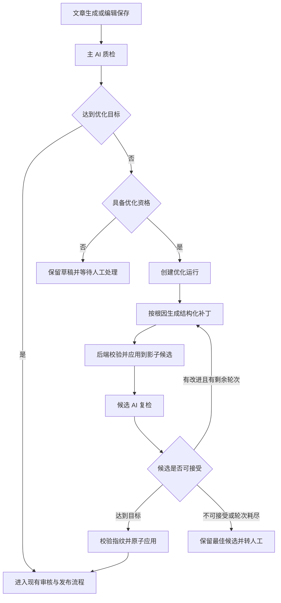

🥷 # GEOFlow AI 质检自动优化迭代方案（待确认）

> 状态：已完成 review，由最终版替代，尚未进入实施
>
> 日期：2026-08-30
>
> 适用范围：任务创建与设置、单篇文章编辑、AI 质检工作流、后台任务与管理端 API

最终版见：`docs/plans/2026-08-30-ai-quality-auto-optimization-final-iteration-plan.md`。

本方案只定义产品、算法和工程升级，不包含业务代码变更。确认后再按文末三个阶段实施。

## 方案摘要

AI 质检完成后，系统可以根据问题定位、原因和建议生成受约束的修改补丁，再用同一套质检规则评估修改候选。任务自动化场景在候选达到目标且通过安全校验后更新文章；单篇编辑场景默认先展示差异，由编辑决定是否应用。

| 决策 | 方案 |
| --- | --- |
| 优化方式 | 采用有次数上限的“质检、修改、复检”循环 |
| 三个级别 | 风险优先、优秀 80+、严格 90+ |
| 发布规则 | 现有自动通过分继续生效，优化目标只能提高要求 |
| 内容安全 | 在影子候选上修改和复检，通过后一次性更新正式文章 |
| 修改范围 | 优先生成结构化局部补丁，保留 Markdown 结构、图片、链接和代码块 |
| 单篇入口 | AI 质检卡片增加“AI 优化”，支持候选差异、应用、放弃和回滚 |
| 任务入口 | 截图红框位置增加自动优化开关与级别选择，工作流预览同步变化 |
| 运行方式 | 增加独立队列 `ai-content-optimization`，质检继续使用现有队列 |
| 发布节奏 | 单篇人工应用先上线，任务自动优化随后灰度，再补齐 API、CLI 和运维能力 |

## 需求理解

本次升级包含两类入口，共用一套优化服务和审计记录。

### 任务自动优化

任务开启 AI 质检后，可以继续开启“质检未达目标时自动优化”。文章生成完成并得到有效质检结果后，系统按所选级别处理：

- 风险优先：先处理严重、高风险和会触发质量门禁的问题，达到任务的自动通过分即可停止。
- 优秀 80+：目标分按 `max(任务自动通过分, 80)` 计算，最多两轮。
- 严格 90+：目标分按 `max(任务自动通过分, 90)` 计算，最多三轮。

任务当前默认自动通过分是 85。选择“优秀 80+”时，界面应显示“本任务实际目标 85 分，受自动通过分约束”。这条规则避免 80 分候选绕过 85 分发布门禁。任务将自动通过分设为 95 时，“严格 90+”的实际目标也应显示为 95。

满足以下任一条件时进入优化判断：质检结果为 `needs_review` 或 `blocked`，或结果已经 `passed` 但分数低于本次优化目标。候选达到目标后接回当前人工审核、定时发布和分发流程。

### 单篇文章 AI 优化

文章编辑页的 AI 质检卡片增加“AI 优化”入口。编辑可以选择目标级别，让系统根据当前质检问题生成修改候选。界面展示分字段差异、每处修改对应的问题和证据，并保留手动编辑入口。

单篇入口默认采用“生成候选并预览”。编辑点击“应用并重新质检”后，系统才更新文章。任务自动优化可以在达到目标后自动应用，因为管理员已经在任务设置中明确开启该能力。

### 本次范围变化

`docs/plans/2026-08-29-ai-quality-final-iteration-plan.md` 曾把“自动改写文章正文”列为非目标。本方案经确认后，将替换其中这一条非目标；原方案中的质检稳定性、评分、超时、证据和发布门禁约束继续有效。

## 当前代码已经提供的基础

截至 2026-08-30，GEOFlow 已经具备结构化质检、精确定位、质量门禁、异步执行和审计基础。本次升级可以在 Laravel、Redis、Horizon 和现有 AI 模型配置内完成。

| 当前能力 | 代码位置 | 可复用点 |
| --- | --- | --- |
| 任务质检开关、模型、方案、通过分、人工放行分 | `resources/views/admin/tasks/create.blade.php`、`resources/js/admin/task-form.js`、`TaskLifecycleService` | 增加自动优化开关与级别，沿用现有禁用、校验和策略快照方式 |
| 文章生成后触发质检 | `WorkerExecutionService` | 生成完成后创建主质检，优化成功后继续原工作流 |
| 质检策略快照 | `ArticleAiQualityPolicyResolver` | 把优化级别、实际目标和轮次写入文章快照，防止任务配置变更影响在途文章 |
| 结构化问题 | `ArticleAiQualityPromptRenderer`、`ArticleAiQualityResultValidator` | 已有字段、原文引用、偏移量、原因、建议、证据键和置信度，可直接作为修改输入 |
| 根因合并与评分 | `ArticleAiQualityScorerV2` | 按根因挑选高优问题，比较修改前后的决定、分数、门禁原因和风险数 |
| 发布门禁 | `ArticleAiQualityGate`、`ArticleAiQualityInspectionService::applyCompletedWorkflow()` | 在发布前插入优化协调器，保留现有锁、指纹和过期判断 |
| 持久化质检记录 | `article_ai_quality_checks`、`article_ai_quality_segments` | 候选复检可使用 `evaluation_mode`、`gate_applied=false` 和 `baseline_check_id` |
| 文章质检卡片 | `resources/views/admin/articles/form.blade.php` | 增加入口、进度、问题适用性和差异预览 |
| 管理端与 API 路由 | `routes/web.php`、`ArticleController`、`Api\V1\ArticleController` | 延续现有 `recheck/status/override` 结构增加优化接口 |
| 超时和降级 | `ProcessArticleAiQualityJob`、质检运行手册 | 优化任务单独排队，复检仍走现有 180 秒完整质检和受控采样逻辑 |

当前质检已经返回“文本梯度”所需的信息：哪段文字有问题、风险有多高、原因是什么、可参考哪些证据、建议如何改。新增优化器负责把这些信息转换成受约束补丁，质检器继续负责判分和放行。

## 参考算法与开源项目

本方案借鉴机制，不引入新的 Python 运行时、外部服务或第三方 API Key。

| 资料 | 可借鉴机制 | GEOFlow 中的用法 |
| --- | --- | --- |
| [Self-Refine](https://github.com/madaan/self-refine) | 初稿、反馈、迭代，保留历史并设置最大尝试次数 | 用质检问题作为明确反馈，每轮保存输入、补丁、候选和结果 |
| [TextGrad](https://github.com/zou-group/textgrad) 与 [Nature 论文](https://www.nature.com/articles/s41586-025-08661-4) | 用自然语言反馈指导文本更新，反馈中包含上下文和约束 | 把问题、证据、禁改项、历史失败原因一起交给优化模型 |
| [LangGraph evaluator-optimizer](https://docs.langchain.com/oss/python/langgraph/workflows-agents) | 生成器、评估器、条件分支和可持久化状态 | 在 Laravel 队列中实现显式状态机，每次模型调用都是可恢复的一步 |
| [DSPy Refine](https://github.com/stanfordnlp/dspy/blob/main/docs/docs/cheatsheet.md) | 最多 N 次尝试、奖励阈值、提前停止、保留最好候选 | 每个级别设置轮次和目标分，达到目标即停，失败时保留最佳候选供人工处理 |
| [Anthropic: Building effective agents](https://www.anthropic.com/engineering/building-effective-agents) | 评估标准清晰时使用 evaluator-optimizer，限制迭代次数并设置人工检查点 | 质检规则继续充当评估器，高风险和不确定事实交给人工处理 |

## 产品规则

### 三个优化级别

| 级别 | 显示名称 | 实际目标 | 每轮编辑预算 | 最多轮次 | 适用场景 |
| --- | --- | --- | --- | --- | --- |
| `pass` | 风险优先，达标即可 | 任务自动通过分 | 正文字符数的 15% | 1 | 发布效率优先，只处理门禁、高风险和严重问题 |
| `excellent_80` | 优秀 80+ | `max(自动通过分, 80)` | 正文字符数的 25% | 2 | 兼顾质量和耗时，推荐默认级别 |
| `excellent_90` | 严格 90+ | `max(自动通过分, 90)` | 正文字符数的 35% | 3 | 重要内容，允许更多调用和等待时间 |

编辑预算按单轮计算，并设置 8,000 字符的单轮绝对上限。标题、摘要、关键词和元描述单独按字段长度校验。后续可以根据真实数据调整数值，第一版先固定在配置文件中，避免任务表增加过多参数。

### 触发资格

自动优化只处理满足以下条件的文章：

- 文章仍处于未发布状态。
- 主质检已完成，结果未过期，文章指纹和策略指纹一致。
- 质检是完整模式，或完整模式已经明确完成。超时后的抽样结果只提供人工参考。
- 结果包含至少一个可自动处理的问题，或分数低于较高优化目标且质检器给出明确改进项。
- 同一文章、基础内容指纹和策略下没有运行中的优化任务。

这些情况不触发自动优化：模型调用失败、执行异常、质检取消、结果过期、证据构建失败、已发布文章、纯发布标识问题、没有可靠证据的新增事实请求。

任务同时开启超时抽样和自动优化时，自动优化目标需要完整质检确认。抽样结果到达后，文章保持草稿，系统把完整复检放入 `ai-quality-backfill` 队列；完整结果到达后继续优化判断。管理员仍可按现有门禁规则填写原因并人工放行。候选复检得到抽样结果时同样不能自动应用，系统会等待完整复检，或在运行预算耗尽后保存候选并转人工。

### 问题分流

| 问题类型 | 默认处理 | 条件 |
| --- | --- | --- |
| 知识库冲突、数据不一致 | 可自动优化 | 证据已审核、内容稳定，且替换值能从证据中直接得到 |
| 绝对化、夸大或高风险广告措辞 | 可自动优化 | 可以通过收敛措辞解决，修改不增加新事实 |
| 占位符、残缺句、内容完整性问题 | 可自动优化 | 修复范围明确，不需要猜测作者意图 |
| 引用范围错误 | 条件自动优化 | 已有证据能精确支持新的表述 |
| 缺少可信信源 | 转人工 | 系统没有经过审核的替代来源 |
| 促销、法律或监管语境不明 | 转人工 | 修改依赖活动规则、合同、资质或合规判断 |
| AI 标识、广告标识和发布标识 | 交给发布流程 | 这类字段由文章正文外的元数据控制 |
| 高影响事实存在多种解释 | 转人工 | 候选之间无法通过现有证据确定 |

### 本次实施边界

- 已发布文章不会被任务自动优化，编辑可以复制为草稿后处理。
- 优化器只使用任务提示词、知识库和质检证据，不自动搜索互联网信源。
- 第一版每轮只生成一个候选，不做多候选并行搜索。
- 第一版不开放自由编辑优化提示词、轮次、编辑预算和优化模型。
- 第一版不改变现有质检评分维度和权重，优化效果继续由当前评分器判断。

## 目标架构



优化器和质检器使用两个独立角色：内容模型生成补丁，质检模型按原规则评估候选。任务没有单独指定优化模型时，第一版沿用任务的内容生成模型；质检继续使用质检模型。模型可以是同一底层提供商，提示词、输出契约和审计记录保持独立。

### 工作流接入点

`ArticleAiQualityInspectionService::applyCompletedWorkflow()` 需要增加分流：

1. 主质检达到任务优化目标时，继续现有审核和发布流程。
2. 主质检达到发布门禁但未达到 80 或 90 目标时，先创建优化运行，暂停自动发布。
3. 主质检未通过且具备优化资格时，创建优化运行。
4. 候选复检完成后只通知优化协调器，`gate_applied=false`，不会直接发布，也不会递归创建新的优化运行；抽样候选需要完整复检确认。
5. 候选达到目标且通过安全校验后，把候选应用为正式文章，并让该质检结果成为当前有效门禁结果。
6. 运行失败、超过轮次或候选不安全时，文章保持草稿，最佳候选作为人工建议保存。

## 优化算法

### 冻结本轮输入

创建运行时保存以下快照：

- 正式文章的标题、摘要、正文、关键词、元描述和内容哈希。
- 任务质检策略、优化级别、实际目标、最大轮次、生成模型和质检模型。
- 主质检结果、问题根因、偏移量、证据、质量门禁原因和评分明细。
- 知识库、提示词和算法版本指纹。

运行期间有人保存了文章，正式内容哈希会变化。此时运行进入 `stale`，系统保留候选和差异，不再自动应用。

### 选择问题和生成补丁

优化器按以下顺序选问题：门禁原因、严重问题、高风险问题、中风险问题、低风险问题。同一 `root_cause_key` 的多个位置合并为一个修改目标，减少重复调用和相互冲突的修改。

模型返回结构化补丁，禁止直接返回一篇完整文章：

```json
{
  "base_article_hash": "sha256:...",
  "strategy": "excellent_80",
  "operations": [
    {
      "field": "content",
      "start_offset": 120,
      "end_offset": 168,
      "old_text_hash": "sha256:...",
      "replacement": "修改后的 Markdown 片段",
      "issue_codes": ["KB_CONTRADICTION"],
      "root_cause_keys": ["..."],
      "evidence_keys": ["kb:42:block:7"],
      "reason": "修改理由"
    }
  ]
}
```

每个补丁必须指向质检问题或同一根因，附带原文哈希和证据键。后端按偏移量从后往前应用，防止前一处替换改变后一处位置。

### 后端校验

`ArticleAiOptimizationPatchValidator` 负责以下检查：

- 字段在 `title/excerpt/content/keywords/meta_description` 白名单内。
- 偏移量、原文引用和 `old_text_hash` 与冻结快照一致。
- 补丁之间没有重叠，所有问题和证据键都存在于本轮输入。
- 修改量没有超过级别预算和字段长度限制。
- 不新增证据中不存在的数字、实体、网址、引文、资质和效果承诺。
- Markdown 标题层级、列表、表格、代码围栏、链接和图片语法完整。
- 未被质检定位的图片、链接、代码块和结构节点保持不变。
- 修改后的确定性风险扫描没有新增严重或高风险项。

任何一项失败，本轮候选不进入复检。系统可以在剩余轮次内把校验错误反馈给优化器；连续两次补丁校验失败后停止运行并转人工。

### 影子候选复检

后端把通过校验的补丁应用到内存或运行快照，正式文章保持不动。候选质检记录使用：

```text
evaluation_mode = optimization_candidate
gate_applied = false
baseline_check_id = 主质检或上一轮候选质检 ID
```

候选复检沿用当前证据构建、结构化预检、语义判断、结果验证和 `ArticleAiQualityScorerV2`。实现时给质检服务增加“文章快照输入”，避免为了复检候选而写入正式文章。

### 接受候选

候选比较采用固定优先级：

1. 硬阻断数减少。
2. 严重和高风险问题数减少。
3. 质量门禁原因数减少。
4. 决定从 `blocked` 改进到 `needs_review` 或 `passed`。
5. 总分提高。
6. 语义偏移和修改量更小。

候选还要同时满足这些条件：没有新增严重或高风险问题；确定性风险扫描没有变差；没有新增无证据的重要事实；正文主题、提纲、关键实体、图片、链接和代码块保持完整。

候选达到目标时立即停止。尚未达标的候选只有在决定改善，或总分至少提高 3 分且高优问题没有回退时，才成为下一轮基础。其他候选记录为 rejected，本轮之前的最佳候选继续保留。

为防止模型通过大幅删文提高分数，候选需要通过内容保留检查：标题意图和主要章节保持，关键实体覆盖率不低于基础文章，正文字符数不得低于基础文章的 75%，质检明确要求删减的场景可以按问题范围豁免。

### 应用与回滚

任务自动应用时使用数据库事务和文章行锁：

1. 再次比较正式文章哈希、策略指纹和任务状态。
2. 更新文章字段，记录优化运行 ID 和修改前快照。
3. 把最终候选质检标记为当前门禁结果，旧结果进入过期状态。
4. 调用现有工作流转换服务，继续人工审核或自动发布。

单篇人工应用走同一服务，只把触发来源记录为 `manual_editor`。

应用后支持回滚。当前文章哈希仍等于本次优化结果哈希时，可以一键恢复；哈希已经变化时，界面展示差异并要求人工合并，避免覆盖后续编辑。

## 状态机与幂等

### 运行状态

```text
queued
  -> planning
  -> rewriting
  -> evaluating
  -> completed | candidate_ready | needs_review | failed | stale | cancelled

candidate_ready -> applying -> completed | stale | failed
evaluating -> rewriting                 # 仍有轮次且候选可继续
```

任务自动模式达到目标后进入 `applying`。单篇预览模式达到目标后进入 `candidate_ready`，等待编辑应用。

### 幂等规则

- 活跃唯一键由 `article_id + base_article_hash + policy_fingerprint + strategy + trigger` 组成。
- 同一个质检完成事件重复投递时，返回已有运行。
- 每一步保存输入哈希、输出哈希和请求键，队列重试不会重复调用已经完成的模型步骤。
- 同一篇文章只允许一个自动优化运行处于活跃状态；单篇手动请求发现自动运行时，界面显示当前进度并允许管理员取消后重开。
- 候选质检标记 `gate_applied=false`，不会触发发布或新一轮顶层优化。
- 任务关闭 AI 质检、关闭自动优化或文章被发布时，运行在下一状态迁移点取消。

## 数据模型

### 任务配置

在 `tasks` 增加：

| 字段 | 类型 | 默认值 | 说明 |
| --- | --- | --- | --- |
| `ai_quality_auto_optimize_enabled` | boolean | `false` | 质检未达目标时自动生成并应用安全候选 |
| `ai_quality_optimization_level` | string | `excellent_80` | `pass/excellent_80/excellent_90` |

第一版不增加可编辑轮次、编辑预算和优化模型字段。轮次和预算由级别决定，优化模型沿用内容生成模型。后续真实数据证明有独立配置价值时再开放。

`ArticleAiQualityPolicyResolver` 需要把以下值写入任务文章的策略快照：

```json
{
  "auto_optimize_enabled": true,
  "optimization_level": "excellent_80",
  "optimization_target_score": 85,
  "optimization_max_rounds": 2,
  "optimization_model_id": 12,
  "optimization_policy_version": "v1"
}
```

### 优化运行表

新增 `article_ai_optimization_runs`：

| 字段组 | 字段 |
| --- | --- |
| 关联 | `article_id`、`task_id`、`source_check_id`、`final_check_id`、`initiated_by` |
| 策略 | `trigger`、`strategy`、`target_score`、`max_rounds`、`completed_rounds`、`policy_version` |
| 状态 | `status`、`stop_reason`、`error_code`、`error_message` |
| 指纹 | `base_article_hash`、`candidate_article_hash`、`policy_fingerprint`、`active_dedupe_key` |
| 内容 | `original_snapshot`、`best_candidate_snapshot`、`final_candidate_snapshot` |
| 审计 | `execution_meta`、`usage_meta`、`started_at`、`finished_at`、时间戳 |

`active_dedupe_key` 在活跃状态下有唯一索引，终态时置空。快照字段使用压缩 JSON 或与现有质检快照相同的存储方式，正文过长时需要验证数据库行大小；超过安全阈值可以改为独立快照表，第一阶段测试后确定。

### 优化步骤表

新增 `article_ai_optimization_steps`：

| 字段组 | 字段 |
| --- | --- |
| 关联与轮次 | `run_id`、`round`、`input_check_id`、`output_check_id` |
| 状态 | `status`、`rejection_reason`、`started_at`、`finished_at` |
| 指纹 | `before_hash`、`after_hash`、`request_key` |
| 输入输出 | `selected_root_causes`、`patch_plan`、`applied_patch`、`validation_result` |
| 评分 | `before_score`、`after_score`、`before_decision`、`after_decision` |
| 调用审计 | `model_id`、`provider`、`algorithm_version`、`usage_meta`、`execution_meta` |

## 服务、任务与接口

### 新增服务

| 类 | 职责 |
| --- | --- |
| `ArticleAiOptimizationPolicyResolver` | 解析级别、实际目标、轮次、预算和模型 |
| `ArticleAiOptimizationCoordinator` | 接收主质检和候选复检事件，驱动状态迁移 |
| `ArticleAiOptimizationService` | 创建运行、调度步骤、应用候选、回滚和取消 |
| `ArticleAiOptimizationPromptRenderer` | 把问题、证据、约束和历史失败原因组装成提示词 |
| `ArticleAiOptimizationPatchValidator` | 校验偏移量、原文哈希、事实、Markdown 和编辑预算 |
| `ArticleAiOptimizationCandidateSelector` | 比较决定、风险、分数和语义偏移，保留最佳候选 |
| `ArticleAiOptimizationDiffPresenter` | 生成管理端按字段展示的差异数据 |

### 队列任务

新增 `ProcessArticleAiOptimizationJob`，使用 `ai-content-optimization` 队列。初始并发设为 1，每篇文章每一轮最多调用一次修改模型和一次候选质检。Job 只执行一个可恢复步骤，然后保存状态并退出；等待候选质检时释放工作进程。

质检队列继续运行 `ProcessArticleAiQualityJob`。候选质检完成后发送状态事件，协调器再派发下一步，避免优化工作进程阻塞 180 秒或更久。

### 管理端路由

```text
POST /admin/articles/{article}/ai-quality/optimization/start
GET  /admin/articles/{article}/ai-quality/optimization/status
POST /admin/articles/{article}/ai-quality/optimization/apply
POST /admin/articles/{article}/ai-quality/optimization/cancel
POST /admin/articles/{article}/ai-quality/optimization/rollback
```

控制器建议单独使用 `Admin\ArticleAiOptimizationController`，避免继续扩大 `Admin\ArticleController`。权限沿用文章编辑和 AI 质检权限，回滚与任务自动优化开关写入管理员审计日志。

### API 与 CLI

第三阶段给 `/api/v1/articles/{article}/ai-quality/optimization/*` 增加同等能力，并在任务 API 中返回两个新配置字段。现有 GeoFlow CLI 增加：

```text
geoflow article ai-optimize ARTICLE_ID --level excellent_80 --preview
geoflow article ai-optimization-status ARTICLE_ID
geoflow article ai-optimization-cancel ARTICLE_ID
```

CLI 第一版只允许预览，自动应用需要显式 `--apply`，并检查当前文章哈希。

## 管理端界面

### 任务创建与设置

截图红框位于“完整质检超时后允许自动降级”和“当前工作流预览”之间，适合放置自动优化设置。沿用当前白色卡片、蓝色主色、圆角和表单密度，不重做整张 AI 质检卡片。

```text
┌ 质检未达目标时自动优化                                  [开关] ┐
│ AI 会按问题定位、原因、建议和证据修改文章，并重新质检。        │
│                                                                  │
│ [风险优先]          [优秀 80+ 推荐]          [严格 90+]          │
│ 达到通过分           实际目标 85 分             实际目标 90 分     │
│ 最多 1 轮            最多 2 轮                  最多 3 轮          │
│                                                                  │
│ 预计增加 1~4 次模型调用。任务发布会等待优化结果。                │
└──────────────────────────────────────────────────────────────────┘
```

交互规则：

- AI 质检关闭时，整个自动优化区域禁用并收起说明。
- 自动优化开启后默认选择“优秀 80+”，实际目标实时根据自动通过分计算。
- 选择级别后显示最大轮次、预计模型调用次数和最长等待提示。严格 90+ 最坏情况可能经历三次修改和三次完整质检，界面按“可能需要数分钟”表达。
- 开启完整质检超时采样时，补充说明“抽样结果只供参考，文章保持草稿；完整质检完成或人工放行后再继续”。
- 工作流预览改为：`生成文章 -> AI 质检 -> 未达目标时 AI 优化与复检 -> 原有审核或发布流程`。
- 桌面端三个选项同排，窄屏改为单列。单选卡支持键盘操作、清晰焦点和完整中文标签。

### 单篇文章编辑

在现有 AI 质检卡片标题栏中，把“AI 优化”作为次要按钮放在“一键 AI 质检”旁边。以下条件满足时按钮可用：当前存在有效完整质检结果，分数低于所选目标或存在可自动处理问题，文章尚未发布。

点击后在质检卡片内展开子面板，避免用弹窗遮挡编辑器和问题定位：

```text
当前 72 分             目标：优秀 80+             [开始 AI 优化]
可自动处理 4 项        需人工确认 2 项

第 1 轮  已生成补丁 -> 校验通过 -> 复检 82 分

标题      - 原文
          + 候选
正文      3 处修改，可逐处定位并查看对应问题与证据

[应用并重新质检] [放弃候选] [继续手动修改]
```

进度轮询可以沿用 `article-ai-quality-progress.js` 的模式，新增独立模块 `article-ai-optimization-progress.js`。差异按标题、摘要、正文、关键词和元描述分组。正文差异需要支持“定位到编辑器”，并显示问题代码、风险级别、原因、建议和证据。

手动修改始终可用。编辑器内容在优化运行期间发生变化时，面板提示候选已过期，允许查看和复制局部建议，不允许一键覆盖。

## 安全、稳定性与成本

### 内容安全

- 只在未发布文章上自动运行。
- 只使用经过现有证据构建器提供的证据，禁止模型自行引入网址和资料。
- 涉及法律、医疗、金融、资质、活动规则等高影响内容，缺少确定证据时转人工。
- 每个修改都能追溯到质检问题、证据、模型、提示词版本和管理员操作。
- 修改前快照、候选和最终结果完整保存，回滚有哈希保护。

### 运行稳定性

- 新队列与内容生成、AI 质检队列隔离，初始并发 1。
- 全局开关 `GEOFLOW_AI_QUALITY_OPTIMIZATION_ENABLED=false` 控制功能，自动应用再加 `GEOFLOW_AI_QUALITY_OPTIMIZATION_AUTO_APPLY_ENABLED=false`。
- 系统轮次上限固定为 3，任务级别不能突破。
- 单次运行最多 3 次修改调用和 3 次候选质检；补丁连续两次无效立即停止。
- 提供取消、过期清理、孤儿运行对账和队列健康检查。
- 质量模型或内容模型熔断时，文章保持草稿并显示可恢复状态。

### 观测指标

建议新增：

```text
ai_quality_optimization_runs_total{trigger,strategy,status}
ai_quality_optimization_rounds
ai_quality_optimization_score_delta
ai_quality_optimization_high_risk_delta
ai_quality_optimization_duration_seconds
ai_quality_optimization_model_calls
ai_quality_optimization_patch_rejections_total{reason}
ai_quality_optimization_stale_conflicts_total
ai_quality_optimization_auto_applies_total
ai_quality_optimization_rollbacks_total
```

日志需要包含 `article_id/run_id/step_id/source_check_id/candidate_check_id/base_hash/strategy/target_score`，不得记录未脱敏的模型密钥。

## 分阶段实施

### 阶段一：单篇候选与安全基础

交付内容：

- 两张优化数据表、模型、状态枚举、策略解析和幂等键。
- 结构化补丁提示词、补丁校验、影子候选质检和候选选择。
- 独立优化队列、取消、过期和失败恢复。
- 文章编辑页“AI 优化”、进度、差异、人工应用和受保护回滚。
- 全局功能开关默认关闭。

验收结果：管理员可以对一篇草稿生成候选，正式文章在应用前保持不变；候选能够复用现有质检得到新分数；并发编辑会让候选过期；应用和回滚均有审计记录。

### 阶段二：任务自动优化

交付内容：

- 任务表两个新字段，创建、编辑、复制、校验、策略快照和语言包同步更新。
- 截图红框区域的开关、三级选项、实际目标和工作流预览。
- 主质检完成后的优化分流，候选达标后的原子应用和原工作流恢复。
- 自动应用开关、任务范围灰度、去重、重试和对账。

验收结果：任务开启后，低于目标且具备资格的草稿自动生成候选；候选达标后继续原审核或发布流程；失败和不安全候选保留草稿；关闭功能后现有质检与发布行为不变。

### 阶段三：评测、API 与生产运维

交付内容：

- API、CLI、运行手册、健康检查、监控指标和告警。
- 在既有 240 条生产评测集规划上增加 60 条优化样本，每个级别至少 20 条，再增加 30 条对抗样本。
- 单篇人工使用、任务候选观察和任务自动应用三档灰度。
- 对模型调用、轮次、耗时、得分变化、人工接受率和回滚率做周报。

自动应用放量门槛：

| 指标 | 门槛 |
| --- | --- |
| 新增严重或高风险问题 | 0 |
| 新增无证据的重要事实、数字、网址或效果承诺 | 0 |
| 人工抽检的语义与结构保留通过率 | 至少 95% |
| 风险优先级别达标率 | 至少 80% |
| 优秀 80+ 达标率 | 至少 70% |
| 严格 90+ 达标率 | 至少 60% |
| 自动应用后分数回退 | 0 |
| 重复活跃运行 | 0 |
| 现有 AI 质检队列 P95 等待时间增幅 | 不超过 10% |

灰度顺序建议为内部单篇预览、指定任务自动优化、5% 任务、25% 任务、全部已主动开启的任务。任一安全指标越界时关闭自动应用，保留单篇预览和既有质检。

## 预计改动文件

### 现有文件

- `app/Http/Controllers/Admin/TaskController.php`
- `app/Http/Controllers/Admin/ArticleController.php`
- `app/Http/Controllers/Api/V1/ArticleController.php`
- `app/Models/Task.php`
- `app/Models/Article.php`
- `app/Services/GeoFlow/TaskLifecycleService.php`
- `app/Services/GeoFlow/WorkerExecutionService.php`
- `app/Services/GeoFlow/ArticleAiQualityInspectionService.php`
- `app/Services/GeoFlow/ArticleAiQualityPolicyResolver.php`
- `app/Services/GeoFlow/ArticleAiQualityInvalidationService.php`
- `resources/views/admin/tasks/create.blade.php`
- `resources/views/admin/articles/form.blade.php`
- `resources/js/admin/task-form.js`
- `routes/web.php`
- `routes/api.php`
- `lang/zh_CN/admin.php`
- `config/geoflow.php`
- `config/horizon.php`
- `routes/console.php`
- `docs/ai-quality-inspection-runbook.md`

### 新增文件

- `app/Http/Controllers/Admin/ArticleAiOptimizationController.php`
- `app/Jobs/ProcessArticleAiOptimizationJob.php`
- `app/Jobs/ReconcileArticleAiOptimizationJob.php`
- `app/Console/Commands/ReconcileArticleAiOptimizationCommand.php`
- `app/Models/ArticleAiOptimizationRun.php`
- `app/Models/ArticleAiOptimizationStep.php`
- `app/Services/GeoFlow/ArticleAiOptimizationPolicyResolver.php`
- `app/Services/GeoFlow/ArticleAiOptimizationCoordinator.php`
- `app/Services/GeoFlow/ArticleAiOptimizationService.php`
- `app/Services/GeoFlow/ArticleAiOptimizationPromptRenderer.php`
- `app/Services/GeoFlow/ArticleAiOptimizationPatchValidator.php`
- `app/Services/GeoFlow/ArticleAiOptimizationCandidateSelector.php`
- `app/Support/Admin/ArticleAiOptimizationDiffPresenter.php`
- `resources/js/admin/article-ai-optimization-progress.js`
- `database/migrations/*_add_ai_quality_auto_optimization_to_tasks_table.php`
- `database/migrations/*_create_article_ai_optimization_runs_table.php`
- `database/migrations/*_create_article_ai_optimization_steps_table.php`

控制器、服务和测试的最终拆分可以在实施时按职责微调，数据边界、状态机和安全规则保持不变。

## 实施时优先验证的脆弱边界

`ArticleAiQualityInspectionService::applyCompletedWorkflow()` 是风险最高的接入点。当前完整质检完成后会统一应用工作流，候选质检复用这条路径时可能误触发发布。实施顺序应先让该方法识别 `evaluation_mode` 和 `gate_applied`，再接入任何优化任务，并用“候选完成后文章仍为草稿”的功能测试锁定行为。

第二个边界是候选快照复检。现有质检主要围绕持久化文章计算内容指纹，新增的快照输入必须让证据、分段、评分和最终指纹都基于同一份候选内容。该能力应先写独立契约测试，确认正式文章没有被临时改写，再开始生成补丁。

第三个边界是任务发布竞态。主质检已经 `passed` 但低于 90 分目标时，现有代码可能立即继续发布。优化协调器需要在同一事务和行锁内取得优先处理权，保存“等待优化”状态后才释放工作流锁。

## 测试与验收

### 单元测试

- 三级目标解析覆盖任务通过分低于、等于和高于 80、90 的情况。
- 问题分流覆盖自动处理、条件处理和人工处理。
- 补丁校验覆盖偏移错误、哈希不一致、重叠补丁、超预算、Markdown 破坏和无证据新事实。
- 候选选择覆盖门禁改善、风险回退、分数小幅波动、大幅删文和达到目标提前停止。
- 幂等键、状态迁移、取消、过期和回滚哈希保护。

### 功能测试

- 主质检 85 分已通过、目标 90 分时，文章暂停发布并创建优化运行。
- 主质检执行失败或只有抽样结果时，不创建自动优化运行。
- 候选质检 `gate_applied=false`，不会发布文章，也不会再次创建顶层运行。
- 候选达到目标后在事务中更新文章，并继续原有人工审核或发布流程。
- 编辑在运行期间修改文章时，自动应用失败并进入 `stale`。
- 队列重复投递、超时和重试不会产生重复模型调用或重复发布。
- 已发布文章不进入任务自动优化。
- 关闭全局开关或任务开关后，现有行为保持一致。

### 前端测试

- AI 质检开关控制自动优化区域的可用状态。
- 三级选项正确计算和显示实际目标、轮次和提示。
- 工作流预览随任务设置更新。
- 单篇进度、轮询终止、候选过期、差异定位、应用、放弃和回滚。
- 键盘、焦点、长中文和窄屏布局。

### 建议验证命令

```bash
php artisan test tests/Unit/ArticleAiOptimizationPolicyResolverTest.php
php artisan test tests/Unit/ArticleAiOptimizationPatchValidatorTest.php
php artisan test tests/Unit/ArticleAiOptimizationCandidateSelectorTest.php
php artisan test tests/Feature/ArticleAiOptimizationServiceTest.php
php artisan test tests/Feature/AdminArticleAiOptimizationTest.php
php artisan test tests/Feature/AiQualityTaskConfigurationTest.php
php artisan test tests/Feature/ArticleAiQualityGateTest.php
npm run test:analytics
php artisan route:list --path=ai-quality
npm run build
```

实施完成后再运行完整测试集、静态检查和 `/check` 发布前审查。

## 风险与处理

| 风险 | 处理 |
| --- | --- |
| 模型为了提分删掉重要内容 | 编辑预算、75% 最低长度、关键实体和章节保留检查、人工抽样 |
| 同一模型既修改又评分产生偏好 | 修改与质检使用独立提示词和角色，候选仍经过确定性扫描；有独立质检模型时优先使用 |
| 循环耗时影响发布 | 独立队列、最大三轮、达到目标提前停止、等待时释放工作进程 |
| 80 分级别低于当前 85 分门禁 | 实际目标使用 `max(自动通过分, 80)`，界面明确显示 |
| 人工编辑与自动应用冲突 | 基础哈希、行锁、过期状态和差异保留 |
| 候选复检误触发发布 | `evaluation_mode=optimization_candidate`、`gate_applied=false`，完成事件进入优化协调器 |
| 重试造成重复调用或重复发布 | 活跃唯一键、步骤请求键、状态迁移检查和现有发布幂等 |
| 数据库快照过大 | 第一阶段压测行大小，超过阈值时拆独立快照表或对象存储 |
| 费用不可控 | 固定轮次、固定调用上限、按运行记录 token 和模型调用次数、独立熔断 |

## 需要确认的产品决定

以下是建议默认值，整份方案确认即视为一并确认：

| 决定 | 建议值 |
| --- | --- |
| 任务自动优化默认状态 | 关闭，由管理员主动开启 |
| 默认级别 | 优秀 80+，实际目标受任务自动通过分约束 |
| 单篇入口默认行为 | 先生成候选并预览，人工应用 |
| 已发布文章 | 不自动改写，只允许复制为草稿后优化 |
| 优化模型 | 沿用内容生成模型，质检模型继续承担评估 |
| 最大轮次 | 1、2、3 对应三个级别，系统上限 3 |
| 抽样质检 | 可以展示建议，不触发自动应用 |
| 自动优化与抽样自动放行同时开启 | 抽样结果不自动发布，系统排队等待完整复检，管理员仍可人工放行 |
| 自动应用条件 | 达到目标、决定为 `passed`、无新高风险、指纹一致、补丁全部通过校验 |
| 失败结果 | 正式文章保持不变，保存最佳候选并转人工 |

确认后按阶段一开始实施。每个阶段单独提交验收结果，阶段二的任务自动应用需要阶段一评测通过并保持功能开关关闭状态完成部署。
