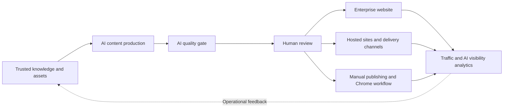

# GEOFlow 3.0

> Languages: [简体中文](../../README.md) | [English](README_en.md) | [日本語](README_ja.md) | [Español](README_es.md) | [Русский](README_ru.md) | [Português (BR)](README_pt_BR.md)

> An open-source GEO operations platform for enterprise websites

GEOFlow connects trusted knowledge, AI content production, quality gates, human review, multi-site delivery, and analytics in one operating workflow. Brand, growth, and content teams can use it to run an enterprise website, a GEO content channel, an industry source site, or an internal content operations platform while keeping source material, decisions, publishing results, and operational data in one system.

[Quick start](#quick-start) · [Interface preview](#interface-preview) · [Core capabilities](#geoflow-30-core-capabilities) · [Deployment guide](../deployment/DEPLOYMENT.md) · [Changelog](../CHANGELOG_en.md) · [Website](https://www.geoflow.me)

[](../../version.json)
[](https://github.com/yaojingang/GEOFlow/releases/latest)
[](https://www.php.net/)
[](https://github.com/yaojingang/GEOFlow/actions/workflows/ci.yml)
[](../../LICENSE)
[](https://github.com/yaojingang/GEOFlow/stargazers)

> **Version note:** The current source version is `3.0.0`. The [GitHub Releases](https://github.com/yaojingang/GEOFlow/releases) page is the source of truth for published versions. Production deployments should use a published release or pin a reviewed commit.

---

## What GEOFlow is built to solve

Enterprise GEO programs need brand knowledge, model configuration, content production, quality review, website engineering, channel delivery, and performance analysis. When these jobs live in separate tools, teams lose the links between source material, review decisions, and published results.

GEOFlow puts the operating workflow in one admin system:



The system records knowledge sources, task settings, model calls, quality evidence, manual overrides, publication state, and channel logs so teams can review and maintain their content assets over time.

---

## Interface preview

<table>
  <tr>
    <td width="50%"><br /><sub>Illustrated help workspace</sub></td>
    <td width="50%"><br /><sub>Analytics overview</sub></td>
  </tr>
  <tr>
    <td width="50%"><br /><sub>Task management</sub></td>
    <td width="50%"><br /><sub>Article AI quality inspection</sub></td>
  </tr>
  <tr>
    <td width="50%"><br /><sub>Hosted channel sites</sub></td>
    <td width="50%"><br /><sub>Manual publishing workspace</sub></td>
  </tr>
</table>

These sanitized screens come from the built-in 3.0 help library and cover knowledge assistance, task scheduling, quality inspection, hosted sites, manual publishing, and analytics.

---

## GEOFlow 3.0 core capabilities

| Capability | How 3.0 handles the work |
|------------|--------------------------|
| Trusted knowledge and content production | Manage knowledge bases, title libraries, keywords, images, authors, prompts, and AI models in one place. Knowledge bases support structured chunking, optional semantic planning, vector retrieval, and a stable fallback path. |
| AI quality gates | Check knowledge evidence, data and citations, advertising rules, and publishing context. Store category scores, source locations, regulatory references, revision advice, and history. Articles that need review, are blocked, fail inspection, or have stale results remain drafts. |
| Review and operations collaboration | Manage drafts, reviews, publishing, trash, and bulk Markdown export. The manual publishing workspace records identities, account references, assignees, schedules, risk notes, receipts, and audit history. |
| Enterprise websites and multi-site delivery | The local frontend outputs SEO metadata, Open Graph, Schema, sitemaps, and `llms.txt`. Delivery channels include hosted sites, GEOFlow Agent, WordPress REST, and generic HTTP APIs. |
| Analytics and operations | Analytics cover content, distribution, traffic, top content, AI crawlers, and trends. The independent Updater handles signed updates, full backups, environment validation, and restore-point rollback. |
| Team and developer access | Admin UI V3 supports six languages, responsive layouts, PWA installation, and illustrated help. API v1, GEOFlow CLI, and the bundled Agent Skill support automation and extension work. |

### Major changes in 3.0

- Admin UI V3 gives the main admin pages a shared sidebar, top bar, navigation, forms, dialogs, and mobile behavior. Static assets load locally.
- The AI workspace is now an illustrated admin help assistant with 15 topics, 24 sanitized screenshots, and 72 fixed evaluation questions. Feature links are generated from the current administrator's permissions.
- Article AI inspection now participates in the publishing gate. Results, manual overrides, and policy changes remain auditable.
- Hosted channel sites support subdomain allocation, lifecycle management, article assignment, publishing quotas, failure cooldowns, technical checks, cache invalidation, and reconciliation.
- The Chrome operations assistant uses device pairing and a least-privilege token to claim manual publishing tasks, fill drafts for review, and return execution evidence. An operator confirms the final publication.
- Title libraries support batch AI generation for up to 100,000 entries, resume, cancellation, retries, and stable deduplication. Deleted tasks retain 90 days of audit data.
- API v1 and `bin/geoflow` cover catalogs, tasks, runs, materials, articles, and browser operations protocols.
- The independent GEOFlow Updater uses a local Unix socket for updates, full backups, environment validation, and restore-point rollback. High-risk actions require an administrator password and a six-digit authenticator code.

See the [Chinese changelog](../CHANGELOG.md) and [English changelog](../CHANGELOG_en.md) for the complete history.

---

## Where GEOFlow fits

| Scenario | Recommended setup | Main capabilities |
|----------|-------------------|-------------------|
| Enterprise website GEO operations | Build around products, cases, FAQs, industry knowledge, and brand rules | Enterprise knowledge, tasks, quality gates, website publishing, analytics |
| GEO channel within an existing website | Launch an information, knowledge, or solutions channel on a subdomain or separate path | Themes, categories, SEO, scheduling, lead forms |
| Industry source site | Maintain verifiable long-term content for one industry, subject, or problem area | RAG, review, citation-friendly output, sitemaps, `llms.txt` |
| Internal content operations | Keep the public frontend secondary and let brand, growth, and content teams manage production and review | Asset libraries, API, CLI, manual publishing, permissions, audit history |
| Multi-brand or multi-site operations | Manage multiple sites, categories, or publishing destinations from one admin system | Hosted sites, Agent, WordPress, generic APIs, delivery logs |

GEOFlow is designed for teams with real business source material, named review owners, and an ongoing operations plan. Knowledge quality, human judgment, and regular maintenance determine whether users and AI systems can trust the published content.

---

## Security and governance

| Area | Boundary |
|------|----------|
| Content quality | Knowledge evidence, rule versions, scores, manual overrides, and result expiry are traceable. |
| Accounts and permissions | Feature entry points follow permissions, sensitive actions require super-administrator access, and task and manual publishing state changes keep history. |
| Browser operations | The Chrome extension uses device pairing and a least-privilege token. It does not store external platform passwords, cookies, or OAuth credentials. |
| Outbound requests | URL import, delivery, AI, theme references, and update checks share an outbound security policy that limits private-network access, redirects, and response size. |
| Updates and recovery | The Updater uses signed packages, a local Unix socket, environment validation, full backups, and restore points. High-risk requests require a second factor. |
| Anonymous telemetry | Telemetry is disabled by default. When enabled, it sends only allowlisted fields and excludes business content, accounts, email addresses, domains, cookies, and secrets. |

The [deployment guide](../deployment/DEPLOYMENT.md) and the release notes for the selected version define the current security gates and upgrade procedure.

---

## Components and runtime

| Component | Current source version or status | Notes |
|-----------|----------------------------------|-------|
| GEOFlow Core | `3.0.0` | Laravel application, admin, frontend, API, queues, and distribution system |
| GEOFlow CLI | `0.2.0` | Bundled as `bin/geoflow`; supports macOS, Linux, and WSL |
| Chrome operations assistant | `0.1.0` | Source and packaged output live in `browser-extension/` and `dist/browser-extension/` |
| GEOFlow Updater | Independent component | Use a signed version explicitly compatible with the target release; see [geoflow-updater](https://github.com/yaojingang/geoflow-updater) |
| Target-site Agent | Generated per channel | Each channel can build a preconfigured PHP package with a homepage, article pages, static assets, Schema, sitemap, and `llms.txt` |

Runtime requirements:

| Component | Requirement |
|-----------|-------------|
| PHP | 8.3 or later; Docker may use PHP 8.4 |
| Database | PostgreSQL; pgvector image or compatible extension recommended |
| Redis | Queues, cache, and runtime state |
| Node.js | Frontend asset builds; CI uses Node.js 22 |
| Container deployment | Docker Compose; production uses Nginx and php-fpm |

---

## Quick start

### Docker for development and evaluation

```bash
git clone https://github.com/yaojingang/GEOFlow.git
cd GEOFlow
cp .env.example .env
docker compose build
docker compose up -d --remove-orphans
```

- Frontend: `http://localhost:18080`
- Admin login: `http://localhost:18080/geo_admin/login`
- `APP_PORT` controls the port, and `ADMIN_BASE_PATH` controls the admin prefix.
- The `init` service runs migrations and initializes an empty database on first start.

The [deployment guide](../deployment/DEPLOYMENT.md) documents development administrator settings. Production environments should set an explicit administrator password, HTTPS, secure cookie policy, and reverse-proxy configuration.

### Docker for production

Production uses `docker-compose.prod.yml` with Nginx and php-fpm. Prepare `.env.prod`, database backups, HTTPS, persistent directories, and process supervision before deployment:

```bash
cp .env.prod.example .env.prod

docker compose --env-file .env.prod -f docker-compose.prod.yml build
docker compose --env-file .env.prod -f docker-compose.prod.yml up -d postgres redis
docker compose --env-file .env.prod -f docker-compose.prod.yml up -d init
docker compose --env-file .env.prod -f docker-compose.prod.yml up -d app web queue ai-quality-queue ai-quality-backfill-queue ai-optimization-queue knowledge-queue scheduler reverb
```

See [`docs/deployment/DEPLOYMENT.md`](../deployment/DEPLOYMENT.md) for production setup, health checks, reverse proxy configuration, and recovery.

### Upgrading from 2.x

Back up the database, `.env`, uploads, and `storage`. Drain old processes before running migrations, rebuilding frontend assets, and restarting services. Early 2.x installations also need the managed-image readiness check and security audit. Enable hosted sites only after wildcard DNS, wildcard TLS, trusted proxies, and Nginx are configured.

Existing deployments should follow the complete [drain and safe migration procedure](../deployment/DEPLOYMENT.md). Avoid rebuilding containers immediately after `git pull`. Exact commands and component compatibility follow the selected GitHub Release.

---

## Developer entry points

### GEOFlow CLI

`bin/geoflow` manages catalogs, tasks, runs, materials, and articles through API v1. It supports secure configuration, login, JSON files or stdin, delete confirmation, and structured errors.

[CLI guide in Chinese](../GEOFLOW_CLI.md) | [CLI guide in English](../GEOFLOW_CLI_en.md)

### GEOFlow Agent Skill

The repository includes a unified [GEOFlow Agent Skill](../../.agents/skills/geoflow/) for Laravel development, admin operations, public frontend work, theme packages, channel sites, and legacy migrations. Tools that support Agent Skills can discover it from the repository, and Codex users can invoke it with `$geoflow`.

See the [Skill README](../../.agents/skills/geoflow/README.md) for installation and rollback instructions.

### Development and tests

```bash
composer install
npm ci
npm run build
composer test
npm run test:analytics
vendor/bin/pint --test
```

Read the [contribution guide](../../CONTRIBUTING.md) before submitting changes.

---

## Open-source and commercial licensing

The current version of GEOFlow is licensed under the [GNU Affero General Public License v3.0](../../LICENSE). Versions previously released under Apache-2.0 keep their original license; the historical text is available at [`docs/licenses/Apache-2.0.txt`](../licenses/Apache-2.0.txt).

| Use | License path |
|-----|--------------|
| Use, modify, deploy, or distribute while complying with AGPL-3.0 | Free to use. Network-service and distribution scenarios must meet the corresponding source-code obligations in the license. |
| Proprietary changes, white-label products, OEM distribution, proprietary integration, or another use that needs an AGPL-3.0 exception | Request a separate commercial license from the copyright holder. |

Start a commercial licensing inquiry through a [GitHub Issue](https://github.com/yaojingang/GEOFlow/issues/new). Issues are public, so do not include contracts, pricing, customer records, or other confidential information. The discussion can move to a private channel after the initial contact. The license text and any signed agreement define the applicable obligations.

External contributors keep copyright in their contributions and must accept the [GEOFlow Contributor License Agreement v1.0](../../CLA.md) before merge. The CLA allows the project to maintain the AGPL edition and offer separate commercial licenses.

### Anonymous telemetry

Anonymous telemetry is disabled by default. When a deployer enables it and configures an HTTPS collection endpoint, an authenticated admin page sends at most one activity event per day. The payload is limited to a random instance ID, an irreversible administrator digest, the GEOFlow version, and the event type.

```dotenv
GEOFLOW_TELEMETRY_ENABLED=false
```

The payload excludes domains, page paths, administrator accounts, email addresses, article content, cookies, `APP_KEY`, and business secrets. No request is sent when the collection endpoint is empty.

---

## Other languages

- [简体中文 README](../../README.md)
- [日本語 README](README_ja.md)
- [Español README](README_es.md)
- [Русский README](README_ru.md)
- [Português (BR) README](README_pt_BR.md)

---

## Star history

[](https://star-history.dera.page/#yaojingang/GEOFlow&Date)
