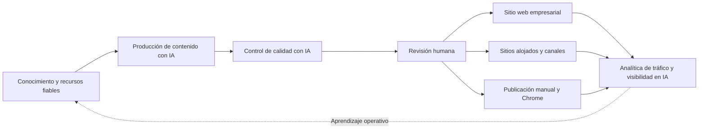

# GEOFlow 3.0

> Languages: [简体中文](../../README.md) | [English](README_en.md) | [日本語](README_ja.md) | [Español](README_es.md) | [Русский](README_ru.md) | [Português (BR)](README_pt_BR.md)

> Plataforma GEO de código abierto para operar sitios web empresariales

GEOFlow conecta conocimiento fiable, producción de contenido con IA, controles de calidad, revisión humana, distribución multisitio y analítica en un solo flujo operativo. Los equipos de marca, crecimiento y contenido pueden usarlo para gestionar un sitio corporativo, un canal GEO, un sitio especializado o una plataforma interna de contenidos, con las fuentes, las decisiones, las publicaciones y los datos de operación dentro del mismo sistema.

[Inicio rápido](#inicio-rápido) · [Vista de la interfaz](#vista-de-la-interfaz) · [Funciones principales](#funciones-principales-de-geoflow-30) · [Guía de despliegue](../deployment/DEPLOYMENT.md) · [Historial de cambios](../CHANGELOG_en.md) · [Sitio web](https://www.geoflow.me)

[](../../version.json)
[](https://github.com/yaojingang/GEOFlow/releases/latest)
[](https://www.php.net/)
[](https://github.com/yaojingang/GEOFlow/actions/workflows/ci.yml)
[](../../LICENSE)
[](https://github.com/yaojingang/GEOFlow/stargazers)

> **Estado de la versión:** La versión actual del código fuente es `3.0.0`. La página de [GitHub Releases](https://github.com/yaojingang/GEOFlow/releases) indica qué versiones se han publicado. Para producción, usa una versión publicada o fija un commit que haya sido revisado.

---

## Qué problema resuelve GEOFlow

Un programa GEO empresarial necesita gestionar conocimiento de marca, modelos, producción de contenido, control de calidad, ingeniería web, distribución y análisis. Cuando cada trabajo se realiza en una herramienta distinta, se pierde la relación entre las fuentes, las decisiones de revisión y los resultados publicados.

GEOFlow reúne el flujo operativo en un solo panel de administración:



El sistema conserva las fuentes de conocimiento, la configuración de tareas, las llamadas a modelos, las pruebas de calidad, las autorizaciones manuales, el estado de publicación y los registros de cada canal.

---

## Vista de la interfaz

<table>
  <tr>
    <td width="50%"><br /><sub>Área de ayuda ilustrada</sub></td>
    <td width="50%"><br /><sub>Resumen analítico</sub></td>
  </tr>
  <tr>
    <td width="50%"><br /><sub>Gestión de tareas</sub></td>
    <td width="50%"><br /><sub>Control de calidad con IA</sub></td>
  </tr>
  <tr>
    <td width="50%"><br /><sub>Sitios de canal alojados</sub></td>
    <td width="50%"><br /><sub>Área de publicación manual</sub></td>
  </tr>
</table>

Estas pantallas anonimizadas forman parte de la ayuda incluida en 3.0 y cubren asistencia, tareas, control de calidad, sitios alojados, publicación manual y analítica.

---

## Funciones principales de GEOFlow 3.0

| Función | Cómo trabaja 3.0 |
|---------|------------------|
| Conocimiento fiable y producción de contenido | Centraliza bases de conocimiento, títulos, palabras clave, imágenes, autores, prompts y modelos de IA. Admite fragmentación estructurada, planificación semántica opcional, búsqueda vectorial y una ruta de respaldo estable. |
| Controles de calidad con IA | Revisa pruebas de conocimiento, datos y citas, reglas publicitarias y contexto de publicación. Guarda puntuaciones por categoría, ubicación en el texto, referencias normativas, recomendaciones e historial. Los artículos pendientes, bloqueados, fallidos o con resultados caducados permanecen como borradores. |
| Revisión y colaboración operativa | Gestiona borradores, revisiones, publicaciones, papelera y exportación masiva a Markdown. El área de publicación manual registra identidades, cuentas, responsables, horarios, riesgos, comprobantes e historial de auditoría. |
| Sitios empresariales y distribución multisitio | El frontend local genera metadatos SEO, Open Graph, Schema, sitemaps y `llms.txt`. Los canales incluyen sitios alojados, GEOFlow Agent, WordPress REST y API HTTP genéricas. |
| Analítica y operaciones | Muestra contenido, distribución, tráfico, artículos destacados, rastreadores de IA y tendencias. El Updater independiente gestiona actualizaciones firmadas, copias completas, validación del entorno y restauración. |
| Acceso para equipos y desarrolladores | Admin UI V3 admite seis idiomas, diseño adaptable, PWA y ayuda ilustrada. API v1, GEOFlow CLI y Agent Skill permiten automatizar y ampliar el sistema. |

### Cambios principales de 3.0

- Admin UI V3 unifica barra lateral, barra superior, navegación, formularios, diálogos y comportamiento móvil. Los recursos estáticos se cargan localmente.
- El espacio de trabajo de IA funciona como asistente ilustrado del panel, con 15 temas, 24 capturas anonimizadas y 72 preguntas de evaluación. Los enlaces se generan según los permisos del administrador.
- El control de calidad de artículos participa en el proceso de publicación y conserva resultados, autorizaciones manuales y cambios de políticas.
- Los sitios de canal alojados incorporan subdominios, ciclo de vida, asignación de artículos, cuotas, pausa tras fallos, comprobaciones técnicas, invalidación de caché y conciliación de estado.
- El asistente de Chrome usa emparejamiento de dispositivos y un Token con privilegios mínimos para recibir tareas, completar borradores y devolver pruebas de ejecución. La publicación final la confirma una persona.
- Las bibliotecas de títulos permiten generar hasta 100.000 entradas por lotes, reanudar, cancelar, reintentar y eliminar duplicados. Las tareas eliminadas conservan 90 días de información de auditoría.
- API v1 y `bin/geoflow` cubren catálogos, tareas, ejecuciones, materiales, artículos y protocolos de operación del navegador.
- GEOFlow Updater usa un Unix socket local para actualizar, realizar copias completas, validar el entorno y volver a un punto de restauración. Las operaciones de alto riesgo requieren contraseña de administrador y un código de seis dígitos.

Consulta el [historial en chino](../CHANGELOG.md) y el [historial en inglés](../CHANGELOG_en.md) para ver todos los cambios.

---

## Casos de uso

| Caso | Configuración recomendada | Funciones principales |
|------|---------------------------|-----------------------|
| Operación GEO de un sitio empresarial | Publicar de forma continua a partir de productos, casos, preguntas frecuentes, conocimiento sectorial y reglas de marca | Conocimiento empresarial, tareas, calidad, publicación web, analítica |
| Canal GEO dentro de un sitio existente | Abrir un canal de información, conocimiento o soluciones en un subdominio o ruta separada | Temas, categorías, SEO, programación, formularios de contacto |
| Sitio especializado | Mantener contenido verificable sobre un sector, tema o problema | RAG, revisión, salida preparada para citas, sitemap, `llms.txt` |
| Operaciones internas de contenido | Dar menos peso al frontend público y centralizar la producción y revisión de marca, crecimiento y contenido | Recursos, API, CLI, publicación manual, permisos, auditoría |
| Operación multimarcas o multisitio | Gestionar varios sitios, categorías o destinos desde un solo panel | Sitios alojados, Agent, WordPress, API genéricas, registros de distribución |

GEOFlow está pensado para equipos con materiales empresariales reales, responsables de revisión definidos y un plan de operación continuo. La calidad del conocimiento, el criterio humano y el mantenimiento regular sostienen la confianza de usuarios y sistemas de IA.

---

## Seguridad y gobernanza

| Área | Límite de diseño |
|------|------------------|
| Calidad del contenido | Se pueden rastrear las pruebas, versiones de reglas, puntuaciones, autorizaciones manuales y caducidad de resultados. |
| Cuentas y permisos | Los accesos respetan permisos, las operaciones sensibles requieren un superadministrador y los cambios de estado conservan historial. |
| Operación en el navegador | La extensión usa emparejamiento y un Token con privilegios mínimos. No guarda contraseñas, cookies ni credenciales OAuth de plataformas externas. |
| Solicitudes salientes | La importación, distribución, IA, referencias de temas y comprobaciones de actualización comparten una política que limita redes privadas, redirecciones y tamaño de respuesta. |
| Actualización y recuperación | El Updater usa paquetes firmados, Unix socket local, validación, copias completas y puntos de restauración. Las solicitudes de alto riesgo requieren un segundo factor. |
| Telemetría anónima | Está desactivada de forma predeterminada. Al activarla solo envía campos autorizados y excluye contenido, cuentas, correos, dominios, cookies y secretos. |

La [guía de despliegue](../deployment/DEPLOYMENT.md) y las notas de la versión seleccionada definen los controles y el procedimiento de actualización vigentes.

---

## Componentes y entorno

| Componente | Versión o estado actual del código | Descripción |
|------------|------------------------------------|-------------|
| GEOFlow Core | `3.0.0` | Aplicación Laravel, panel, frontend, API, colas y distribución |
| GEOFlow CLI | `0.2.0` | Incluido como `bin/geoflow`; compatible con macOS, Linux y WSL |
| Asistente de Chrome | `0.1.0` | Código y paquete en `browser-extension/` y `dist/browser-extension/` |
| GEOFlow Updater | Componente independiente | Usa una versión firmada compatible con la versión objetivo; consulta [geoflow-updater](https://github.com/yaojingang/geoflow-updater) |
| Agent de destino | Generado por canal | Crea un paquete PHP configurado con portada, artículos, recursos, Schema, sitemap y `llms.txt` |

Requisitos:

| Componente | Requisito |
|------------|-----------|
| PHP | 8.3 o posterior; Docker puede usar PHP 8.4 |
| Base de datos | PostgreSQL; se recomienda pgvector o una extensión compatible |
| Redis | Colas, caché y estado de ejecución |
| Node.js | Compilación del frontend; CI usa Node.js 22 |
| Contenedores | Docker Compose; producción usa Nginx y php-fpm |

---

## Inicio rápido

### Docker para desarrollo y evaluación

```bash
git clone https://github.com/yaojingang/GEOFlow.git
cd GEOFlow
cp .env.example .env
docker compose build
docker compose up -d --remove-orphans
```

- Frontend: `http://localhost:18080`
- Panel: `http://localhost:18080/geo_admin/login`
- `APP_PORT` controla el puerto y `ADMIN_BASE_PATH` el prefijo del panel.
- El servicio `init` ejecuta las migraciones e inicializa una base de datos vacía en el primer arranque.

La [guía de despliegue](../deployment/DEPLOYMENT.md) documenta la cuenta de desarrollo. En producción configura una contraseña de administrador, HTTPS, cookies seguras y el proxy inverso.

### Docker para producción

Producción usa `docker-compose.prod.yml` con Nginx y php-fpm. Prepara `.env.prod`, copias de la base de datos, HTTPS, directorios persistentes y supervisión de procesos:

```bash
cp .env.prod.example .env.prod

docker compose --env-file .env.prod -f docker-compose.prod.yml build
docker compose --env-file .env.prod -f docker-compose.prod.yml up -d postgres redis
docker compose --env-file .env.prod -f docker-compose.prod.yml up -d init
docker compose --env-file .env.prod -f docker-compose.prod.yml up -d app web queue ai-quality-queue ai-quality-backfill-queue ai-optimization-queue knowledge-queue scheduler reverb
```

Consulta [`docs/deployment/DEPLOYMENT.md`](../deployment/DEPLOYMENT.md) para producción, comprobaciones de salud, proxy inverso y recuperación.

### Actualización desde 2.x

Haz una copia de la base de datos, `.env`, archivos subidos y `storage`. Detén los procesos antiguos y deja que terminen antes de migrar, recompilar el frontend y reiniciar servicios. Las primeras versiones 2.x también necesitan la comprobación de imágenes administradas y la auditoría de seguridad. Activa los sitios alojados después de configurar DNS y TLS comodín, proxies de confianza y Nginx.

Las instalaciones existentes deben seguir el [procedimiento seguro de parada y migración](../deployment/DEPLOYMENT.md). Evita reconstruir contenedores inmediatamente después de `git pull`. Los comandos exactos y la compatibilidad siguen la versión elegida en GitHub Releases.

---

## Acceso para desarrolladores

### GEOFlow CLI

`bin/geoflow` gestiona catálogos, tareas, ejecuciones, materiales y artículos mediante API v1. Admite configuración segura, inicio de sesión, archivos JSON o stdin, confirmación de borrado y errores estructurados.

[Guía CLI en chino](../GEOFLOW_CLI.md) | [Guía CLI en inglés](../GEOFLOW_CLI_en.md)

### GEOFlow Agent Skill

El repositorio incluye [GEOFlow Agent Skill](../../.agents/skills/geoflow/) para desarrollo Laravel, operaciones del panel, frontend público, paquetes de temas, sitios de canal y migraciones antiguas. Las herramientas compatibles pueden descubrirlo en el repositorio y Codex permite invocarlo con `$geoflow`.

Consulta el [README del Skill](../../.agents/skills/geoflow/README.md) para instalarlo o restaurarlo.

### Desarrollo y pruebas

```bash
composer install
npm ci
npm run build
composer test
npm run test:analytics
vendor/bin/pint --test
```

Lee la [guía de contribución](../../CONTRIBUTING.md) antes de enviar cambios.

---

## Licencia abierta y licencia comercial

La versión actual de GEOFlow se publica bajo la [GNU Affero General Public License v3.0](../../LICENSE). Las versiones publicadas previamente con Apache-2.0 conservan esa licencia; el texto histórico está en [`docs/licenses/Apache-2.0.txt`](../licenses/Apache-2.0.txt).

| Uso | Vía de licencia |
|-----|-----------------|
| Usar, modificar, desplegar o distribuir cumpliendo AGPL-3.0 | Uso gratuito. Los servicios de red y la distribución deben cumplir las obligaciones de código fuente correspondientes. |
| Cambios propietarios, marca blanca, OEM, integración en productos propietarios u otro uso que requiera una excepción a AGPL-3.0 | Solicita una licencia comercial independiente al titular de los derechos. |

Inicia una consulta comercial mediante un [GitHub Issue](https://github.com/yaojingang/GEOFlow/issues/new). Los Issues son públicos, así que no incluyas contratos, precios, datos de clientes ni información confidencial. Después del primer contacto se puede continuar por un canal privado. El texto de la licencia y cualquier acuerdo firmado determinan las obligaciones aplicables.

Los colaboradores externos conservan los derechos sobre sus aportaciones y deben aceptar el [GEOFlow Contributor License Agreement v1.0](../../CLA.md) antes de la fusión. El CLA permite mantener la edición AGPL y ofrecer licencias comerciales independientes.

### Telemetría anónima

La telemetría anónima está desactivada de forma predeterminada. Cuando se activa y se configura un endpoint HTTPS, una página autenticada del panel envía como máximo un evento de actividad al día. El contenido se limita a un ID aleatorio de instancia, un resumen irreversible del administrador, la versión de GEOFlow y el tipo de evento.

```dotenv
GEOFLOW_TELEMETRY_ENABLED=false
```

No se envían dominios, rutas, cuentas, correos, artículos, cookies, `APP_KEY` ni secretos empresariales. Si el endpoint está vacío, no se realiza ninguna solicitud.

---

## Otros idiomas

- [简体中文 README](../../README.md)
- [English README](README_en.md)
- [日本語 README](README_ja.md)
- [Русский README](README_ru.md)
- [Português (BR) README](README_pt_BR.md)

---

## Historial de estrellas

[](https://star-history.dera.page/#yaojingang/GEOFlow&Date)
