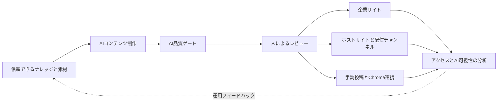
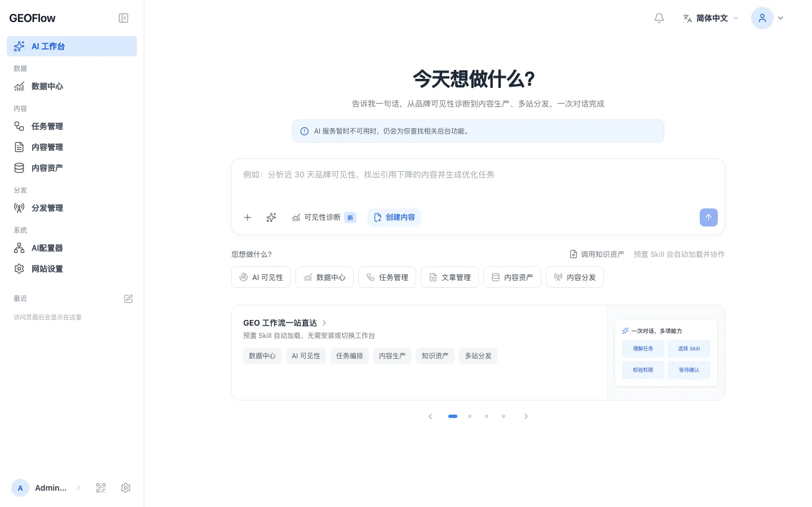
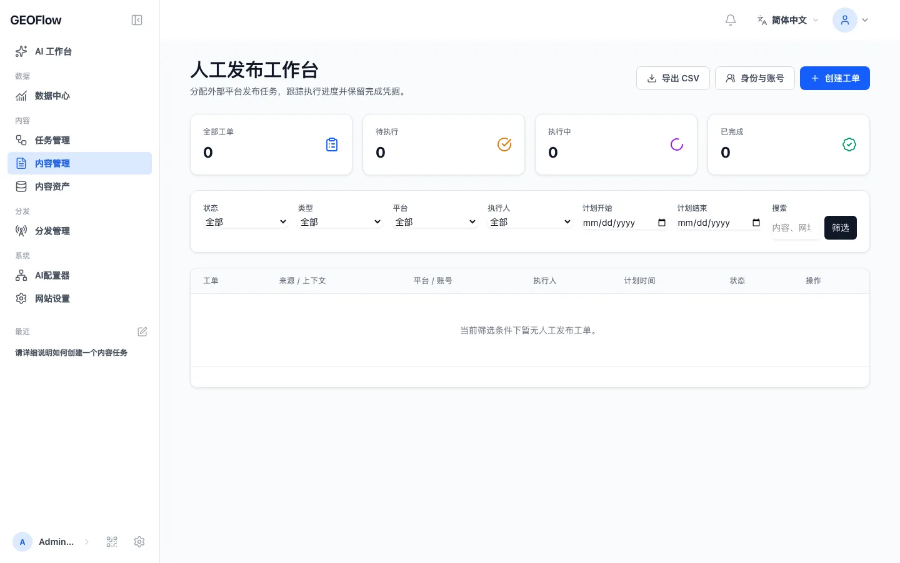

# GEOFlow 3.0

> Languages: [简体中文](../../README.md) | [English](README_en.md) | [日本語](README_ja.md) | [Español](README_es.md) | [Русский](README_ru.md) | [Português (BR)](README_pt_BR.md)

> 企業サイト向けのオープンソースGEO運用プラットフォーム

GEOFlowは、信頼できるナレッジ、AIコンテンツ制作、品質ゲート、人によるレビュー、複数サイトへの配信、分析を一つの運用フローにつなぎます。ブランド、グロース、コンテンツの各チームは、企業サイト、GEOコンテンツチャンネル、業界情報サイト、社内コンテンツ運用基盤を構築し、資料、判断、公開結果、運用データを同じシステムで管理できます。

[クイックスタート](#クイックスタート) · [画面プレビュー](#画面プレビュー) · [主要機能](#geoflow-30の主要機能) · [デプロイガイド](../deployment/DEPLOYMENT.md) · [変更履歴](../CHANGELOG_en.md) · [公式サイト](https://www.geoflow.me)

[](../../version.json)
[](https://github.com/yaojingang/GEOFlow/releases/latest)
[](https://www.php.net/)
[](https://github.com/yaojingang/GEOFlow/actions/workflows/ci.yml)
[](../../LICENSE)
[](https://github.com/yaojingang/GEOFlow/stargazers)

> **バージョンについて：** 現在のソースバージョンは `3.0.0` です。公開済みバージョンは [GitHub Releases](https://github.com/yaojingang/GEOFlow/releases) を基準に確認してください。本番環境では公開済みリリースを使用するか、レビュー済みコミットに固定してください。

---

## GEOFlowが解決する課題

企業のGEO運用には、ブランドナレッジ、モデル設定、コンテンツ制作、品質確認、サイト実装、チャンネル配信、効果分析が必要です。これらが別々のツールに分かれると、資料の出所、レビュー判断、公開結果の対応関係を追いにくくなります。

GEOFlowは一つの管理画面で運用フローを管理します。



ナレッジの出所、タスク設定、モデル呼び出し、品質判定の根拠、手動承認、公開状態、チャンネルログを記録し、チームがコンテンツ資産を継続的に見直せるようにします。

---

## 画面プレビュー

<table>
  <tr>
    <td width="50%"><br /><sub>画像付きヘルプワークスペース</sub></td>
    <td width="50%"><br /><sub>分析概要</sub></td>
  </tr>
  <tr>
    <td width="50%"><br /><sub>タスク管理</sub></td>
    <td width="50%"><br /><sub>記事AI品質検査</sub></td>
  </tr>
  <tr>
    <td width="50%"><br /><sub>ホスト型チャンネルサイト</sub></td>
    <td width="50%"><br /><sub>手動投稿ワークスペース</sub></td>
  </tr>
</table>

これらは3.0に組み込まれた匿名化済みヘルプ素材です。ナレッジ支援、タスク実行、品質検査、ホストサイト、手動投稿、分析の主要フローを確認できます。

---

## GEOFlow 3.0の主要機能

| 機能 | 3.0での運用方法 |
|------|------------------|
| 信頼できるナレッジとコンテンツ制作 | ナレッジベース、タイトル、キーワード、画像、著者、プロンプト、AIモデルを集中管理します。構造化チャンク、任意の意味計画、ベクトル検索、安定したフォールバックに対応します。 |
| AI品質ゲート | ナレッジ根拠、データと引用、広告ルール、公開文脈を検査します。項目別スコア、原文位置、法規根拠、修正案、履歴を保存します。要確認、ブロック、異常、期限切れの結果を持つ記事は下書きに留まります。 |
| レビューと運用連携 | 下書き、レビュー、公開、ごみ箱、Markdown一括出力を管理します。手動投稿ワークスペースは、投稿者情報、アカウント参照、担当者、予定時刻、リスク、実行証跡、監査履歴を保存します。 |
| 企業サイトと複数サイト配信 | ローカルフロントエンドはSEOメタデータ、Open Graph、Schema、sitemap、`llms.txt` を出力します。ホストサイト、GEOFlow Agent、WordPress REST、汎用HTTP APIに配信できます。 |
| 分析と運用保守 | コンテンツ、配信、アクセス、上位記事、AIクローラー、推移を分析します。独立したUpdaterが署名付き更新、完全バックアップ、環境検証、復元ポイントへのロールバックを担当します。 |
| チームと開発者向け機能 | Admin UI V3は6言語、レスポンシブ表示、PWA、画像付きヘルプに対応します。API v1、GEOFlow CLI、同梱Agent Skillから自動化と拡張を行えます。 |

### 3.0の主な変更

- Admin UI V3で主要画面のサイドバー、トップバー、ナビゲーション、フォーム、ダイアログ、モバイル表示を統一し、静的アセットをローカル配信にしました。
- AIワークスペースを管理画面向けの画像付きヘルプに変更しました。15テーマ、24枚の匿名化画像、72問の固定評価を収録し、現在の権限から機能リンクを生成します。
- 記事AI品質検査を公開ゲートに接続し、検査結果、手動承認、ポリシー変更を監査可能にしました。
- ホスト型チャンネルサイトにサブドメイン割り当て、ライフサイクル管理、記事割り当て、公開上限、失敗時の待機、技術確認、キャッシュ削除、状態照合を追加しました。
- Chrome運用アシスタントは端末ペアリングと最小権限Tokenで手動投稿タスクを取得し、確認用の下書きを入力して実行証跡を返します。最終公開は担当者が確認します。
- タイトルライブラリは最大10万件のAI一括生成、再開、キャンセル、再試行、重複除去に対応します。削除したタスクの監査情報は90日間保持します。
- API v1と `bin/geoflow` はカタログ、タスク、実行履歴、素材、記事、ブラウザー運用プロトコルを扱います。
- 独立したGEOFlow UpdaterはローカルUnix socketを使って更新、完全バックアップ、環境検証、復元ポイントへのロールバックを実行します。高リスク操作には管理者パスワードと6桁の認証コードが必要です。

詳細は [中国語の変更履歴](../CHANGELOG.md) と [英語の変更履歴](../CHANGELOG_en.md) を参照してください。

---

## 利用シーン

| シーン | 推奨構成 | 主な機能 |
|--------|----------|----------|
| 企業サイトのGEO運用 | 製品、事例、FAQ、業界知識、ブランドルールを基に継続運用 | 企業ナレッジ、タスク、品質ゲート、サイト公開、分析 |
| 既存サイト内のGEOチャンネル | サブドメインまたは別パスに情報、ナレッジ、ソリューションのチャンネルを開設 | テーマ、カテゴリ、SEO、スケジュール、リードフォーム |
| 業界情報サイト | 一つの業界、テーマ、課題領域で検証可能な長期コンテンツを管理 | RAG、レビュー、引用しやすい出力、sitemap、`llms.txt` |
| 社内コンテンツ運用 | 公開フロントエンドを抑え、ブランド、グロース、コンテンツチームが制作とレビューを管理 | 素材、API、CLI、手動投稿、権限、監査 |
| 複数ブランドと複数サイト | 一つの管理画面から複数サイト、カテゴリ、公開先を管理 | ホストサイト、Agent、WordPress、汎用API、配信ログ |

GEOFlowは、実際の事業資料、明確なレビュー責任者、継続的な運用計画を持つチーム向けです。ナレッジの品質、人の判断、定期的な保守が、ユーザーとAIからの信頼を支えます。

---

## セキュリティとガバナンス

| 範囲 | 境界 |
|------|------|
| コンテンツ品質 | ナレッジ根拠、ルールのバージョン、スコア、手動承認、結果の期限切れを追跡できます。 |
| アカウントと権限 | 機能リンクは権限に従い、機密操作はスーパー管理者が実行します。タスクと手動投稿の状態履歴を保存します。 |
| ブラウザー運用 | Chrome拡張は端末ペアリングと最小権限Tokenを使用し、外部サービスのパスワード、Cookie、OAuth認証情報を保存しません。 |
| 外部リクエスト | URL取り込み、配信、AI、テーマ参照、更新確認に共通の外部通信ポリシーを適用し、プライベートネットワーク、リダイレクト、応答サイズを制限します。 |
| 更新と復元 | Updaterは署名付きパッケージ、ローカルUnix socket、環境検証、完全バックアップ、復元ポイントを使用します。高リスク操作には追加認証が必要です。 |
| 匿名テレメトリー | 初期状態では無効です。有効化しても許可済みフィールドだけを送信し、事業コンテンツ、アカウント、メール、ドメイン、Cookie、秘密情報を除外します。 |

現在のセキュリティゲートとアップグレード手順は [デプロイガイド](../deployment/DEPLOYMENT.md) と対象バージョンのリリースノートを確認してください。

---

## コンポーネントと実行環境

| コンポーネント | 現在のソースバージョンまたは状態 | 説明 |
|----------------|----------------------------------|------|
| GEOFlow Core | `3.0.0` | Laravelアプリ、管理画面、フロントエンド、API、キュー、配信システム |
| GEOFlow CLI | `0.2.0` | `bin/geoflow` を同梱し、macOS、Linux、WSLをサポート |
| Chrome運用アシスタント | `0.1.0` | ソースと配布用ファイルは `browser-extension/` と `dist/browser-extension/` に配置 |
| GEOFlow Updater | 独立コンポーネント | 対象リリースと明示的に互換性がある署名版を使用。詳細は [geoflow-updater](https://github.com/yaojingang/geoflow-updater) を参照 |
| 配信先Agent | チャンネルごとに生成 | ホーム、記事、静的アセット、Schema、sitemap、`llms.txt` を含む設定済みPHPパッケージを生成 |

実行要件：

| コンポーネント | 要件 |
|----------------|------|
| PHP | 8.3以上。DockerではPHP 8.4を利用可能 |
| データベース | PostgreSQL。pgvectorイメージまたは互換拡張を推奨 |
| Redis | キュー、キャッシュ、実行状態に使用 |
| Node.js | フロントエンドのビルドに使用。CIはNode.js 22 |
| コンテナ | Docker Compose。本番環境はNginxとphp-fpm |

---

## クイックスタート

### Dockerで開発と評価

```bash
git clone https://github.com/yaojingang/GEOFlow.git
cd GEOFlow
cp .env.example .env
docker compose build
docker compose up -d --remove-orphans
```

- フロントエンド： `http://localhost:18080`
- 管理画面： `http://localhost:18080/geo_admin/login`
- ポートは `APP_PORT`、管理画面のプレフィックスは `ADMIN_BASE_PATH` で変更できます。
- 初回起動時は `init` サービスがマイグレーションと空データベースの初期化を行います。

開発用管理者設定は [デプロイガイド](../deployment/DEPLOYMENT.md) に記載しています。本番環境では管理者パスワード、HTTPS、Cookieの安全設定、リバースプロキシを明示的に設定してください。

### Docker本番環境

本番環境では `docker-compose.prod.yml` とNginx、php-fpmを使用します。デプロイ前に `.env.prod`、データベースのバックアップ、HTTPS、永続化ディレクトリ、プロセス管理を準備してください。

```bash
cp .env.prod.example .env.prod

docker compose --env-file .env.prod -f docker-compose.prod.yml build
docker compose --env-file .env.prod -f docker-compose.prod.yml up -d postgres redis
docker compose --env-file .env.prod -f docker-compose.prod.yml up -d init
docker compose --env-file .env.prod -f docker-compose.prod.yml up -d app web queue ai-quality-queue ai-quality-backfill-queue ai-optimization-queue knowledge-queue scheduler reverb
```

本番構成、ヘルスチェック、リバースプロキシ、復旧方法は [`docs/deployment/DEPLOYMENT.md`](../deployment/DEPLOYMENT.md) を参照してください。

### 2.xからのアップグレード

データベース、`.env`、アップロード、`storage` をバックアップしてください。古いプロセスを停止して処理を完了させてから、マイグレーション、フロントエンドの再ビルド、サービスの再起動を行います。初期の2.xから更新する場合は、管理対象画像のreadinessチェックとセキュリティ監査も必要です。ホストサイトは、ワイルドカードDNS、ワイルドカードTLS、信頼済みプロキシ、Nginxの設定後に有効化してください。

既存環境は [安全な停止とマイグレーション手順](../deployment/DEPLOYMENT.md) に従ってください。`git pull` の直後にコンテナを再構築する運用は避けてください。正確なコマンドとコンポーネント互換性は対象のGitHub Releaseに従います。

---

## 開発者向け入口

### GEOFlow CLI

`bin/geoflow` はAPI v1を通じてカタログ、タスク、実行履歴、素材、記事を管理します。安全な設定、ログイン、JSONファイルまたはstdin、削除確認、構造化エラーに対応します。

[CLI中国語ガイド](../GEOFLOW_CLI.md) | [CLI英語ガイド](../GEOFLOW_CLI_en.md)

### GEOFlow Agent Skill

リポジトリには [GEOFlow Agent Skill](../../.agents/skills/geoflow/) が含まれています。Laravel開発、管理画面の運用、公開フロントエンド、テーマパッケージ、チャンネルサイト、旧版移行を扱います。Agent Skills対応ツールはリポジトリから検出でき、Codexでは `$geoflow` で呼び出せます。

インストールとロールバックは [Skill README](../../.agents/skills/geoflow/README.md) を参照してください。

### 開発とテスト

```bash
composer install
npm ci
npm run build
composer test
npm run test:analytics
vendor/bin/pint --test
```

変更を送る前に [コントリビューションガイド](../../CONTRIBUTING.md) を確認してください。

---

## オープンソースと商用ライセンス

現在のGEOFlowは [GNU Affero General Public License v3.0](../../LICENSE) で提供されます。Apache-2.0で公開済みの旧バージョンには元のライセンスが引き続き適用されます。旧ライセンス本文は [`docs/licenses/Apache-2.0.txt`](../licenses/Apache-2.0.txt) に保存されています。

| 利用方法 | ライセンス |
|----------|------------|
| AGPL-3.0を守って利用、変更、デプロイ、配布する | 無料で利用できます。ネットワークサービスと配布では、ライセンスが定める対応ソースコードの義務を履行してください。 |
| 非公開の変更、ホワイトラベル、OEM、プロプライエタリ製品への組み込み、AGPL-3.0の例外が必要な利用 | 著作権者に個別の商用ライセンスを申請してください。 |

商用ライセンスの初回連絡には [GitHub Issue](https://github.com/yaojingang/GEOFlow/issues/new) を利用できます。Issueは公開されるため、契約、価格、顧客情報、その他の機密情報を書かないでください。初回連絡後は非公開の連絡手段に移行できます。適用される義務はライセンス本文と署名済み契約で決まります。

外部コントリビューターは貢献物の著作権を保持し、マージ前に [GEOFlow Contributor License Agreement v1.0](../../CLA.md) への同意が必要です。CLAにより、プロジェクトはAGPL版の維持と個別の商用ライセンス提供を継続できます。

### 匿名テレメトリー

匿名テレメトリーは初期状態で無効です。デプロイ管理者が有効化し、HTTPSの収集先を設定した場合、ログイン済み管理画面から1日最大1回のアクティビティイベントを送信します。送信項目はランダムなインスタンスID、管理者の不可逆ダイジェスト、GEOFlowバージョン、イベント種別に限定されます。

```dotenv
GEOFLOW_TELEMETRY_ENABLED=false
```

ドメイン、ページパス、管理者アカウント、メール、記事本文、Cookie、`APP_KEY`、業務上の秘密情報は送信しません。収集先が空の場合はリクエストを送信しません。

---

## 他の言語

- [简体中文README](../../README.md)
- [English README](README_en.md)
- [Español README](README_es.md)
- [Русский README](README_ru.md)
- [Português (BR) README](README_pt_BR.md)

---

## Star履歴

[](https://star-history.dera.page/#yaojingang/GEOFlow&Date)
