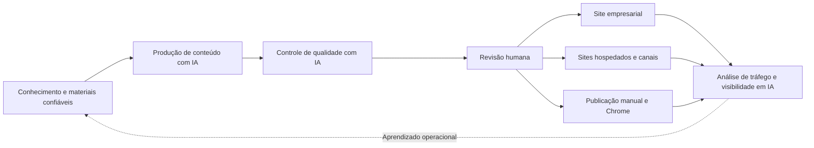

# GEOFlow 3.0

> Languages: [简体中文](../../README.md) | [English](README_en.md) | [日本語](README_ja.md) | [Español](README_es.md) | [Русский](README_ru.md) | [Português (BR)](README_pt_BR.md)

> Plataforma GEO de código aberto para operar sites empresariais

O GEOFlow conecta conhecimento confiável, produção de conteúdo com IA, controle de qualidade, revisão humana, distribuição para vários sites e análise em um único fluxo operacional. Equipes de marca, crescimento e conteúdo podem usá-lo para operar um site corporativo, um canal GEO, um site de referência setorial ou uma plataforma interna de conteúdo, mantendo fontes, decisões, resultados de publicação e dados operacionais no mesmo sistema.

[Início rápido](#início-rápido) · [Prévia da interface](#prévia-da-interface) · [Principais recursos](#principais-recursos-do-geoflow-30) · [Guia de implantação](../deployment/DEPLOYMENT.md) · [Histórico de alterações](../CHANGELOG_en.md) · [Site oficial](https://www.geoflow.me)

[](../../version.json)
[](https://github.com/yaojingang/GEOFlow/releases/latest)
[](https://www.php.net/)
[](https://github.com/yaojingang/GEOFlow/actions/workflows/ci.yml)
[](../../LICENSE)
[](https://github.com/yaojingang/GEOFlow/stargazers)

> **Status da versão:** A versão atual do código-fonte é `3.0.0`. Consulte [GitHub Releases](https://github.com/yaojingang/GEOFlow/releases) para saber quais versões foram publicadas. Em produção, use uma versão publicada ou fixe um commit revisado.

---

## O problema que o GEOFlow resolve

Uma operação GEO empresarial precisa administrar conhecimento de marca, modelos, produção de conteúdo, revisão de qualidade, engenharia do site, distribuição e análise. Quando cada atividade fica em uma ferramenta, a relação entre as fontes, as decisões de revisão e o resultado publicado se perde.

O GEOFlow reúne esse fluxo em um único painel:



O sistema registra fontes de conhecimento, configuração de tarefas, chamadas de modelos, evidências de qualidade, liberações manuais, estado de publicação e logs dos canais.

---

## Prévia da interface

<table>
  <tr>
    <td width="50%"><br /><sub>Área de ajuda ilustrada</sub></td>
    <td width="50%"><br /><sub>Visão analítica</sub></td>
  </tr>
  <tr>
    <td width="50%"><br /><sub>Gestão de tarefas</sub></td>
    <td width="50%"><br /><sub>Qualidade de artigos com IA</sub></td>
  </tr>
  <tr>
    <td width="50%"><br /><sub>Sites de canal hospedados</sub></td>
    <td width="50%"><br /><sub>Área de publicação manual</sub></td>
  </tr>
</table>

Essas telas anonimizadas fazem parte da ajuda incluída no 3.0 e cobrem assistência, tarefas, inspeção de qualidade, sites hospedados, publicação manual e análise.

---

## Principais recursos do GEOFlow 3.0

| Recurso | Como o 3.0 organiza o trabalho |
|---------|---------------------------------|
| Conhecimento confiável e produção de conteúdo | Centraliza bases de conhecimento, títulos, palavras-chave, imagens, autores, prompts e modelos de IA. Oferece divisão estruturada, planejamento semântico opcional, busca vetorial e fallback estável. |
| Controle de qualidade com IA | Verifica evidências de conhecimento, dados e citações, regras de publicidade e contexto de publicação. Salva notas por categoria, posição no texto, referências regulatórias, sugestões e histórico. Artigos pendentes, bloqueados, com falha ou resultado expirado permanecem como rascunhos. |
| Revisão e colaboração operacional | Gerencia rascunhos, revisão, publicação, lixeira e exportação em lote para Markdown. A área de publicação manual registra identidades, contas, responsáveis, horários, riscos, comprovantes e histórico de auditoria. |
| Sites empresariais e distribuição multissite | O frontend local gera metadados SEO, Open Graph, Schema, sitemaps e `llms.txt`. Os canais incluem sites hospedados, GEOFlow Agent, WordPress REST e APIs HTTP genéricas. |
| Análise e operações | Reúne conteúdo, distribuição, tráfego, conteúdos mais acessados, rastreadores de IA e tendências. O Updater independente cuida de atualizações assinadas, backups completos, validação do ambiente e restauração. |
| Acesso para equipes e desenvolvedores | O Admin UI V3 oferece seis idiomas, layout responsivo, PWA e ajuda ilustrada. API v1, GEOFlow CLI e Agent Skill permitem automação e extensões. |

### Principais mudanças do 3.0

- O Admin UI V3 unifica barra lateral, barra superior, navegação, formulários, diálogos e experiência móvel. Os recursos estáticos são carregados localmente.
- O espaço de trabalho de IA agora funciona como assistente ilustrado do painel, com 15 temas, 24 capturas anonimizadas e 72 perguntas fixas de avaliação. Os links são gerados conforme as permissões do administrador.
- A inspeção de qualidade de artigos integra a etapa de publicação e mantém resultados, liberações manuais e mudanças de política em auditoria.
- Os sites de canal hospedados incluem subdomínios, ciclo de vida, associação de artigos, cotas, pausa após falhas, verificações técnicas, invalidação de cache e conciliação.
- O assistente do Chrome usa pareamento de dispositivo e um Token com privilégio mínimo para receber tarefas, preencher rascunhos e devolver evidências de execução. Uma pessoa confirma a publicação final.
- As bibliotecas de títulos geram até 100 mil entradas em lotes, com retomada, cancelamento, repetição e deduplicação. Tarefas excluídas mantêm 90 dias de dados de auditoria.
- A API v1 e o `bin/geoflow` cobrem catálogos, tarefas, execuções, materiais, artigos e protocolos de operação no navegador.
- O GEOFlow Updater usa um Unix socket local para atualizações, backups completos, validação do ambiente e retorno a pontos de restauração. Ações de alto risco exigem senha de administrador e código autenticador de seis dígitos.

Consulte o [histórico em chinês](../CHANGELOG.md) e o [histórico em inglês](../CHANGELOG_en.md) para ver todas as alterações.

---

## Cenários de uso

| Cenário | Configuração recomendada | Principais recursos |
|---------|--------------------------|--------------------|
| Operação GEO de site empresarial | Produzir continuamente a partir de produtos, casos, perguntas frequentes, conhecimento do setor e regras de marca | Conhecimento empresarial, tarefas, qualidade, publicação no site, análise |
| Canal GEO em um site existente | Abrir um canal de informação, conhecimento ou soluções em um subdomínio ou caminho separado | Temas, categorias, SEO, agendamento, formulários de contato |
| Site de referência setorial | Manter conteúdo verificável sobre um setor, tema ou problema | RAG, revisão, saída preparada para citações, sitemap, `llms.txt` |
| Operação interna de conteúdo | Reduzir o peso do frontend público e centralizar produção e revisão das equipes | Materiais, API, CLI, publicação manual, permissões, auditoria |
| Operação multimarcas ou multissite | Administrar vários sites, categorias ou destinos em um painel | Sites hospedados, Agent, WordPress, APIs genéricas, logs de distribuição |

O GEOFlow foi projetado para equipes com materiais empresariais reais, responsáveis de revisão definidos e um plano contínuo de operação. A qualidade do conhecimento, o julgamento humano e a manutenção regular sustentam a confiança de usuários e sistemas de IA.

---

## Segurança e governança

| Área | Limite de projeto |
|------|-------------------|
| Qualidade do conteúdo | Evidências, versões de regras, notas, liberações manuais e expiração de resultados podem ser rastreadas. |
| Contas e permissões | Os acessos seguem permissões, ações sensíveis exigem superadministrador e as mudanças de estado mantêm histórico. |
| Operação no navegador | A extensão usa pareamento e Token com privilégio mínimo. Ela não armazena senhas, cookies ou credenciais OAuth de plataformas externas. |
| Requisições externas | Importação, distribuição, IA, referências de temas e verificações de atualização usam uma política que limita redes privadas, redirecionamentos e tamanho de resposta. |
| Atualização e recuperação | O Updater usa pacotes assinados, Unix socket local, validação, backups completos e pontos de restauração. Solicitações de alto risco exigem segundo fator. |
| Telemetria anônima | Vem desativada. Quando ativada, envia somente campos permitidos e exclui conteúdo, contas, e-mails, domínios, cookies e segredos. |

O [guia de implantação](../deployment/DEPLOYMENT.md) e as notas da versão escolhida definem os controles e o processo de atualização vigentes.

---

## Componentes e ambiente

| Componente | Versão ou estado atual do código | Descrição |
|------------|----------------------------------|-----------|
| GEOFlow Core | `3.0.0` | Aplicação Laravel, painel, frontend, API, filas e distribuição |
| GEOFlow CLI | `0.2.0` | Incluído como `bin/geoflow`; compatível com macOS, Linux e WSL |
| Assistente do Chrome | `0.1.0` | Código e pacote em `browser-extension/` e `dist/browser-extension/` |
| GEOFlow Updater | Componente independente | Use uma versão assinada compatível com a versão alvo; consulte [geoflow-updater](https://github.com/yaojingang/geoflow-updater) |
| Agent de destino | Gerado por canal | Cria um pacote PHP configurado com página inicial, artigos, recursos, Schema, sitemap e `llms.txt` |

Requisitos:

| Componente | Requisito |
|------------|-----------|
| PHP | 8.3 ou superior; o Docker pode usar PHP 8.4 |
| Banco de dados | PostgreSQL; recomenda-se pgvector ou extensão compatível |
| Redis | Filas, cache e estado de execução |
| Node.js | Build do frontend; o CI usa Node.js 22 |
| Contêineres | Docker Compose; produção usa Nginx e php-fpm |

---

## Início rápido

### Docker para desenvolvimento e avaliação

```bash
git clone https://github.com/yaojingang/GEOFlow.git
cd GEOFlow
cp .env.example .env
docker compose build
docker compose up -d --remove-orphans
```

- Frontend: `http://localhost:18080`
- Painel: `http://localhost:18080/geo_admin/login`
- `APP_PORT` controla a porta e `ADMIN_BASE_PATH` controla o prefixo do painel.
- O serviço `init` executa as migrações e inicializa um banco vazio na primeira execução.

O [guia de implantação](../deployment/DEPLOYMENT.md) documenta a conta de desenvolvimento. Em produção, defina senha de administrador, HTTPS, cookies seguros e proxy reverso.

### Docker para produção

A produção usa `docker-compose.prod.yml` com Nginx e php-fpm. Prepare `.env.prod`, backups do banco, HTTPS, diretórios persistentes e supervisão de processos:

```bash
cp .env.prod.example .env.prod

docker compose --env-file .env.prod -f docker-compose.prod.yml build
docker compose --env-file .env.prod -f docker-compose.prod.yml up -d postgres redis
docker compose --env-file .env.prod -f docker-compose.prod.yml up -d init
docker compose --env-file .env.prod -f docker-compose.prod.yml up -d app web queue ai-quality-queue ai-quality-backfill-queue knowledge-queue scheduler reverb
```

Consulte [`docs/deployment/DEPLOYMENT.md`](../deployment/DEPLOYMENT.md) para produção, verificações de saúde, proxy reverso e recuperação.

### Atualização a partir do 2.x

Faça backup do banco, `.env`, uploads e `storage`. Interrompa os processos antigos e aguarde a conclusão antes de migrar, recompilar o frontend e reiniciar os serviços. Instalações iniciais do 2.x também precisam da verificação de imagens gerenciadas e da auditoria de segurança. Ative sites hospedados depois de configurar DNS e TLS curinga, proxies confiáveis e Nginx.

Instalações existentes devem seguir o [procedimento seguro de interrupção e migração](../deployment/DEPLOYMENT.md). Evite reconstruir contêineres imediatamente após `git pull`. Os comandos exatos e a compatibilidade seguem a versão escolhida no GitHub Releases.

---

## Acesso para desenvolvedores

### GEOFlow CLI

O `bin/geoflow` gerencia catálogos, tarefas, execuções, materiais e artigos pela API v1. Oferece configuração segura, login, arquivos JSON ou stdin, confirmação de exclusão e erros estruturados.

[Guia CLI em chinês](../GEOFLOW_CLI.md) | [Guia CLI em inglês](../GEOFLOW_CLI_en.md)

### GEOFlow Agent Skill

O repositório inclui o [GEOFlow Agent Skill](../../.agents/skills/geoflow/) para desenvolvimento Laravel, operações do painel, frontend público, pacotes de temas, sites de canal e migrações legadas. Ferramentas compatíveis podem descobri-lo no repositório, e usuários do Codex podem chamá-lo com `$geoflow`.

Consulte o [README do Skill](../../.agents/skills/geoflow/README.md) para instalação e restauração.

### Desenvolvimento e testes

```bash
composer install
npm ci
npm run build
composer test
npm run test:analytics
vendor/bin/pint --test
```

Leia o [guia de contribuição](../../CONTRIBUTING.md) antes de enviar alterações.

---

## Licença de código aberto e licença comercial

A versão atual do GEOFlow é publicada sob a [GNU Affero General Public License v3.0](../../LICENSE). Versões publicadas anteriormente sob Apache-2.0 mantêm a licença original; o texto histórico está em [`docs/licenses/Apache-2.0.txt`](../licenses/Apache-2.0.txt).

| Uso | Caminho de licença |
|-----|--------------------|
| Usar, modificar, implantar ou distribuir de acordo com a AGPL-3.0 | Uso gratuito. Serviços de rede e distribuição devem cumprir as obrigações correspondentes de código-fonte. |
| Alterações proprietárias, marca branca, OEM, integração em produto proprietário ou outro uso que exija exceção à AGPL-3.0 | Solicite uma licença comercial separada ao titular dos direitos. |

Inicie uma consulta comercial por um [GitHub Issue](https://github.com/yaojingang/GEOFlow/issues/new). Issues são públicos, então não inclua contratos, preços, dados de clientes ou informações confidenciais. Após o contato inicial, a conversa pode seguir por um canal privado. O texto da licença e qualquer acordo assinado definem as obrigações aplicáveis.

Colaboradores externos mantêm os direitos autorais sobre suas contribuições e devem aceitar o [GEOFlow Contributor License Agreement v1.0](../../CLA.md) antes do merge. O CLA permite manter a edição AGPL e oferecer licenças comerciais separadas.

### Telemetria anônima

A telemetria anônima vem desativada. Quando o responsável pela implantação a ativa e configura um endpoint HTTPS, uma página autenticada do painel envia no máximo um evento de atividade por dia. Os dados se limitam a um ID aleatório da instância, um resumo irreversível do administrador, a versão do GEOFlow e o tipo de evento.

```dotenv
GEOFLOW_TELEMETRY_ENABLED=false
```

Não são enviados domínios, caminhos, contas, e-mails, artigos, cookies, `APP_KEY` ou segredos empresariais. Nenhuma requisição é feita quando o endpoint está vazio.

---

## Outros idiomas

- [简体中文 README](../../README.md)
- [English README](README_en.md)
- [日本語 README](README_ja.md)
- [Español README](README_es.md)
- [Русский README](README_ru.md)

---

## Histórico de estrelas

[](https://star-history.dera.page/#yaojingang/GEOFlow&Date)
