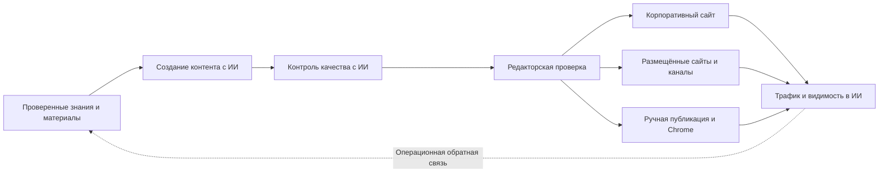

# GEOFlow 3.0

> Languages: [简体中文](../../README.md) | [English](README_en.md) | [日本語](README_ja.md) | [Español](README_es.md) | [Русский](README_ru.md) | [Português (BR)](README_pt_BR.md)

> Открытая GEO-платформа для корпоративных сайтов

GEOFlow объединяет проверенные знания, создание контента с помощью ИИ, контроль качества, редакторскую проверку, публикацию на нескольких сайтах и аналитику в одном рабочем процессе. Команды бренда, роста и контента могут использовать систему для корпоративного сайта, GEO-раздела, отраслевого информационного ресурса или внутренней контент-платформы, сохраняя источники, решения, результаты публикации и операционные данные в одном месте.

[Быстрый старт](#быстрый-старт) · [Интерфейс](#интерфейс) · [Основные возможности](#основные-возможности-geoflow-30) · [Развёртывание](../deployment/DEPLOYMENT.md) · [История изменений](../CHANGELOG_en.md) · [Сайт](https://www.geoflow.me)

[](../../version.json)
[](https://github.com/yaojingang/GEOFlow/releases/latest)
[](https://www.php.net/)
[](https://github.com/yaojingang/GEOFlow/actions/workflows/ci.yml)
[](../../LICENSE)
[](https://github.com/yaojingang/GEOFlow/stargazers)

> **Статус версии:** Текущая версия исходного кода: `3.0.0`. Опубликованные версии перечислены на странице [GitHub Releases](https://github.com/yaojingang/GEOFlow/releases). Для рабочего окружения используйте опубликованный выпуск или зафиксируйте проверенный коммит.

---

## Какую задачу решает GEOFlow

Корпоративная GEO-работа включает знания о бренде, настройку моделей, подготовку контента, проверку качества, сайт, каналы публикации и анализ результатов. Когда эти процессы разделены между инструментами, связь между источниками, редакторскими решениями и опубликованным результатом теряется.

GEOFlow собирает рабочий процесс в одной административной системе:



Система хранит источники знаний, настройки задач, вызовы моделей, доказательства качества, ручные разрешения, статусы публикации и журналы каналов.

---

## Интерфейс

<table>
  <tr>
    <td width="50%"><br /><sub>Иллюстрированная справка</sub></td>
    <td width="50%"><br /><sub>Обзор аналитики</sub></td>
  </tr>
  <tr>
    <td width="50%"><br /><sub>Управление задачами</sub></td>
    <td width="50%"><br /><sub>Проверка качества статей</sub></td>
  </tr>
  <tr>
    <td width="50%"><br /><sub>Размещённые сайты каналов</sub></td>
    <td width="50%"><br /><sub>Ручная публикация</sub></td>
  </tr>
</table>

Эти обезличенные экраны входят во встроенную справку 3.0 и показывают работу с базой знаний, задачами, проверкой качества, размещёнными сайтами, ручной публикацией и аналитикой.

---

## Основные возможности GEOFlow 3.0

| Возможность | Как организована работа в 3.0 |
|-------------|--------------------------------|
| Проверенные знания и создание контента | Единое управление базами знаний, заголовками, ключевыми словами, изображениями, авторами, промптами и моделями ИИ. Поддерживаются структурированное разбиение, дополнительное семантическое планирование, векторный поиск и стабильный резервный режим. |
| Контроль качества с ИИ | Проверка источников, данных и цитат, рекламных правил и контекста публикации. Сохраняются оценки по категориям, места в исходном тексте, нормативные ссылки, рекомендации и история. Материалы с ожиданием проверки, блокировкой, ошибкой или устаревшим результатом остаются черновиками. |
| Проверка и совместная работа | Управление черновиками, проверкой, публикацией, корзиной и массовым экспортом Markdown. Рабочая область ручной публикации хранит сведения об исполнителях, аккаунтах, расписании, рисках, подтверждениях и истории аудита. |
| Корпоративные сайты и публикация на нескольких площадках | Локальный frontend создаёт SEO-метаданные, Open Graph, Schema, sitemap и `llms.txt`. Поддерживаются размещённые сайты, GEOFlow Agent, WordPress REST и универсальные HTTP API. |
| Аналитика и эксплуатация | Анализ контента, публикаций, трафика, популярных материалов, ИИ-краулеров и динамики. Отдельный Updater отвечает за подписанные обновления, полные резервные копии, проверку окружения и откат к точке восстановления. |
| Работа команды и разработчиков | Admin UI V3 поддерживает шесть языков, адаптивный интерфейс, PWA и иллюстрированную справку. API v1, GEOFlow CLI и встроенный Agent Skill дают доступ к автоматизации и расширению. |

### Основные изменения 3.0

- Admin UI V3 объединяет боковую и верхнюю панели, навигацию, формы, диалоги и мобильное поведение. Статические ресурсы загружаются локально.
- Рабочая область ИИ стала иллюстрированным помощником по панели управления. В неё входят 15 тем, 24 обезличенных снимка и 72 фиксированных проверочных вопроса. Ссылки на функции формируются с учётом прав администратора.
- Проверка качества статей включена в процесс публикации. Результаты, ручные разрешения и изменения правил сохраняются для аудита.
- Размещённые сайты каналов поддерживают поддомены, жизненный цикл, назначение статей, квоты публикации, паузы после ошибок, технические проверки, очистку кэша и сверку состояния.
- Помощник Chrome использует сопряжение устройства и Token с минимальными правами для получения заданий, заполнения черновиков и возврата подтверждения выполнения. Окончательную публикацию подтверждает сотрудник.
- Библиотеки заголовков поддерживают пакетную генерацию до 100 000 записей, продолжение, отмену, повторные попытки и удаление дублей. Аудит удалённых задач хранится 90 дней.
- API v1 и `bin/geoflow` работают с каталогами, задачами, запусками, материалами, статьями и протоколами браузерных операций.
- Отдельный GEOFlow Updater использует локальный Unix socket для обновлений, полных резервных копий, проверки окружения и отката. Для рискованных действий нужны пароль администратора и шестизначный код аутентификатора.

Полная история доступна в [китайском](../CHANGELOG.md) и [английском](../CHANGELOG_en.md) журналах изменений.

---

## Сценарии использования

| Сценарий | Рекомендуемая конфигурация | Основные возможности |
|----------|----------------------------|----------------------|
| GEO для корпоративного сайта | Постоянная публикация на основе продуктов, кейсов, FAQ, отраслевых знаний и правил бренда | Корпоративные знания, задачи, качество, публикация на сайте, аналитика |
| GEO-раздел существующего сайта | Информационный, справочный или продуктовый раздел на поддомене или отдельном пути | Темы, категории, SEO, расписание, формы заявок |
| Отраслевой информационный ресурс | Проверяемые долгосрочные материалы по отрасли, теме или проблеме | RAG, редакторская проверка, удобный для цитирования вывод, sitemap, `llms.txt` |
| Внутренняя контент-платформа | Централизованная подготовка и проверка материалов командами бренда, роста и контента | Материалы, API, CLI, ручная публикация, права, аудит |
| Несколько брендов и сайтов | Управление несколькими сайтами, категориями и точками публикации из одной панели | Размещённые сайты, Agent, WordPress, универсальные API, журналы доставки |

GEOFlow рассчитан на команды с реальными деловыми материалами, назначенными ответственными за проверку и постоянным операционным планом. Качество знаний, человеческая оценка и регулярное обслуживание поддерживают доверие пользователей и систем ИИ.

---

## Безопасность и управление

| Область | Граница |
|---------|---------|
| Качество контента | Источники, версии правил, оценки, ручные разрешения и срок действия результатов доступны для проверки. |
| Учётные записи и права | Доступ следует правам, рискованные операции требуют супер-администратора, изменения состояния задач и ручных публикаций сохраняются. |
| Браузерные операции | Расширение использует сопряжение и Token с минимальными правами. Пароли, cookies и данные OAuth внешних платформ не сохраняются. |
| Исходящие запросы | Импорт URL, публикация, ИИ, ссылки тем и проверка обновлений используют общую политику с ограничениями частных сетей, перенаправлений и размера ответа. |
| Обновление и восстановление | Updater использует подписанные пакеты, локальный Unix socket, проверку окружения, полные копии и точки восстановления. Рискованные запросы требуют второго фактора. |
| Анонимная телеметрия | По умолчанию отключена. После включения отправляет только разрешённые поля без контента, аккаунтов, адресов электронной почты, доменов, cookies и секретов. |

Текущие требования безопасности и порядок обновления приведены в [руководстве по развёртыванию](../deployment/DEPLOYMENT.md) и примечаниях выбранного выпуска.

---

## Компоненты и окружение

| Компонент | Версия исходного кода или состояние | Описание |
|-----------|--------------------------------------|----------|
| GEOFlow Core | `3.0.0` | Приложение Laravel, панель, frontend, API, очереди и система публикации |
| GEOFlow CLI | `0.2.0` | Входит как `bin/geoflow`; поддерживает macOS, Linux и WSL |
| Помощник Chrome | `0.1.0` | Исходный код и пакет находятся в `browser-extension/` и `dist/browser-extension/` |
| GEOFlow Updater | Отдельный компонент | Используйте подписанную версию, совместимую с целевым выпуском; см. [geoflow-updater](https://github.com/yaojingang/geoflow-updater) |
| Agent целевого сайта | Создаётся для канала | Формирует настроенный PHP-пакет с главной страницей, статьями, ресурсами, Schema, sitemap и `llms.txt` |

Требования:

| Компонент | Требование |
|-----------|------------|
| PHP | 8.3 или новее; Docker может использовать PHP 8.4 |
| База данных | PostgreSQL; рекомендуется pgvector или совместимое расширение |
| Redis | Очереди, кэш и состояние выполнения |
| Node.js | Сборка frontend; CI использует Node.js 22 |
| Контейнеры | Docker Compose; рабочая среда использует Nginx и php-fpm |

---

## Быстрый старт

### Docker для разработки и проверки

```bash
git clone https://github.com/yaojingang/GEOFlow.git
cd GEOFlow
cp .env.example .env
docker compose build
docker compose up -d --remove-orphans
```

- Frontend: `http://localhost:18080`
- Панель: `http://localhost:18080/geo_admin/login`
- `APP_PORT` задаёт порт, `ADMIN_BASE_PATH` задаёт префикс панели.
- При первом запуске сервис `init` выполняет миграции и инициализирует пустую базу данных.

Параметры учётной записи для разработки приведены в [руководстве по развёртыванию](../deployment/DEPLOYMENT.md). В рабочем окружении задайте пароль администратора, HTTPS, безопасные cookies и обратный прокси.

### Docker для рабочего окружения

Рабочее окружение использует `docker-compose.prod.yml`, Nginx и php-fpm. Подготовьте `.env.prod`, резервные копии базы данных, HTTPS, постоянные каталоги и контроль процессов:

```bash
cp .env.prod.example .env.prod

docker compose --env-file .env.prod -f docker-compose.prod.yml build
docker compose --env-file .env.prod -f docker-compose.prod.yml up -d postgres redis
docker compose --env-file .env.prod -f docker-compose.prod.yml up -d init
docker compose --env-file .env.prod -f docker-compose.prod.yml up -d app web queue ai-quality-queue ai-quality-backfill-queue ai-optimization-queue knowledge-queue scheduler reverb
```

См. [`docs/deployment/DEPLOYMENT.md`](../deployment/DEPLOYMENT.md) для настройки, проверок состояния, обратного прокси и восстановления.

### Обновление с 2.x

Создайте резервные копии базы данных, `.env`, загрузок и `storage`. Остановите старые процессы и дождитесь завершения задач перед миграцией, пересборкой frontend и перезапуском сервисов. Ранние версии 2.x также требуют проверки управляемых изображений и аудита безопасности. Включайте размещённые сайты после настройки wildcard DNS, wildcard TLS, доверенных прокси и Nginx.

Для существующих установок используйте [процедуру безопасной остановки и миграции](../deployment/DEPLOYMENT.md). Не пересобирайте контейнеры сразу после `git pull`. Точные команды и совместимость компонентов определяются выбранным GitHub Release.

---

## Для разработчиков

### GEOFlow CLI

`bin/geoflow` управляет каталогами, задачами, запусками, материалами и статьями через API v1. Поддерживаются безопасная конфигурация, вход, JSON-файлы или stdin, подтверждение удаления и структурированные ошибки.

[Руководство CLI на китайском](../GEOFLOW_CLI.md) | [Руководство CLI на английском](../GEOFLOW_CLI_en.md)

### GEOFlow Agent Skill

Репозиторий содержит [GEOFlow Agent Skill](../../.agents/skills/geoflow/) для разработки Laravel, работы с панелью, публичного frontend, пакетов тем, сайтов каналов и миграции старых версий. Совместимые инструменты находят его в репозитории, а пользователи Codex могут вызвать его через `$geoflow`.

Установка и восстановление описаны в [README навыка](../../.agents/skills/geoflow/README.md).

### Разработка и тесты

```bash
composer install
npm ci
npm run build
composer test
npm run test:analytics
vendor/bin/pint --test
```

Перед отправкой изменений прочитайте [руководство участника](../../CONTRIBUTING.md).

---

## Открытая и коммерческая лицензии

Текущая версия GEOFlow распространяется по [GNU Affero General Public License v3.0](../../LICENSE). Ранее опубликованные версии с Apache-2.0 сохраняют исходную лицензию; исторический текст находится в [`docs/licenses/Apache-2.0.txt`](../licenses/Apache-2.0.txt).

| Использование | Лицензия |
|---------------|----------|
| Использование, изменение, развёртывание или распространение с соблюдением AGPL-3.0 | Бесплатно. Сетевые сервисы и распространение должны выполнять соответствующие требования лицензии к исходному коду. |
| Закрытые изменения, white-label, OEM, интеграция в закрытый продукт или другой сценарий, требующий исключения из AGPL-3.0 | Запросите отдельную коммерческую лицензию у правообладателя. |

Начать обсуждение коммерческой лицензии можно через [GitHub Issue](https://github.com/yaojingang/GEOFlow/issues/new). Issues открыты для всех, поэтому не публикуйте договоры, цены, данные клиентов и другую конфиденциальную информацию. После первого контакта обсуждение можно перенести в закрытый канал. Применимые обязанности определяются текстом лицензии и подписанным соглашением.

Внешние участники сохраняют авторские права на свои материалы и до слияния принимают [GEOFlow Contributor License Agreement v1.0](../../CLA.md). CLA позволяет поддерживать AGPL-версию и предлагать отдельные коммерческие лицензии.

### Анонимная телеметрия

Анонимная телеметрия по умолчанию отключена. После включения и настройки HTTPS-адреса авторизованная страница панели отправляет не более одного события активности в день. Данные ограничены случайным ID экземпляра, необратимым хешем администратора, версией GEOFlow и типом события.

```dotenv
GEOFLOW_TELEMETRY_ENABLED=false
```

Домены, пути страниц, аккаунты, адреса электронной почты, статьи, cookies, `APP_KEY` и секреты не отправляются. При пустом адресе сбора запросы не выполняются.

---

## Другие языки

- [简体中文 README](../../README.md)
- [English README](README_en.md)
- [日本語 README](README_ja.md)
- [Español README](README_es.md)
- [Português (BR) README](README_pt_BR.md)

---

## История звёзд

[](https://star-history.dera.page/#yaojingang/GEOFlow&Date)
