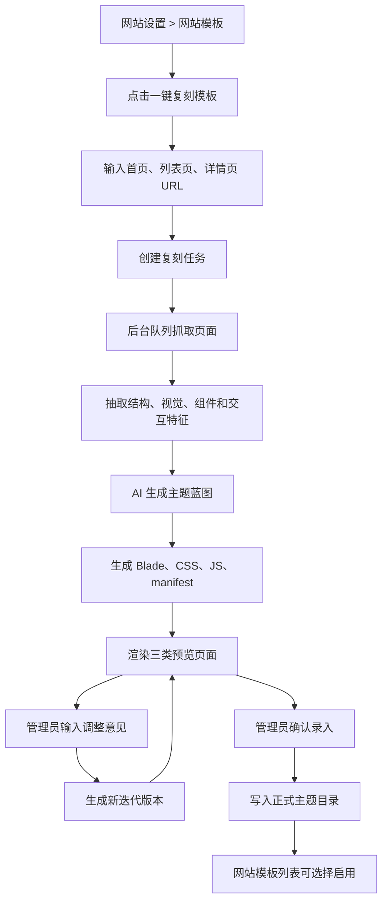

# GEOFlow 网站模板一键复刻功能开发方案

## 目标

在后台「网站设置 > 网站模板」模块增加「一键复刻模板」能力。管理员输入首页、列表页、文章详情页三个对标 URL 后，系统通过后台 Agent 分析页面结构、视觉风格、模块布局和交互特征，生成一套符合 GEOFlow 前台数据契约的新主题包。管理员可以预览首页、列表页、详情页，用文字反馈继续迭代，确认后将主题录入后台并可在现有模板列表中启用。

## 推荐结论

建议做成「异步主题生成工作流」，而不是在网站设置页内同步调用 AI 并直接写文件。

原因：

- 复刻过程包含抓取、清洗、AI 分析、文件生成、预览和人工确认，耗时不可控，必须走队列任务。
- 生成结果需要先进入草稿态，只有管理员确认后才写入正式主题目录，避免污染当前前台。
- 当前主题系统已经有清晰契约：`resources/views/theme/{theme_id}`、`manifest.json`、`public/themes/{theme_id}/theme.css`，复刻功能应复用这套结构。
- 法务和版权风险需要前置约束：只提取布局、颜色、排版和模块逻辑，不复制第三方站点图片、商标、专有文案和源代码。

## 范围

本次建设包含：

- 网站模板模块新增「一键复刻模板」入口。
- 新增复刻任务创建页：输入首页、列表页、详情页 URL，填写主题名称、主题标识、基准主题和 AI 模型。
- 新增复刻任务详情页：展示进度、日志、分析结果、生成文件、三类页面预览、调优反馈输入框。
- 新增后台异步 Job：抓取页面、抽取 UI 特征、生成 GEOFlow Blade 模板、生成独立 CSS/JS、生成主题 manifest。
- 新增草稿主题存储与确认发布机制。
- 新增预览机制：使用本机文章、分类、站点设置数据渲染首页、列表页、详情页。
- 新增迭代机制：用户输入调整意见后，Agent 基于上一版主题草稿生成下一版。
- 新增基础测试：页面入口、任务创建、URL 校验、生成草稿、确认发布、主题列表可见。

本次不包含：

- 不做像素级复制或完整爬取第三方站点所有页面。
- 不复制第三方图片、Logo、商标、广告素材、专有文案和源代码。
- 不做浏览器插件式可视化拖拽编辑器。
- 不在第一版支持任意复杂登录态页面、反爬页面和强 JS 渲染页面。
- 不直接把 AI 生成结果自动设为当前模板，必须人工确认。

## 当前系统基础

现有主题机制：

- 主题扫描：`app/Support/Site/SiteThemeCatalog.php`
- 主题解析：`app/Support/Site/SiteThemeViewResolver.php`
- 后台设置页：`resources/views/admin/site-settings/index.blade.php`
- 设置控制器：`app/Http/Controllers/Admin/SiteSettingsController.php`
- 主题目录：`resources/views/theme/{theme_id}/`
- 运行时静态资源：`public/themes/{theme_id}/theme.css`、`theme.js`

现有主题约定：

- 每个主题至少包含 `manifest.json`、`layout.blade.php`、`home.blade.php`、`category.blade.php`、`article.blade.php`。
- 复杂主题可包含 `archive-index.blade.php`、`archive-month.blade.php`、`partials/*`、`mapping.json`、`tokens.json`。
- 前台缺失模板时会回退到 `resources/views/site/`。

## Review 后补充的关键决策

### 1. 草稿预览不能污染正式主题目录

第一版不要为了预览把草稿文件写进 `resources/views/theme/{theme_id}`。否则 `SiteThemeCatalog` 可能提前扫描到半成品主题，管理员误选后会影响前台。

推荐做法：

- 草稿 Blade 文件写入 `storage/app/geoflow-theme-replications/{replication_id}/draft/{version}/views/`。
- 草稿 CSS/JS 写入 `storage/app/geoflow-theme-replications/{replication_id}/draft/{version}/assets/`。
- 预览时由 `ThemePreviewRenderer` 临时注册 View namespace，例如 `theme-replication-{id}-{version}`，只在当前后台预览请求内生效。
- 草稿资源通过后台受保护路由读取，例如 `/admin/site-settings/theme-replications/{id}/assets/theme.css?version=2`。
- 确认录入时才复制到 `resources/views/theme/{theme_id}` 和 `public/themes/{theme_id}`。

这样可以保证草稿态、预览态和正式态完全隔离。

### 2. 生产环境源码不可写时要有降级路径

很多 Docker 生产环境可能是镜像只读或源码挂载不可写。一键复刻不能假设一定能写入 `resources/` 和 `public/`。

发布前必须检测：

- `resources/views/theme` 是否可写。
- `public/themes` 是否可写。
- 当前是否为源码挂载模式。

处理策略：

- 可写：允许后台「确认录入」直接发布主题。
- 不可写：允许生成「主题安装包」下载，包内包含 `resources/views/theme/{theme_id}`、`public/themes/{theme_id}` 和安装说明；后台提示需要通过代码发布或系统更新中心上线。
- 后续可再扩展为 `storage` 主题目录，但第一版不建议改变现有 `SiteThemeCatalog` 的主扫描契约，避免把前台主题加载路径做复杂。

### 3. AI 不直接生成可执行 Blade，必须经过白名单写入器

AI 可以生成主题蓝图、组件结构和样式 token，但不能直接决定任意 PHP/Blade 可执行逻辑。

落地规则：

- Agent 输出 JSON 蓝图。
- `ThemeScaffoldWriter` 根据蓝图和固定模板骨架生成 Blade。
- Blade 中只允许白名单变量、白名单指令和白名单 include。
- 禁止输出 `@php`、`<?php`、`{!!`、`eval`、`shell_exec`、`file_put_contents`、`DB::`、`Http::` 等危险内容。
- 必要的非转义输出只允许复用现有文章 Markdown 渲染入口，不能由模型自由生成。

这会牺牲一部分自由度，但能显著降低后台生成模板的安全风险。

### 4. 视觉复刻分两档能力，避免第一版架构过重

第一版默认使用「HTML + CSS 摘要」：

- 抓取 HTML。
- 提取 link stylesheet 并按大小和域名限制抓取公开 CSS。
- 解析颜色、字体、间距、网格、组件 class 和 DOM 层级。
- 生成结构化设计摘要给 Agent。

可选增强使用「视觉快照」：

- 增加配置 `GEOFLOW_THEME_REPLICATION_VISUAL_CAPTURE_ENABLED=false`。
- 开启后才使用 Playwright/Chromium 截图、视口采样和 computed style 摘要。
- 只采集桌面和移动两个视口，不做全页面像素匹配。

第一版不强依赖 Playwright，避免 Docker 镜像、依赖体积和服务器权限复杂化。

### 5. 主题生成必须保留 GEOFlow 数据契约

复刻不是把外部页面改成静态 HTML，而是把外部页面的设计语言映射到 GEOFlow 的动态数据结构。

必须保留这些契约：

- 首页：分类导航、精选文章、最新文章、热门文章、站点 SEO、Schema。
- 列表页：分类标题、文章分页、文章卡片、空状态。
- 详情页：标题、发布时间、分类、作者、正文 Markdown HTML、标签、相关文章、广告位。
- 布局：站点名称、Logo、导航、页脚、统计代码、favicon。
- 安全：所有用户可控文本默认转义。

任何生成主题如果破坏这些契约，即使视觉接近，也不能发布。

## 功能流程



## UI 设计

### 1. 网站模板模块入口

在「网站设置 > 网站模板」模块顶部增加一个独立操作区：

- 主按钮：`一键复刻模板`
- 副说明：`输入首页、列表页和详情页对标地址，系统会生成一套保留 GEOFlow 数据契约的新主题。`
- 风险提示：`仅提取布局和样式特征，不复制第三方素材、商标和专有代码。`

按钮位置建议放在「当前生效模板」卡片右侧或网站模板模块顶部右侧，与「保存模板」分开。它是创建新主题，不是保存当前主题。

### 2. 创建复刻任务页

路由建议：

- `GET /admin/site-settings/theme-replications/create`
- `POST /admin/site-settings/theme-replications`

表单模块：

- 基本信息：主题名称、主题标识、基准主题、AI 模型。
- 对标页面：首页 URL、列表页 URL、文章详情页 URL。
- 生成策略：简洁门户、内容站、资讯站、品牌官网四种风格倾向。
- 合规确认：勾选「我确认仅做布局和样式参考，不复制第三方素材和专有内容」。

校验规则：

- URL 必须是 `http` 或 `https`。
- 禁止内网、localhost、回环 IP、保留网段，复用 URL 导入模块的私有地址防护思路。
- 三个 URL 必须可访问，单页最大 HTML 体积限制为 2MB。
- 主题标识只允许 `a-z0-9-_`，长度 3-64。
- 主题标识不能与现有主题重复。

### 3. 复刻任务详情页

路由建议：

- `GET /admin/site-settings/theme-replications/{replicationId}`
- `POST /admin/site-settings/theme-replications/{replicationId}/iterate`
- `POST /admin/site-settings/theme-replications/{replicationId}/publish`

页面结构：

- 顶部状态条：排队中、抓取中、分析中、生成中、可预览、迭代中、已发布、失败。
- 左侧主区域：三个预览卡片，分别是首页、列表页、详情页。
- 右侧信息栏：输入 URL、当前版本、生成文件清单、最近日志、失败原因。
- 底部调优区：文本框输入修改意见，例如「首页卡片更紧凑」「标题改成黑色粗体」「详情页正文行高再大一点」。
- 操作按钮：重新生成、提交调整、确认录入、返回模板列表。

预览方式：

- 第一版用 iframe 预览内部路由，例如：
  - `/admin/site-settings/theme-replications/{id}/preview/home`
  - `/admin/site-settings/theme-replications/{id}/preview/category`
  - `/admin/site-settings/theme-replications/{id}/preview/article`
- 预览数据使用本机已有文章、分类、站点名称、SEO 配置和示例广告位。
- 草稿主题不进入正式 `SiteThemeCatalog`，只有确认录入后才进入网站模板列表。

预览页需要支持：

- 桌面宽度、平板宽度、手机宽度三种视口切换。
- 首页、列表页、详情页三类 tab。
- 一键打开新窗口预览，方便检查响应式细节。
- 展示「本次生成改变了哪些文件」。
- 展示「当前草稿版本」和「上一次迭代意见」。

### 4. 任务列表与历史记录

建议在网站模板模块下方增加「复刻任务记录」折叠区：

- 最近 5 条复刻任务。
- 展示状态、主题名、创建时间、来源域名、当前版本。
- 可进入详情、继续迭代、确认录入、删除草稿。
- 已发布任务显示「已录入」和主题 ID。

这样管理员不用只依赖任务完成后的跳转，也能回到历史任务继续处理。

## 后台设计

### 数据表

新增表：`site_theme_replications`

字段建议：

- `id`
- `name`
- `theme_id`
- `base_theme_id`
- `ai_model_id`
- `status`
- `home_url`
- `category_url`
- `article_url`
- `style_preference`
- `source_fingerprints`
- `analysis_json`
- `generated_files_json`
- `preview_snapshot_json`
- `current_version`
- `published_theme_path`
- `published_asset_path`
- `compliance_status`
- `compliance_report_json`
- `iteration_count`
- `error_message`
- `created_by_admin_id`
- `published_at`
- `created_at`
- `updated_at`

新增表：`site_theme_replication_logs`

字段建议：

- `id`
- `site_theme_replication_id`
- `level`
- `step`
- `message`
- `context_json`
- `created_at`

新增表：`site_theme_replication_versions`

字段建议：

- `id`
- `site_theme_replication_id`
- `version`
- `prompt_hash`
- `feedback`
- `blueprint_json`
- `files_json`
- `compliance_report_json`
- `draft_views_path`
- `draft_assets_path`
- `created_at`

版本表用于保留每次生成和每次文字反馈迭代的结果，避免覆盖上一版，方便回退比较。

文件草稿目录：

- `storage/app/geoflow-theme-replications/{replication_id}/draft/{version}/`

正式发布目录：

- `resources/views/theme/{theme_id}/`
- `public/themes/{theme_id}/`

只读部署降级目录：

- `storage/app/geoflow-theme-replications/{replication_id}/packages/{theme_id}.zip`

### 状态机

任务状态：

- `queued`
- `fetching`
- `extracting`
- `analyzing`
- `generating`
- `scanning`
- `preview_ready`
- `iterating`
- `published`
- `failed`

状态规则：

- `preview_ready` 才允许提交调优意见。
- `preview_ready` 才允许确认录入。
- `published` 后不可直接覆盖，只能通过「复制为新复刻任务」继续迭代。
- `failed` 可重新执行，保留错误日志和已抓取数据。
- `scanning` 不通过时不能进入 `preview_ready`，必须进入 `failed` 并展示安全扫描报告。

### 服务拆分

建议新增这些服务，保持控制器轻量：

- `SiteThemeReplicationService`
  - 创建任务、触发队列、发布草稿主题。
- `ThemeReferenceFetcher`
  - 抓取三个 URL，清洗 HTML、CSS 链接、meta 信息。
- `ThemeReferenceAnalyzer`
  - 从 HTML/CSS 中提取布局、颜色、字体、间距、模块、交互线索。
- `ThemeVisualSnapshotService`
  - 可选服务。配置开启时使用截图和 computed style 摘要增强视觉分析。
- `ThemeReplicationAgent`
  - 调用当前可用 chat 模型，生成主题蓝图和文件生成指令。
- `ThemeScaffoldWriter`
  - 把蓝图写成 GEOFlow Blade、CSS、JS、manifest、tokens、mapping。
- `ThemePreviewRenderer`
  - 用草稿主题和本机数据渲染预览。
- `ThemeComplianceGuard`
  - 过滤外部图片、商标、第三方脚本、危险 Blade/PHP 代码。
- `ThemeReplicationPackageService`
  - 源码不可写时生成可下载主题包和安装说明。

### 队列 Job

新增 Job：

- `RunSiteThemeReplicationJob`
- `IterateSiteThemeReplicationJob`

任务步骤：

1. 校验 URL 与主题标识。
2. 抓取首页、列表页、详情页。
3. 抓取可访问 CSS，按域名、大小和数量限制采样。
4. 清洗 DOM，删除脚本、广告、登录态、跟踪代码和危险链接。
5. 抽取设计特征：
   - 色彩 token
   - 字体层级
   - 网格和断点
   - Header/Footer 结构
   - 卡片、列表、正文、侧栏、面包屑、标签、分页等组件
   - hover、sticky、展开收起等轻量交互
6. 如启用视觉快照，补充截图和 computed style 摘要。
7. 调用 AI 生成主题蓝图。
8. 用白名单 writer 生成草稿文件。
9. 校验生成文件安全性。
10. 渲染预览。
11. 写入状态和日志。

## Agent 设计

### 输入

Agent 输入不直接塞完整 HTML，而是传结构化摘要，控制 token 和风险：

- 三个页面的 URL、title、meta。
- DOM 结构摘要。
- 关键模块清单。
- CSS token 摘要。
- 截断后的代表性 class/组件片段。
- 可选截图摘要和 computed style 摘要。
- 当前 GEOFlow 主题契约说明。
- 当前基准主题的文件结构说明。
- 用户风格偏好和迭代反馈。

### 输出

Agent 输出 JSON，不直接输出任意 PHP 代码：

```json
{
  "theme": {
    "name": "Example Inspired",
    "id": "example-inspired-20260610",
    "description": "A reference-inspired GEOFlow theme..."
  },
  "tokens": {
    "colors": {},
    "typography": {},
    "spacing": {},
    "radius": {}
  },
  "components": [
    {
      "name": "article_card",
      "role": "home.latest_articles",
      "layout": "..."
    }
  ],
  "templates": {
    "layout": "...",
    "home": "...",
    "category": "...",
    "article": "..."
  },
  "assets": {
    "theme_css": "...",
    "theme_js": "..."
  },
  "notes": []
}
```

后台只接受白名单字段，再由 `ThemeScaffoldWriter` 写入文件。这样可以避免模型直接生成任意可执行 PHP。

### Prompt 规则

Agent 提示词必须明确：

- 目标是生成 GEOFlow 主题，不是复制站点。
- 只参考布局、色彩、排版、模块组织和交互方式。
- 不得使用第三方品牌名作为站点品牌。
- 不得引用第三方图片、Logo、广告素材和专有文案。
- 输出必须是 JSON，不输出解释性正文。
- 所有模板必须保留 GEOFlow 的动态数据变量和 SEO/Schema 能力。
- 若源页面结构不足，应基于基准主题补齐，而不是生成空页面。

### AI 失败与降级

- 如果 AI 返回非 JSON，记录日志并尝试一次 JSON 修复。
- 如果修复仍失败，任务进入 `failed`，展示原始错误摘要。
- 如果生成结果缺少必需模板，任务进入 `failed`。
- 如果没有可用 chat 模型，创建任务前直接提示配置 AI 模型。
- 不在第一版做多模型自动竞争生成，避免成本不可控；后续可增加「生成 3 个候选版本」。

## 生成主题文件规则

正式主题目录结构：

```text
resources/views/theme/{theme_id}/
  manifest.json
  mapping.json
  tokens.json
  layout.blade.php
  home.blade.php
  category.blade.php
  article.blade.php
  partials/
    header.blade.php
    footer.blade.php
    article-card.blade.php

public/themes/{theme_id}/
  theme.css
  theme.js
```

关键约束：

- CSS 必须放在 `public/themes/{theme_id}/theme.css`。
- JS 必须放在 `public/themes/{theme_id}/theme.js`，只允许轻量交互。
- Blade 只允许使用 GEOFlow 已有变量和组件约定。
- 不允许生成数据库查询、文件写入、网络请求、`@php` 大段逻辑、`eval`、`shell_exec`、外链脚本。
- 图片默认使用 GEOFlow 本地文章图、站点 Logo 或占位背景，不复制对标站图片。
- SEO、Schema、文章 Markdown 渲染、分类导航、归档路由必须保留。
- `layout.blade.php` 必须引用 `asset('themes/{theme_id}/theme.css')`。
- 不允许在 Blade 中内联大段 `<style>`，页面级小样式也应进入 `theme.css`。
- 不允许在 Blade 中内联大段 `<script>`，轻量交互进入 `theme.js`。
- `manifest.json` 必须写入 `mode: "replicated"`、`source_reference_url`、`created_by: "GEOFlow Theme Replication"` 和合规 notes。

### 文件生成白名单

允许生成的文件：

- `manifest.json`
- `mapping.json`
- `tokens.json`
- `layout.blade.php`
- `home.blade.php`
- `category.blade.php`
- `article.blade.php`
- `archive-index.blade.php`
- `archive-month.blade.php`
- `partials/header.blade.php`
- `partials/footer.blade.php`
- `partials/article-card.blade.php`
- `assets/theme.css`
- `assets/theme.js`

不允许生成：

- `.php` 独立脚本
- `.env`
- `.htaccess`
- `composer.json`
- 任意 `app/`、`routes/`、`config/` 文件
- 任意上传目录或缓存目录文件

发布时 `assets/theme.css`、`assets/theme.js` 同步复制到 `public/themes/{theme_id}/`。

## 安全与合规

必须内置这些约束：

- SSRF 防护：禁止内网、回环、保留 IP、file 协议和非 http/https 协议。
- HTML 清洗：删除 script、iframe、object、embed、form、tracking pixel。
- 外链资产控制：不下载第三方图片、字体和 JS；颜色、排版、布局只做抽象参考。
- 版权提示：后台创建任务前明确提示「参考风格，不复制素材和代码」。
- 代码安全：生成文件写入前做 Blade/PHP 黑名单扫描和允许语法校验。
- 文件写入边界：只允许写入指定主题目录和 public themes 目录。
- 预览隔离：草稿主题只在后台预览路由可访问，不影响前台。
- 发布隔离：确认录入只新增主题，不自动改 `active_theme`。
- 审计日志：记录创建、迭代、发布、删除草稿等管理员操作。
- 速率限制：同一管理员每小时最多创建有限数量复刻任务，避免外部抓取和 AI 成本失控。
- 成本提示：创建前展示预估步骤和可能消耗的 AI 调用，不承诺固定完成时间。

## 分阶段开发计划

### Phase 1：入口、数据模型和任务闭环

可独立发布。

实现内容：

- 新增复刻任务表和日志表。
- 新增复刻版本表。
- 新增后台路由、控制器和基础页面。
- 网站模板模块增加「一键复刻模板」按钮。
- 支持创建任务、查看任务、查看日志、失败重试。
- URL 校验和私有地址防护。
- 源码目录可写性检测和只读环境提示。

验收：

- 能从网站模板模块进入创建页。
- 能提交三个 URL 创建任务。
- 无 AI 配置时给出清晰错误。
- 任务状态和日志可见。
- 源码不可写时显示「可生成主题包，但不能后台直接录入」。

### Phase 2：抓取、分析和主题草稿生成

可独立发布。

实现内容：

- 页面抓取和 HTML/CSS 摘要。
- Agent 生成主题蓝图。
- 写入草稿主题文件。
- 生成 `manifest.json`、`tokens.json`、`mapping.json`。
- 生成独立 `theme.css` 和 `theme.js`。
- 增加安全扫描。
- 草稿版本记录。

验收：

- 三个对标 URL 可生成一套草稿主题。
- 生成文件不包含外链脚本和第三方图片。
- 生成文件通过 Blade 安全扫描。
- 草稿主题不会出现在正式网站模板列表。

### Phase 3：预览、迭代和确认录入

可独立发布。

实现内容：

- 后台 iframe 预览首页、列表页、详情页。
- 用户文本反馈迭代。
- 每次迭代保留版本记录。
- 确认录入后发布到正式主题目录。
- 发布后主题出现在现有网站模板列表。
- 源码不可写时生成主题安装包。

验收：

- 三类页面都能用本地数据预览。
- 输入调优意见后可以生成下一版。
- 确认录入后可在网站设置启用新主题。
- 启用后前台可正常访问首页、分类页、详情页。
- 源码不可写环境可以下载主题包，且不会误提示已经录入成功。

### Phase 4：体验增强

可独立发布。

实现内容：

- 预览页增加桌面/移动视图切换。
- 增加生成文件差异查看。
- 增加复制为新主题。
- 增加失败原因和修复建议。
- 增加已发布主题的「归档」或「删除草稿」能力。
- 可选视觉快照增强，支持更准确的颜色、间距和响应式判断。

验收：

- 管理员可以更清楚地判断生成质量。
- 出错时能知道是 URL 抓取、AI 调用、文件生成还是安全扫描失败。
- 开启视觉快照时不影响未安装 Playwright 的默认部署。

## 涉及文件

预计新增：

- `app/Models/SiteThemeReplication.php`
- `app/Models/SiteThemeReplicationLog.php`
- `app/Http/Controllers/Admin/SiteThemeReplicationController.php`
- `app/Jobs/RunSiteThemeReplicationJob.php`
- `app/Jobs/IterateSiteThemeReplicationJob.php`
- `app/Services/Admin/SiteThemeReplicationService.php`
- `app/Services/Admin/ThemeReferenceFetcher.php`
- `app/Services/Admin/ThemeReferenceAnalyzer.php`
- `app/Services/Admin/ThemeVisualSnapshotService.php`
- `app/Services/Admin/ThemeReplicationAgent.php`
- `app/Services/Admin/ThemeScaffoldWriter.php`
- `app/Services/Admin/ThemePreviewRenderer.php`
- `app/Services/Admin/ThemeComplianceGuard.php`
- `app/Services/Admin/ThemeReplicationPackageService.php`
- `resources/views/admin/site-theme-replications/create.blade.php`
- `resources/views/admin/site-theme-replications/show.blade.php`
- `database/migrations/*_create_site_theme_replications_table.php`
- `database/migrations/*_create_site_theme_replication_logs_table.php`
- `database/migrations/*_create_site_theme_replication_versions_table.php`
- `tests/Feature/AdminSiteThemeReplicationTest.php`

预计修改：

- `routes/web.php`
- `app/Http/Controllers/Admin/SiteSettingsController.php`
- `resources/views/admin/site-settings/index.blade.php`
- `app/Support/Site/SiteThemeCatalog.php`
- `lang/zh_CN/admin.php`
- `lang/en/admin.php`
- `lang/pt_BR/admin.php`
- `config/geoflow.php`

文件数量超过 8 个，这是一个新后台工作流，不建议压成单文件实现。

## 测试计划

自动化测试：

- 管理员可以看到「一键复刻模板」入口。
- 普通未登录用户不能访问复刻页面。
- 创建任务必须填写三个 URL。
- 内网 URL、localhost、非法协议会被拒绝。
- 无可用 chat 模型时显示清晰错误。
- 任务可从 `queued` 跑到 `preview_ready`。
- 草稿主题不会出现在正式主题列表。
- 草稿预览使用 storage draft view namespace，不写入正式主题目录。
- 确认录入后主题出现在 `SiteThemeCatalog`。
- 生成的主题启用后首页、分类页、详情页可渲染。
- 生成的 CSS/JS 独立存在，不把大段 CSS 写入 Blade。
- 安全扫描拒绝 `script`、`shell_exec`、`eval`、外链 JS。
- 源码不可写时不会尝试直接发布，而是生成主题包。
- 非 JSON AI 输出会被拦截并显示错误。

建议验证命令：

```bash
php artisan test tests/Feature/AdminSiteSettingsPageTest.php tests/Feature/AdminSiteThemeReplicationTest.php
php artisan test tests/Feature/SiteArticleMarkdownRenderTest.php
php artisan test
```

手动验收：

- 在 `/admin/site-settings` 点击「一键复刻模板」。
- 输入三个公开页面 URL。
- 等待任务完成。
- 打开首页、列表页、详情页预览。
- 输入一次调优反馈并重新生成。
- 确认录入主题。
- 回到网站模板列表启用新主题。
- 前台访问首页、分类页、详情页确认样式和数据正常。

## 风险与处理

### 风险 1：AI 生成代码不可控

处理：

- Agent 输出 JSON 蓝图，不直接执行模型返回的 PHP。
- 后台 writer 按白名单生成 Blade。
- 文件写入前做危险语法扫描。

### 风险 2：复刻侵犯第三方权益

处理：

- 创建任务前必须确认合规提示。
- 不复制图片、Logo、商标、专有文案和源代码。
- manifest 中写明 `source_reference_url` 和 `notes`，标注为 inspired/reference。

### 风险 3：页面抓取失败或 JS 渲染页面为空

处理：

- 第一版以服务端 HTTP 抓取为主。
- 对 JS 强依赖页面给出明确错误：建议换成可直接访问的公开页面。
- 后续可单独增加 Playwright 截图分析 worker，但不放进第一版闭环。

### 风险 4：生成主题破坏现有前台

处理：

- 草稿主题只在后台预览。
- 正式发布前不写入当前 `active_theme`。
- 确认录入后仍需用户手动选择启用。

### 风险 5：生产环境无法写入源码目录

处理：

- 发布前检测目录可写性。
- 不可写时生成主题安装包，不显示「录入成功」。
- 提供部署说明，建议通过代码提交、系统更新中心或服务器文件同步上线。

### 风险 6：视觉还原不够准确

处理：

- 第一版明确目标是「风格参考」而非像素级复刻。
- HTML/CSS 摘要足够覆盖多数内容站。
- 对视觉要求更高的场景，后续开启 Playwright 视觉快照增强。

## 推荐第一版交付边界

第一版应该做到：

- 后台能创建复刻任务。
- 能抓取三个 URL。
- 能生成一个草稿主题。
- 能预览三类页面。
- 能用一次文字反馈迭代。
- 能确认录入到主题列表。
- 源码不可写时能生成主题安装包。
- 不会自动启用生成主题。

第一版不追求：

- 像素级一致。
- 复杂动效完全还原。
- 反爬页面适配。
- 登录态页面适配。
- 批量复刻多个站点。

## 开发顺序

1. 新增数据表、模型、路由、控制器和页面入口。
2. 实现 URL 校验、任务创建和日志。
3. 实现抓取和页面摘要。
4. 实现 Agent 蓝图生成。
5. 实现草稿主题文件生成和安全扫描。
6. 实现后台预览。
7. 实现文字反馈迭代。
8. 实现确认录入。
9. 补齐测试和翻译。

建议拆成 3 个小提交：

1. `Add site theme replication workflow shell`
   - 数据表、模型、路由、入口、创建页、详情页、状态日志。
2. `Generate and preview replicated theme drafts`
   - 抓取、分析、Agent 蓝图、草稿文件、安全扫描、预览。
3. `Publish replicated themes`
   - 确认录入、只读环境主题包、主题列表集成、完整测试。

## 最终判断

这个功能值得做，但必须把它定位成「参考风格生成 GEOFlow 主题」，不是「复制第三方网站」。最稳妥的实现是异步生成草稿主题、后台预览、人工确认录入。这样既能满足用户快速做模板的目标，也能把 AI 不稳定、版权、安全和前台稳定性风险控制在可接受范围内。
