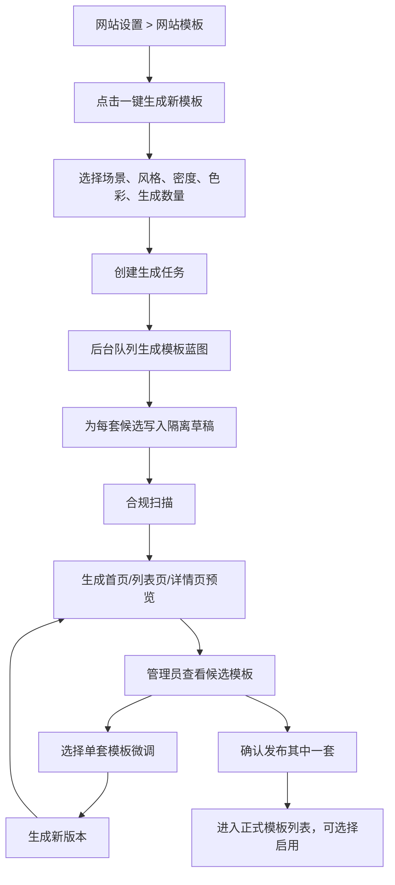

# GEOFlow 网站模板一键生成新模板实施方案

## 1. 背景与目标

当前 GEOFlow 后台「网站设置 > 网站模板」已经具备两类能力：

- 从 `resources/views/theme/{theme_id}` 扫描并启用现有前台模板。
- 通过「一键复刻模板」输入首页、列表页、详情页 3 个参考 URL，生成隔离草稿、预览、迭代、打包和发布。

本次新增「一键生成新模板」能力：管理员不再必须提供 3 个对标 URL，而是通过风格、行业场景、模板参考、页面密度、色彩倾向和生成数量等参数，让系统基于当前主题库和 GEOFlow 前台数据契约，一次生成 1 到 10 套候选模板。每套模板都可以预览、微调、复制、发布或归档。

目标不是做一个任意网页生成器，而是做一个面向 GEO 内容站和多站点分发的受控主题工厂。

## 2. 推荐结论

建议复用现有 `SiteThemeReplication` 工作流，扩展为「主题工作台」的第二种任务类型：`generation`。

不建议新建一套完全独立的模板生成系统，原因是现有复刻链路已经具备：

- 异步队列任务。
- 任务状态、日志、版本。
- 草稿文件隔离。
- 三页面预览。
- 自然语言迭代。
- 合规扫描。
- 发布、下载包、归档和删除草稿。

新增生成能力的核心变化应放在「输入参数」和「蓝图生成策略」上，而不是重写预览和发布链路。

## 3. 范围

本次建设包含：

- 在「网站设置 > 网站模板」模块新增「一键生成新模板」入口。
- 新增生成任务创建页，支持一次生成 1 到 10 套候选模板。
- 支持选择生成参数：适用场景、风格方向、页面密度、色彩倾向、参考基准主题、模板数量、AI 模型。
- 新增生成任务模型字段或扩展现有模型字段，用于区分 `replication` 和 `generation`。
- 新增生成 Job 和生成 Pipeline，复用现有写文件、合规扫描、预览、迭代和发布能力。
- 每套候选模板生成独立 `theme_id`、草稿版本和预览入口。
- 详情页支持候选模板网格展示、单套模板预览、批量生成日志、失败原因和重试。
- 测试覆盖创建、参数校验、批量生成数量限制、候选模板隔离、预览、发布。

本次不包含：

- 不做可视化拖拽编辑器。
- 不做像素级网页克隆。
- 不自动启用 AI 生成主题，必须人工确认。
- 不让 AI 自由写任意 Blade/PHP 逻辑。
- 不批量修改当前所有渠道站点主题。
- 不在第一版接入外部设计素材市场或截图生成服务。

## 4. 当前系统基础

现有相关实现：

- 网站设置页面：`resources/views/admin/site-settings/index.blade.php`
- 复刻控制器：`app/Http/Controllers/Admin/SiteThemeReplicationController.php`
- 任务模型：`app/Models/SiteThemeReplication.php`
- 版本模型：`app/Models/SiteThemeReplicationVersion.php`
- 日志模型：`app/Models/SiteThemeReplicationLog.php`
- 复刻服务：`app/Services/Admin/SiteThemeReplicationService.php`
- 复刻 Pipeline：`app/Services/Admin/SiteThemeReplication/ThemeReplicationPipelineService.php`
- 蓝图生成：`app/Services/Admin/SiteThemeReplication/ThemeReplicationAgent.php`
- 草稿写入：`app/Services/Admin/SiteThemeReplication/ThemeScaffoldWriter.php`
- 合规扫描：`app/Services/Admin/SiteThemeReplication/ThemeComplianceGuard.php`
- 预览渲染：`app/Services/Admin/SiteThemeReplication/ThemePreviewRenderer.php`
- 发布服务：`app/Services/Admin/SiteThemeReplication/ThemeReplicationPublishService.php`
- 打包服务：`app/Services/Admin/SiteThemeReplication/ThemeReplicationPackageService.php`
- 路由：`routes/web.php`
- 测试：`tests/Feature/AdminSiteThemeReplicationTest.php`

现有主题契约：

- 正式模板目录：`resources/views/theme/{theme_id}/`
- 正式资源目录：`public/themes/{theme_id}/`
- 草稿目录：`storage/app/geoflow-theme-replications/{id}/draft/{version}/`
- 每套主题至少生成 `manifest.json`、`tokens.json`、`mapping.json`、`layout.blade.php`、`home.blade.php`、`category.blade.php`、`article.blade.php`、`partials/*`、`theme.css`、`theme.js`。

## 5. 产品设计

### 5.1 网站模板模块入口

在「网站模板」模块顶部形成两个并列能力：

- `一键复刻模板`：输入 3 个参考 URL，生成贴近对标页面的模板。
- `一键生成新模板`：选择风格和场景，批量生成候选模板。

推荐文案：

- 标题：`AI 主题工厂`
- 说明：`基于当前模板库、GEOFlow 数据契约和风格参数，批量生成可预览、可微调、可发布的新模板。`
- 主按钮：`一键生成新模板`
- 副按钮：`一键复刻模板`

### 5.2 创建页字段

新增路由建议：

```text
GET  /admin/site-settings/theme-generations/create
POST /admin/site-settings/theme-generations
```

表单字段：

| 字段 | 类型 | 建议 |
| --- | --- | --- |
| 任务名称 | text | 必填，例如「GEO 行业站模板批量生成」 |
| 主题标识前缀 | text | 必填，例如 `geo-pro`，系统生成 `geo-pro-01` 到 `geo-pro-10` |
| 生成数量 | number / stepper | 1 到 10，默认 3 |
| AI 模型 | select | 仅 active chat model |
| 参考基准主题 | select | 可选，从现有主题库选择 |
| 适用场景 | radio/card | 内容站、品牌官网、资讯媒体、B2B 服务、知识库门户、分发渠道站 |
| 风格方向 | multi-select | 专业稳重、轻量现代、资讯密集、品牌感强、极简阅读、转化导向 |
| 页面密度 | segmented | 紧凑、标准、宽松 |
| 色彩倾向 | segmented | 蓝/绿/红/橙/中性色/AI 自动 |
| 首页结构 | checkbox | Hero、分类入口、精选文章、最新文章、热门文章、CTA |
| 列表页结构 | checkbox | 分类说明、文章流、侧边栏、分页、标签筛选 |
| 详情页结构 | checkbox | 摘要、目录、正文、标签、相关文章、广告位、Schema |
| 额外说明 | textarea | 自然语言补充要求 |

关键限制：

- 一次最多生成 10 套。
- 主题前缀必须符合 `^[a-zA-Z0-9][a-zA-Z0-9_-]{1,58}[a-zA-Z0-9]$`。
- 生成后的每个 `theme_id` 需要与现有主题和现有草稿任务去重。
- 没有可用聊天模型时禁用提交按钮。

### 5.3 生成任务详情页

复用现有复刻详情页布局，但将主区域调整为候选模板矩阵：

- 顶部：任务状态、生成数量、成功数量、失败数量、当前版本。
- 候选模板区：每套候选模板一张卡片，展示名称、theme_id、风格标签、状态、预览按钮。
- 预览区：首页、列表页、详情页、桌面/移动切换。
- 调整区：针对单套模板输入反馈，也支持对全部候选模板输入统一反馈。
- 文件区：每套模板的草稿文件清单和 diff。
- 发布区：单套发布、复制为新模板、下载包。

不建议第一版做「批量发布全部模板」，因为发布动作会写入正式主题目录。第一版先支持单套确认发布，避免误操作。

### 5.4 推荐交互流程



## 6. 技术方案

### 6.0 自检后修正的落地约束

复用 `site_theme_replications` 表是正确方向，但必须处理现有字段约束，否则批量生成父任务会落不了库。

当前表中这些字段是必填或唯一：

- `theme_id`：唯一，现有逻辑默认它就是可发布主题 ID。
- `home_url`、`category_url`、`article_url`：非空，现有复刻任务必须填写。
- `style_preference`：现有只覆盖复刻风格。

生成任务的真实语义不同：

- 批量父任务没有单一可发布主题，只代表一批候选模板。
- 生成任务不一定有参考 URL。
- 候选模板才是真正可预览、可发布的主题。

因此第一版实现必须补充以下兼容策略：

1. 父任务 `theme_id` 存储批次标识，而不是正式主题 ID。
   例如 `geo-pro-batch-mb8x3`。它只用于唯一定位任务，不进入正式模板列表，不允许发布。

2. 候选任务 `theme_id` 才是正式候选主题 ID。
   例如 `geo-pro-01`、`geo-pro-02`。发布、预览、打包、复制都只作用在候选任务上。

3. `home_url`、`category_url`、`article_url` 需要通过迁移改为 nullable。
   复刻任务继续强校验必填；生成任务允许为空，并把生成来源写入 `generation_params_json` 和 `source_fingerprints`。

4. 所有读取 URL 的服务必须区分任务类型。
   `ThemeReferenceFetcher`、`ThemeReferenceAnalyzer`、`sourceDomains()` 只处理 `task_type=replication`；生成任务不能进入抓取链路。

5. 现有详情页不能直接套给父任务。
   父任务详情页展示候选列表和汇总进度；候选任务详情页复用现有预览、迭代、发布页面。

6. 发布、复制、下载包必须禁止父任务。
   `canPublish()`、`isPreviewReady()`、`downloadPackage()`、`publish()` 都要只允许 `replication` 和 `generation_candidate`。

7. 批量生成需要处理 theme_id 并发冲突。
   创建候选时必须在写入前后都检查唯一性；如果 `geo-pro-01` 已存在，自动尝试 `geo-pro-01-a` 或递增后缀，并记录日志。

这些修正让“复用现有工作流”不再只是概念，而是能和当前数据库、服务和页面状态兼容。

### 6.1 数据模型方案

推荐第一版复用 `site_theme_replications` 表，并增加少量字段，而不是创建全新三张表。

新增迁移字段建议：

```text
site_theme_replications
  task_type string(30) default "replication" index
  generation_count unsignedInteger default 1
  generation_params_json json nullable
  parent_replication_id unsignedBigInteger nullable index
  candidate_index unsignedInteger nullable
  home_url/category_url/article_url nullable
```

语义：

- `task_type=replication`：现有 URL 复刻任务。
- `task_type=generation_batch`：批量生成父任务，不直接写主题文件。
- `task_type=generation_candidate`：单套候选模板，复用版本、预览、发布能力。
- `parent_replication_id`：候选模板归属的批量父任务。
- `candidate_index`：候选模板序号，便于展示和生成 theme_id。

模型补充：

- `SiteThemeReplication::TASK_TYPE_REPLICATION`
- `SiteThemeReplication::TASK_TYPE_GENERATION_BATCH`
- `SiteThemeReplication::TASK_TYPE_GENERATION_CANDIDATE`
- `parent()`、`candidates()` 关系。
- `isBatchGeneration()`、`isGenerationCandidate()`、`canPreviewTheme()`、`canPublishTheme()` 这类语义方法，避免在 Controller 和 Blade 里散落字符串判断。

迁移补充：

- 新增字段时使用 `Schema::hasColumn()` 判断，保持重复迁移安全。
- URL 字段改 nullable 前要确认数据库驱动兼容；如果当前环境不支持直接 `change()`，就采用新增 nullable shadow 字段的保守方案。但优先推荐直接改 nullable，因为语义更清楚。
- 父任务写入 `theme_id` 时使用批次 ID，不能占用用户想发布的主题 ID 前缀。

为什么不新建 `site_theme_generations`：

- 现有日志、版本、草稿、发布都绑定 `SiteThemeReplication`。
- 新表会导致预览、发布、打包、迭代都要复制一套关系。
- 使用 `task_type` 能让第一版更快闭环。

### 6.2 服务与 Job

新增或扩展：

```text
app/Jobs/RunSiteThemeGenerationBatchJob.php
app/Jobs/RunSiteThemeGenerationCandidateJob.php
app/Services/Admin/SiteThemeGenerationService.php
app/Services/Admin/SiteThemeReplication/ThemeGenerationPipelineService.php
app/Services/Admin/SiteThemeReplication/ThemeGenerationAgent.php
```

职责：

- `SiteThemeGenerationService`
  - 校验参数。
  - 创建父任务。
  - 创建候选任务。
  - 生成唯一 theme_id。
  - 汇总父任务状态。
  - 计算候选状态统计：成功、失败、生成中、待处理。

- `RunSiteThemeGenerationBatchJob`
  - 根据 `generation_count` 创建候选任务。
  - 为每个候选派发 `RunSiteThemeGenerationCandidateJob`。
  - 更新父任务日志。
  - 子任务派发完成后把父任务状态标记为 `generating` 或 `ready`，但父任务永远不进入可发布状态。

- `RunSiteThemeGenerationCandidateJob`
  - 调用 `ThemeGenerationPipelineService`。

- `ThemeGenerationPipelineService`
  - 读取基准主题 manifest/tokens/css 摘要。
  - 构建生成上下文。
  - 调用 `ThemeGenerationAgent` 生成 blueprint。
  - 复用 `ThemeScaffoldWriter` 写入草稿。
  - 复用 `ThemeComplianceGuard` 扫描。
  - 复用版本与预览快照保存逻辑。

- `ThemeGenerationAgent`
  - 根据风格参数生成不同 token、组件组合、页面结构。
  - 第一版可先采用确定性生成策略 + AI 模型预留字段，后续再接真实 LLM。
  - 必须输出受控 JSON blueprint，不能输出自由 Blade/PHP。

建议不要让 `ThemeGenerationPipelineService` 继承或调用 `ThemeReplicationPipelineService::run()`，因为复刻 Pipeline 的第一步是抓取 URL。生成 Pipeline 应复用底层能力：`ThemeScaffoldWriter`、`ThemeComplianceGuard`、版本保存、日志保存、预览快照，而不是复用抓取流程。

### 6.3 蓝图生成策略

输入：

```json
{
  "scenario": "content_site",
  "style_directions": ["professional", "modern"],
  "density": "standard",
  "color_preference": "blue",
  "base_theme_id": "netease-news",
  "page_modules": {
    "home": ["hero", "featured", "latest", "categories"],
    "category": ["intro", "article_stream", "pagination"],
    "article": ["summary", "toc", "content", "related"]
  },
  "extra_instruction": "文章页阅读体验优先，减少装饰。"
}
```

输出：

```json
{
  "theme": {
    "name": "GEO Professional Blue 01",
    "id": "geo-pro-01",
    "description": "A professional GEOFlow content theme..."
  },
  "tokens": {
    "colors": {},
    "typography": {},
    "radius": {},
    "spacing": {}
  },
  "components": [],
  "layout": {
    "home": {},
    "category": {},
    "article": {}
  },
  "assets": {
    "theme_css": "...",
    "theme_js": "..."
  },
  "notes": []
}
```

为了生成多套模板，同一批任务中每个候选需要做差异化：

- 色彩：主色/强调色轻微变化。
- 密度：卡片间距、列表布局、正文宽度变化。
- 结构：首页 Hero 强弱、是否有侧栏、卡片 vs 列表。
- 排版：标题权重、正文行高、meta 信息位置。
- 视觉气质：B2B、媒体、知识库、品牌站的组件顺序不同。

批量生成还需要一个明确的差异化矩阵，避免 10 套模板只是颜色略微不同：

| 维度 | 候选差异 |
| --- | --- |
| 首页首屏 | 强 Hero、弱 Hero、无 Hero 资讯流 |
| 内容布局 | 卡片网格、紧凑列表、左文右栏、专题流 |
| 阅读体验 | 窄正文、宽正文、目录优先、摘要优先 |
| 商业转化 | CTA 强、CTA 弱、服务介绍强、内容推荐强 |
| 色彩 | 同色系深浅、互补强调色、中性色专业版 |
| 质感 | 轻阴影、无阴影、边框型、杂志型 |

`candidate_index` 必须参与 seed 计算，让同一批次中每个候选在布局、颜色、密度、组件顺序上都有稳定差异。

### 6.4 安全与合规

继续沿用并加强 `ThemeComplianceGuard`：

- 禁止 `@php`、`<?php`、`eval`、`shell_exec`、`DB::`、`Http::`。
- 禁止外链 CSS、JS、图片作为主题默认依赖。
- CSS 禁止 `@import url(http...)`。
- JS 禁止外部请求。
- Blade 只允许固定骨架和白名单变量。

新增生成类检查：

- 每套候选模板必须包含 `manifest.json`。
- 每套候选必须包含 `home/category/article`。
- CSS 不得超过合理大小，例如 120KB。
- 生成数量超过 10 直接拒绝。
- 父任务失败不影响已生成成功的候选模板。

新增成本与资源保护：

- 一次最多 10 套，但 UI 应显示预计会触发的模型调用次数。
- 队列层面建议串行或低并发执行候选生成，避免同时 10 次调用同一个模型。
- 每个候选生成失败后不自动无限重试，最多使用 Laravel 队列默认重试或显式限制 1-2 次。
- AI 调用失败时使用确定性蓝图回退，但日志必须标记 `fallback_used=true`。
- 父任务详情页需要显示「AI 生成 / 规则回退」比例，避免用户误以为全部由模型完成。

### 6.5 页面与路由兼容

建议新增生成路由，但候选详情继续落到现有复刻详情页：

```text
GET  /admin/site-settings/theme-generations/create
POST /admin/site-settings/theme-generations
GET  /admin/site-settings/theme-generations/{batchId}
POST /admin/site-settings/theme-generations/{batchId}/retry-failed
```

候选模板继续使用：

```text
GET  /admin/site-settings/theme-replications/{candidateId}
GET  /admin/site-settings/theme-replications/{candidateId}/preview/{page}
POST /admin/site-settings/theme-replications/{candidateId}/iterate
POST /admin/site-settings/theme-replications/{candidateId}/publish
```

这样用户感知是「生成任务 -> 候选模板 -> 模板详情」，技术上也能复用已有的候选生命周期。

页面需要显式区分：

- 复刻任务：显示参考 URL、抓取日志、来源站点。
- 生成父任务：显示生成参数、候选统计、候选列表。
- 生成候选任务：显示来源批次、候选序号、风格参数、预览和发布。

### 6.6 可回滚与清理策略

生成能力会产生更多草稿文件，必须在第一版就设计清理方式：

- 父任务归档时，不自动删除已发布候选的正式模板文件。
- 父任务删除草稿时，只删除未发布候选的草稿目录。
- 候选发布后仍保留版本记录，允许下载包和追踪来源。
- 未发布候选可以删除草稿，不进入正式模板列表。
- 后续可做「清理 30 天前未发布草稿」，但第一版只提供手动清理。

## 7. 分阶段开发计划

### Phase 1：产品入口与父任务创建

可独立合并。

内容：

- 网站模板模块新增「一键生成新模板」入口。
- 新增创建页和路由。
- 新增迁移字段：`task_type`、`generation_count`、`generation_params_json`、`parent_replication_id`、`candidate_index`。
- 将 `home_url`、`category_url`、`article_url` 改为 nullable，并确保现有复刻任务数据不受影响。
- 在模型中加入任务类型常量、父子关系和语义判断方法。
- 新增 `SiteThemeGenerationService`，负责参数校验和父任务创建。
- 创建后进入父任务详情页，展示「等待生成候选」状态。
- 父任务 `theme_id` 使用批次标识，不占用最终候选模板 ID。

验证：

```bash
php artisan test tests/Feature/AdminSiteThemeGenerationTest.php
```

手动验收：

- 没有可用 chat model 时按钮禁用或提交失败提示清楚。
- 生成数量最大 10。
- theme_id 前缀和现有主题冲突时拦截。
- 生成父任务没有参考 URL 也能保存。
- 现有一键复刻任务仍然要求 3 个 URL。

### Phase 2：批量候选生成闭环

可独立合并。

内容：

- 新增批量生成 Job。
- 创建 1 到 10 个 `generation_candidate` 子任务。
- 每个候选生成唯一 `theme_id`。
- 候选任务继承父任务的生成参数、AI 模型、基准主题和创建人。
- 第一版先用确定性蓝图生成，保证无外部 AI 调用也能测试。
- 复用 `ThemeScaffoldWriter`、`ThemeComplianceGuard`、版本表和预览快照。
- 父任务根据候选状态汇总成功、失败、生成中、待处理。
- 生成候选时处理 `theme_id` 并发冲突和重复后缀。

验证：

```bash
php artisan test tests/Feature/AdminSiteThemeGenerationTest.php
php artisan test tests/Feature/AdminSiteThemeReplicationTest.php
```

手动验收：

- 一次生成 3 套模板，详情页能看到 3 个候选。
- 每个候选都有独立预览。
- 子任务失败不会导致父任务页面 500。
- 父任务不显示发布按钮，候选任务才显示发布按钮。

### Phase 3：候选详情、预览与迭代复用

可独立合并。

内容：

- 父任务详情页展示候选模板网格。
- 点击候选进入现有 `theme-replications/{id}` 详情页或共享详情组件。
- 支持对单套候选模板输入反馈并迭代。
- 发布、下载包、复制为新模板继续复用现有能力。
- 候选详情页隐藏参考 URL 区块，改为显示「生成参数」和「来源批次」。
- 父任务支持重试失败候选，但不重复生成已成功候选。

验证：

```bash
php artisan test tests/Feature/AdminSiteThemeGenerationTest.php
```

手动验收：

- 候选模板可打开首页、列表页、详情页预览。
- 候选模板可以自然语言微调。
- 发布后进入正式网站模板列表。
- 归档父任务不会删除已发布候选正式文件。

### Phase 4：真实 AI 生成增强

可独立合并。

内容：

- `ThemeGenerationAgent` 接入当前选择的聊天模型。
- 如果 AI 调用失败，自动回退到确定性蓝图。
- 记录 prompt hash、模型、输入参数和失败日志。
- 支持「基于现有模板能力综合生成」：读取基准主题 manifest、tokens、CSS 摘要，而不是直接复制源码。
- 控制每个候选只触发一次主模型调用，失败后最多进入规则回退，不做无限重试。
- 父任务详情页显示 AI 生成成功数、规则回退数和失败数。

验证：

```bash
php artisan test tests/Feature/AdminSiteThemeGenerationTest.php
php artisan test
```

手动验收：

- 有模型时生成结果能体现风格参数。
- 模型失败时仍能生成可预览的安全模板。
- 日志能说明是 AI 生成还是回退生成。
- 同一批 5 套模板在布局或 token 上有可识别差异。

## 8. 测试计划

新增测试文件：

```text
tests/Feature/AdminSiteThemeGenerationTest.php
```

测试点：

- 网站设置页显示「一键生成新模板」入口。
- 管理员能打开生成创建页。
- 生成数量不能超过 10。
- 主题前缀非法时拒绝。
- 没有 active chat model 时给出明确提示。
- 可以创建 `generation_batch` 父任务。
- 父任务允许 URL 为空，复刻任务仍要求 URL。
- 父任务不能预览、发布、下载包。
- 批量 Job 能创建指定数量的 `generation_candidate`。
- 候选模板 theme_id 唯一。
- theme_id 冲突时自动使用安全后缀。
- 候选模板能写入草稿文件并通过合规扫描。
- 候选模板可预览首页、列表页、详情页。
- 候选模板可发布到正式主题目录或生成下载包。
- 失败候选不影响成功候选展示。
- 规则回退会写入日志和版本上下文。
- 删除未发布候选草稿不会影响已发布正式模板。
- 现有复刻功能回归不受影响。

回归测试：

```bash
php artisan test tests/Feature/AdminSiteThemeReplicationTest.php
php artisan test tests/Feature/AdminSiteSettingsPageTest.php
php artisan test
```

## 9. 风险与处理

### 风险 1：生成 10 套模板耗时较长

处理：

- 父任务只创建子任务，不同步等待。
- 子任务分队列执行。
- 页面展示每套候选状态。
- 可先限制并发，由现有队列 worker 控制。

### 风险 2：AI 生成结果不稳定

处理：

- AI 只生成 JSON blueprint。
- Blade 和文件由白名单 writer 生成。
- AI 失败回退到确定性模板生成。
- 每版都保存版本，支持重新生成和归档。

### 风险 3：模板数量过多导致列表混乱

处理：

- 父任务下聚合候选，不直接全部显示在正式模板列表。
- 只有发布后的模板进入正式模板列表。
- 未发布草稿可清理。

### 风险 4：生产环境目录不可写

处理：

- 沿用现有发布诊断。
- 可写时直接发布。
- 不可写时生成主题包下载。

### 风险 5：生成主题破坏前台数据契约

处理：

- 固定 `ThemeScaffoldWriter` 生成 Blade。
- 合规扫描新增页面契约检查。
- 测试覆盖首页、分类页、文章页渲染。

### 风险 6：复用表导致父任务被当成普通模板处理

处理：

- 父任务 `task_type=generation_batch`。
- 模型方法 `canPublishTheme()` 对父任务返回 false。
- 控制器发布、预览、下载包入口统一拒绝父任务。
- Blade 根据任务类型显示不同区块。

### 风险 7：URL 字段改 nullable 影响旧复刻逻辑

处理：

- Controller 层继续对复刻任务强制校验 3 个 URL。
- `ThemeReferenceFetcher` 只处理复刻任务，遇到生成任务直接拒绝。
- 测试覆盖复刻任务 URL 必填回归。

## 10. 关键决策

1. 使用 `task_type` 扩展现有 `SiteThemeReplication`，不新建完整并行系统。
   理由：复用日志、版本、草稿、预览、发布和测试，降低重复代码。

2. 批量任务拆成父任务和候选子任务。
   理由：一次最多生成 10 套，需要独立状态、独立失败、独立发布。

3. 父任务不是可发布模板，候选任务才是可发布模板。
   理由：批量父任务只是管理容器，不能污染正式主题列表。

4. 第一版先有确定性生成回退。
   理由：测试稳定，模型不可用时功能仍闭环。

5. 不自动发布全部候选模板。
   理由：模板发布会影响正式主题列表，必须人工确认。

6. AI 只生成 blueprint，不直接写 Blade/PHP。
   理由：这是后台可写文件能力，安全边界必须强约束。

7. URL 字段改 nullable，但复刻入口继续强校验 URL。
   理由：生成任务没有 URL，数据库语义必须支持；业务入口再保证复刻任务质量。

## 11. 最脆弱假设

本方案假设现有主题复刻链路已经稳定，包括草稿写入、预览、合规扫描和发布。如果这些能力在生产 Docker 环境中不可写或队列未运行，则「一键生成新模板」也会受到同样限制。

另一个脆弱假设是：复用 `site_theme_replications` 不会让父任务混入可发布模板流程。这个假设必须靠 `task_type`、模型语义方法、控制器拦截和测试共同约束，不能只靠 UI 隐藏按钮。

应对方式：

- 创建页显示部署诊断。
- 生成任务必须走队列。
- 不可写环境只生成下载包。
- 生成失败时保留父任务和日志，不影响现有网站模板。
- 父任务所有发布、预览、下载入口都做服务端拒绝。

## 12. 文件影响范围

预计新增或修改超过 8 个文件：

- `routes/web.php`
- `app/Http/Controllers/Admin/SiteThemeGenerationController.php`
- `app/Jobs/RunSiteThemeGenerationBatchJob.php`
- `app/Jobs/RunSiteThemeGenerationCandidateJob.php`
- `app/Models/SiteThemeReplication.php`
- `app/Services/Admin/SiteThemeGenerationService.php`
- `app/Services/Admin/SiteThemeReplication/ThemeGenerationPipelineService.php`
- `app/Services/Admin/SiteThemeReplication/ThemeGenerationAgent.php`
- `database/migrations/*_add_generation_fields_to_site_theme_replications.php`
- `resources/views/admin/site-settings/index.blade.php`
- `resources/views/admin/site-theme-generations/create.blade.php`
- `resources/views/admin/site-theme-generations/show.blade.php`
- `lang/zh_CN/admin.php`
- `lang/en/admin.php`
- `lang/pt_BR/admin.php`
- `tests/Feature/AdminSiteThemeGenerationTest.php`

## 13. 不推荐的替代方案

### 替代方案：新建完全独立 `site_theme_generations` 系统

不推荐。

原因：

- 会重复实现日志、版本、草稿、预览、发布、打包和归档。
- 后续「复刻」和「生成」会变成两套 UI 和两套状态机。
- 当前现有链路已经能承载单套候选模板生命周期。

只有在未来需要支持大型模板市场、多人协作审核、跨站点主题库同步时，才值得独立建模。

## 14. 交付验收标准

功能验收：

- 管理员能从网站模板模块进入一键生成新模板。
- 可以选择风格、场景、基准主题和生成数量。
- 一次生成 1 到 10 套候选模板。
- 每套候选模板都可预览首页、列表页、详情页。
- 每套候选模板都可单独微调。
- 每套候选模板都可发布或下载包。
- 发布后的模板能在网站模板列表中选择启用。

质量验收：

- 不影响现有一键复刻模板。
- 不影响现有网站模板选择保存。
- 生成结果不包含危险 Blade/PHP。
- 生产不可写环境有下载包降级。
- 全量测试通过。

建议确认后按 Phase 1 到 Phase 4 逐步开发，每个 Phase 独立提交并跑测试。
