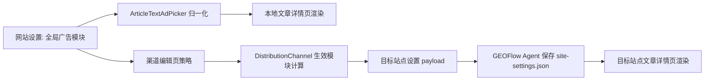

# 文章正文文本广告模块与渠道独立配置迭代方案

## 背景

当前 GEOFlow 已支持文章详情页正文顶部和底部的轻量文本广告，数据保存在 `site_settings.article_detail_text_ads`，并可以通过分发渠道同步到 GEOFlow Agent 目标站点。

现有实现的核心限制是：

- 一条广告记录等于一条文字链，无法表达“一个广告模块内包含多条文字链”。
- 分发渠道只能继承、禁用或勾选全局广告，不能在渠道内维护自己的文本广告内容。
- 当前每个位置最多渲染 3 条扁平广告，无法按模块组织 5-10 条锚文本广告。
- 远端目标站点包已支持 `article_text_ads`，但仍按扁平结构渲染。

新的目标是把文本广告升级为“广告模块 + 多条文字链”，同时允许每个渠道站点独立维护自己的广告模块，满足不同站点独立追踪、独立投放和独立统计的需求。

## 目标

1. 全局网站后台可以创建多个文章正文文本广告模块。
2. 每个广告模块最多包含 10 条文字链。
3. 每条文字链可配置文字、链接、颜色、新标签打开、追踪参数、启用状态和排序。
4. 每个模块可选择展示位置：正文顶部或正文底部。
5. 渠道站点可以选择继承全局模块、勾选全局模块、禁用广告，或使用渠道自定义模块。
6. 本地前台和 GEOFlow Agent 目标站点都能渲染新结构。
7. 兼容现有旧扁平文本广告数据，避免已有配置失效。

## 非目标

- 本阶段不做点击统计、曝光统计、AB 测试和报表。
- 本阶段不为 WordPress REST 自动注入这些文本广告。
- 本阶段不新建独立广告数据表，仍使用站点设置和渠道配置 JSON。
- 本阶段不实现按文章、分类、关键词定向投放。
- 本阶段不伪造浏览器 HTTP Referer；“来源追踪”继续通过 URL query 参数实现。

## 推荐方案

采用“版本化 JSON 结构 + 旧结构兼容 + 渠道覆盖配置”的方案。

全局配置继续使用：

```text
site_settings.article_detail_text_ads
```

渠道配置继续使用：

```text
distribution_channels.channel_config.article_text_ad_policy
```

但数据结构从扁平广告列表升级为广告模块列表。

### 新全局结构

```json
[
  {
    "schema_version": 2,
    "id": "module_xxx",
    "name": "正文顶部推荐",
    "placement": "content_top",
    "enabled": true,
    "sort_order": 10,
    "links": [
      {
        "id": "link_xxx",
        "text": "锚文本广告 1",
        "url": "https://example.com",
        "text_color": "#2563eb",
        "open_new_tab": true,
        "tracking_enabled": true,
        "tracking_param": "utm_source=geoflow&utm_medium=article_text_ad",
        "enabled": true,
        "sort_order": 10
      }
    ]
  }
]
```

### 渠道策略结构

```json
{
  "content_top": {
    "mode": "inherit",
    "module_ids": [],
    "custom_modules": []
  },
  "content_bottom": {
    "mode": "inherit",
    "module_ids": [],
    "custom_modules": []
  }
}
```

`mode` 支持：

- `inherit`：继承全局启用模块。
- `selected`：只同步勾选的全局模块。
- `custom`：使用当前渠道自定义模块。
- `disabled`：不展示。

为兼容旧版本，归一化时继续读取旧的 `ad_ids`，并把旧扁平广告转换为单链接模块。

## 自检后的补充完善

### 1. 必须兼容旧数据

现有线上可能已经保存了旧结构：

```json
[
  {
    "id": "sync-top",
    "placement": "content_top",
    "text": "Top CTA",
    "url": "/top-sync"
  }
]
```

新版本不能要求用户手工迁移。归一化服务需要自动把旧记录包装为：

```json
{
  "schema_version": 2,
  "id": "sync-top",
  "name": "Top CTA",
  "placement": "content_top",
  "links": [
    {
      "id": "sync-top_link",
      "text": "Top CTA",
      "url": "/top-sync"
    }
  ]
}
```

这样本地文章页、渠道 payload 和目标站点包都能同时支持新旧结构。

### 2. 渠道独立配置不单独建表

渠道自定义模块放在 `channel_config.article_text_ad_policy.{placement}.custom_modules` 中。

原因：

- 当前渠道设置本身已经是 JSON 配置。
- 文本广告数量很小，每个位置最多几个模块，每个模块最多 10 条链接。
- 暂时没有点击统计和跨渠道查询需求。
- 回滚简单，清空 `article_text_ad_policy` 即可回到继承全局。

如果未来要做点击统计、投放报表、定向规则，再拆独立表。

### 3. 模块和链接都要限量

建议限制：

- 全局总模块数：最多 30 个。
- 每个渠道自定义模块数：每个位置最多 5 个。
- 每个模块文字链：最多 10 条。
- 前台每个位置默认渲染模块数：最多 2 个。
- 单条广告文字：最多 120 字。
- 单条 URL：最多 500 字。
- 追踪参数：最多 250 字。

这样可以避免正文顶部/底部广告过重，也能控制目标站点包 payload 大小。

### 4. 样式保持“轻量、透明、自适应”

文本广告模块不做强视觉卡片。默认样式：

- 背景透明或白底。
- 继承正文区域字体。
- 只使用轻量上下边线或间距。
- 多条文字链按行展示。
- 链接颜色由每条文字链控制，但不改变容器背景。
- 移动端保持单列。

这样可以适配当前 20 套前台模板和未来复刻模板，不会破坏不同主题的文章排版。

### 5. selected 模式选择“模块”，不是选择单条链接

渠道 `selected` 模式应勾选广告模块，而不是勾选模块里的单条链接。

原因：

- 广告模块是投放单元。
- 模块内部多条文字链通常是一个投放组合。
- 如果需要单站点修改其中某几条链接，应使用 `custom` 模式。

旧的 `ad_ids` 仍兼容，但新版 UI 使用 `module_ids`。

### 6. 目标站点包需要双格式渲染

GEOFlow Agent 目标站点包必须支持：

- 旧扁平 `article_text_ads`。
- 新模块化 `article_text_ads`。
- 空广告配置。

远端 `normalizeArticleTextAds()` 返回统一模块结构，`renderArticleTextAds()` 只处理统一结构。

### 7. 保存失败要保留用户输入

全局和渠道表单一旦出现非法 URL、非法颜色、超过 10 条链接等错误，需要通过 `withInput()` 保留输入，避免用户重新填写多条链接。

## 数据流



## Phase 1：归一化服务与兼容层

### 改动范围

- `app/Support/Site/ArticleTextAdPicker.php`
- `app/Http/Controllers/Admin/SiteSettingsController.php`
- 相关单元/Feature 测试

### 任务

1. 新增统一模块归一化方法：
   - `normalizeModules()`
   - `normalizeModule()`
   - `normalizeLink()`
2. 兼容旧扁平结构。
3. 增加模块和链接限量。
4. 保持现有 `renderPlacement()` 对外可用。
5. 渲染逻辑改为模块内多链接逐行输出。

### Review Gate

- 旧扁平结构仍能展示。
- 新模块结构能展示多条文字链。
- 禁用模块、禁用链接不会展示。
- HTML 转义、安全链接和 tracking 参数逻辑不回退。

## Phase 2：全局网站设置 UI 升级

### 改动范围

- `resources/views/admin/site-settings/index.blade.php`
- `app/Http/Controllers/Admin/SiteSettingsController.php`
- `resources/lang/*/admin.php`
- `tests/Feature/AdminSiteSettingsPageTest.php`

### 任务

1. “添加文本广告”改成“添加广告模块”。
2. 每个模块内支持添加、删除、排序最多 10 条文字链。
3. 表单字段支持模块层和链接层。
4. 错误提示精确到模块和链接序号。
5. 空状态、预览和说明文案更新。

### Review Gate

- 保存 1 个模块 1 条链接成功。
- 保存 1 个模块 10 条链接成功。
- 第 11 条链接被拦截。
- 非法 URL、非法颜色、非法追踪参数被拦截并保留输入。
- 旧底部跟随广告 `article_detail_ads` 不受影响。

## Phase 3：渠道编辑页独立配置

### 改动范围

- `resources/views/admin/distribution/edit.blade.php`
- `resources/views/admin/distribution/show.blade.php`
- `app/Http/Controllers/Admin/DistributionController.php`
- `app/Models/DistributionChannel.php`
- `resources/lang/*/admin.php`
- `tests/Feature/AdminDistributionPageTest.php`

### 任务

1. 渠道文本广告策略增加 `custom` 模式。
2. `selected` 模式改为勾选全局广告模块。
3. `custom` 模式显示渠道自定义模块编辑器。
4. 自定义模块使用和全局相同的字段、校验和归一化规则。
5. 渠道详情页展示最终策略和模块数量。

### Review Gate

- `inherit` 输出全局启用模块。
- `selected` 只输出勾选模块。
- `custom` 只输出渠道自定义模块。
- `disabled` 输出空广告。
- 旧 `ad_ids` 渠道配置仍兼容。

## Phase 4：同步 payload 与目标站点包

### 改动范围

- `app/Models/DistributionChannel.php`
- `app/Services/GeoFlow/DistributionTargetSitePackageBuilder.php`
- 目标站点包内嵌 `config.php`、`public/index.php`、`assets/site.css` 生成逻辑
- `tests/Feature/AdminDistributionPageTest.php`

### 任务

1. `targetSiteSettingsPayload()` 输出最终模块化 `article_text_ads`。
2. Agent 目标站点包默认配置仍为 `article_text_ads => []`。
3. 目标站点包接收并归一化新旧结构。
4. 目标站点包文章页按模块渲染多条文字链。
5. 目标站点包 CSS 增加模块和链接行样式。

### Review Gate

- 生成的目标站点包包含新归一化函数。
- 旧目标站点无广告设置不报错。
- 新目标站点能在正文顶部/底部渲染模块和多条文字链。
- 静态模式重建后广告生效。

## Phase 5：测试、回归与收口

### 建议测试

- `php artisan test tests/Feature/AdminSiteSettingsPageTest.php`
- `php artisan test tests/Feature/AdminDistributionPageTest.php`
- `php artisan test tests/Feature/SiteArticleMarkdownRenderTest.php`
- 必要时运行 `php artisan test`

### 覆盖点

1. 全局模块新增、编辑、删除、排序。
2. 模块内多条文字链保存和渲染。
3. 超过 10 条文字链失败。
4. 旧扁平广告结构自动兼容。
5. 渠道四种策略输出正确。
6. 渠道自定义模块可保存、回显和同步。
7. 目标站点包支持新结构。
8. 旧 `article_detail_ads` 底部跟随广告无回归。

## 公开接口变化

### 保持不变

- `site_settings.article_detail_text_ads`
- `settings.article_text_ads`
- `channel_config.article_text_ad_policy`

### 结构升级

- `article_detail_text_ads` 从扁平广告数组升级为模块数组。
- `article_text_ad_policy` 增加 `custom` 模式。
- `selected` 新增 `module_ids`，旧 `ad_ids` 继续兼容。

## 回滚方案

- 全局回滚：清空 `site_settings.article_detail_text_ads` 或恢复旧 JSON。
- 渠道回滚：清空 `channel_config.article_text_ad_policy`，恢复默认继承全局。
- 远端回滚：同步空 `article_text_ads`，或删除目标站点 `storage/site-settings.json` 中的该字段。
- 代码回滚：由于未新增数据库表，回滚不涉及迁移回滚。

## 主要风险

1. **旧目标站点包不支持模块结构**
   - 处理：后台提示用户重新下载并覆盖目标站点包。

2. **嵌套表单交互复杂**
   - 处理：全局和渠道复用同一套前端模板与 JS 逻辑，减少两套行为不一致。

3. **广告太多影响正文体验**
   - 处理：模块和链接双限量，前台每个位置默认最多渲染 2 个模块。

4. **渠道自定义与全局继承混淆**
   - 处理：UI 明确说明四种模式，并在详情页展示当前生效来源。

## 结论

建议按以上 5 个 Phase 实施。这个方案不新增数据表，兼容现有数据，能满足“一个文本广告模块包含多条文字链”和“每个渠道站点可独立配置广告”的需求，同时保留后续扩展点击统计、曝光统计和定向投放的空间。
